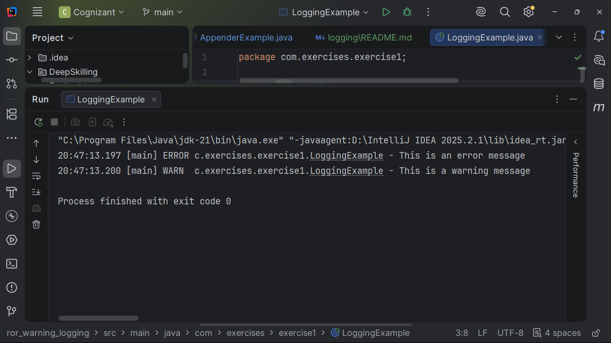
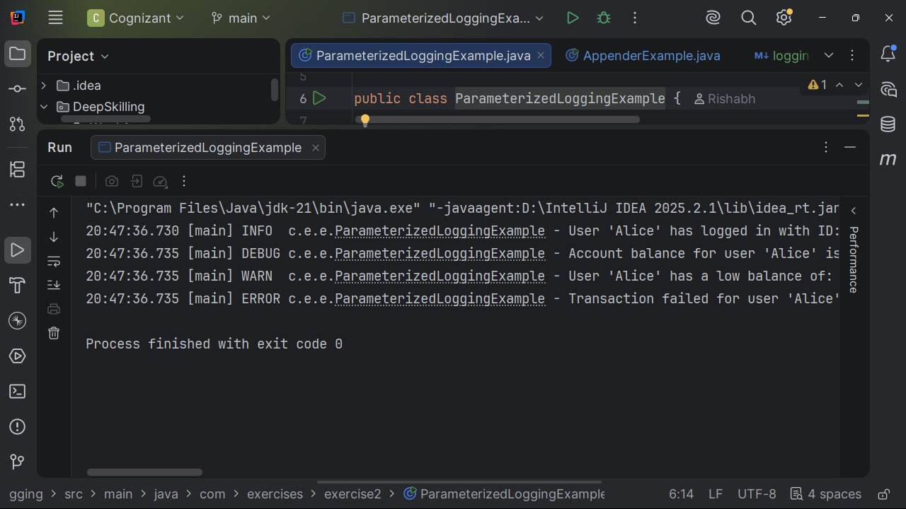

#  Logging Using SLF4J

**Completed by:** Rishabh Dubey

This project contains the successful implementation of all **SLF4J Logging** hands-on exercises from the Cognizant Digital Nurture DeepSkilling program.

The exercises demonstrate various logging techniques using **SLF4J** together with **Logback**, including logging levels, parameterized logging, different appenders, and unit testing.

---

#  Overview

SLF4J (Simple Logging Facade for Java) is a logging abstraction that allows developers to plug in different logging frameworks such as Logback, Log4j, or java.util.logging without changing application code.

This hands-on demonstrates:

- Logging Error Messages
- Logging Warning Messages
- Parameterized Logging
- Logback Configuration
- Console Appender
- File Appender
- Unit Testing Logging Applications

---

# 🛠 Technologies Used

- Java
- Maven
- SLF4J
- Logback
- JUnit 5

---

#  Project Structure

```
Week1
└── logging
    ├── exercise1_error_warning_logging
    ├── exercise2_parameterized_logging
    └── exercise3_different_appenders
```

---

# ✅ Hands-on Exercises Completed

---

# Exercise 1 — Logging Error Messages and Warning Levels

### Objective

Demonstrate logging **Error** and **Warning** messages using SLF4J.

### Concepts Covered

- Logger
- LoggerFactory
- ERROR Level
- WARN Level
- Console Logging
- Unit Testing

### Implemented Files

| File | Link |
|------|------|
| LoggingExample.java | https://github.com/RishBootDev/Cognizant_DN/blob/main/DeepSkilling/Week1/logging/exercise1_error_warning_logging/src/main/java/com/exercises/exercise1/LoggingExample.java |
| logback.xml | https://github.com/RishBootDev/Cognizant_DN/blob/main/DeepSkilling/Week1/logging/exercise1_error_warning_logging/src/main/resources/logback.xml |
| LoggingExampleTest.java | https://github.com/RishBootDev/Cognizant_DN/blob/main/DeepSkilling/Week1/logging/exercise1_error_warning_logging/src/test/java/com/exercises/exercise1/LoggingExampleTest.java |
| logback-test.xml | https://github.com/RishBootDev/Cognizant_DN/blob/main/DeepSkilling/Week1/logging/exercise1_error_warning_logging/src/test/resources/logback-test.xml |

---
### Output Screenshot



---

# Exercise 2 — Parameterized Logging

### Objective

Demonstrate parameterized logging using placeholders.

### Concepts Covered

- Parameterized Logging
- Dynamic Log Messages
- Placeholder Formatting (`{}`)
- Exception Logging
- Performance Benefits

### Implemented Files

| File | Link |
|------|------|
| ParameterizedLoggingExample.java | https://github.com/RishBootDev/Cognizant_DN/blob/main/DeepSkilling/Week1/logging/exercise2_parameterized_logging/src/main/java/com/exercises/exercise2/ParameterizedLoggingExample.java |
| logback.xml | https://github.com/RishBootDev/Cognizant_DN/blob/main/DeepSkilling/Week1/logging/exercise2_parameterized_logging/src/main/resources/logback.xml |

---
### Output Screenshot


---

# Exercise 3 — Using Different Appenders

### Objective

Configure Logback to log messages simultaneously to both the console and a log file.

### Concepts Covered

- Console Appender
- File Appender
- Logback XML Configuration
- Multiple Logging Destinations
- Logging Levels

### Implemented Files

| File | Link |
|------|------|
| AppenderExample.java | https://github.com/RishBootDev/Cognizant_DN/blob/main/DeepSkilling/Week1/logging/exercise3_different_appenders/src/main/java/com/exercises/exercise3/AppenderExample.java |
| logback.xml | https://github.com/RishBootDev/Cognizant_DN/blob/main/DeepSkilling/Week1/logging/exercise3_different_appenders/src/main/resources/logback.xml |

---
### Output Screenshot



---

#  SLF4J Logging Levels

| Level | Description |
|--------|-------------|
| TRACE | Fine-grained debugging information |
| DEBUG | Debugging application flow |
| INFO | General application information |
| WARN | Warning messages |
| ERROR | Error messages |

---

#  Features Implemented

- ✅ Error Logging
- ✅ Warning Logging
- ✅ Parameterized Logging
- ✅ Exception Logging
- ✅ Console Appender
- ✅ File Appender
- ✅ Logback XML Configuration
- ✅ LoggerFactory Usage
- ✅ Unit Testing

---
# ▶️ Running the Exercises

Clone the repository

```bash
git clone https://github.com/RishBootDev/Cognizant_DN.git
```

Navigate to any exercise

```bash
cd DeepSkilling/Week1/logging/exercise1_error_warning_logging
```

Compile

```bash
mvn clean compile
```

Run

```bash
mvn exec:java
```

Run Tests

```bash
mvn test
```
---

# Concepts Learned

- SLF4J Logging API
- Logback Framework
- Logging Levels
- LoggerFactory
- Parameterized Logging
- Console Logging
- File Logging
- Multiple Appenders
- Logback XML Configuration
- Unit Testing Logging Applications

---

# References

- https://www.slf4j.org/
- https://logback.qos.ch/
- https://www.baeldung.com/slf4j-with-logback

---