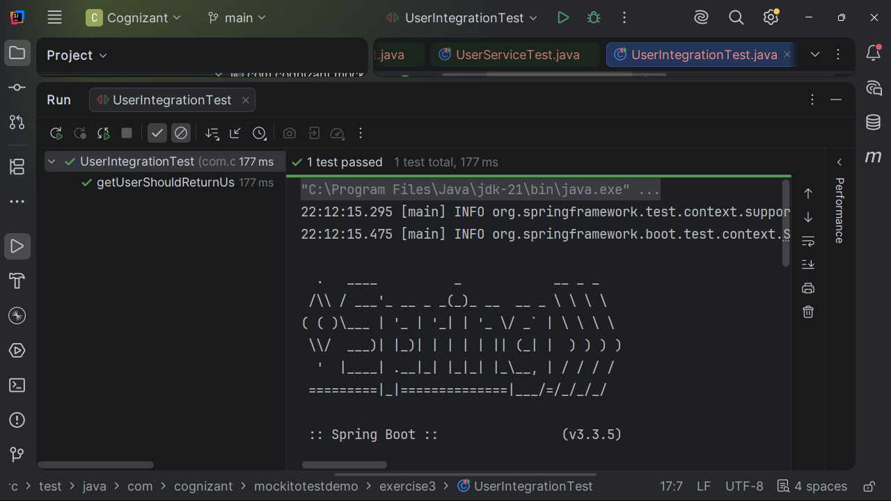
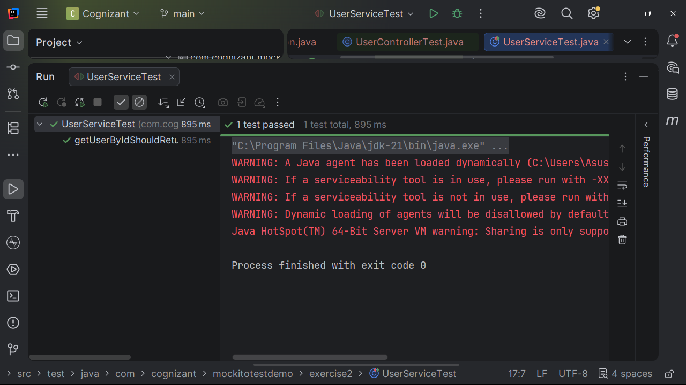
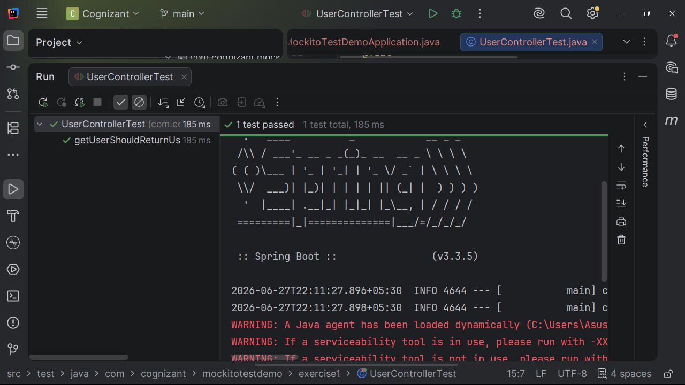

# Mockito - Mock Dependencies Exercises

A Spring Boot application implementing all Mockito Mock Dependencies hands-on exercises using JUnit 5, Mockito, MockMvc, and Spring Boot Testing.

## Table of Contents

- [Project Overview](#project-overview)
- [Project Structure](#project-structure)
- [Hands-on Tracker](#hands-on-tracker)
- [Output Screenshots](#output-screenshots)
- [Technologies Used](#technologies-used)
- [How to Run the Application](#how-to-run-the-application)
- [How to Run All Tests](#how-to-run-all-tests)
- [How to Run Individual Exercise Tests](#how-to-run-individual-exercise-tests)
- [REST Endpoints](#rest-endpoints)
- [Key Testing Concepts Demonstrated](#key-testing-concepts-demonstrated)
- [Final Completion Status](#final-completion-status)

---

## Project Overview

This project demonstrates how to isolate Spring Boot components for testing by mocking dependencies using Mockito.

The implementation covers:

- Mocking Service Dependencies
- Mocking Repository Dependencies
- Controller Testing with MockMvc
- Integration Testing with Mocked Beans
- JUnit 5 Assertions
- Mockito Stubbing and Verification
- Spring Boot Testing Framework

The project is organized package-wise, where each exercise is implemented independently.

**Base Package**

```text
com.cognizant.mockitotestdemo
```

---

## Project Structure

```text
mockito-test-demo
│
├── outputs
│   ├── exercise1.png
│   ├── exercise2.png
│   └── exercise3.png
│
├── src
│   ├── main
│   │   ├── java
│   │   │   └── com
│   │   │       └── cognizant
│   │   │           └── mockitotestdemo
│   │   │               ├── exercise1
│   │   │               ├── exercise2
│   │   │               └── exercise3
│   │   │
│   │   └── resources
│   │       └── application.properties
│   │
│   └── test
│       ├── java
│       │   └── com
│       │       └── cognizant
│       │           └── mockitotestdemo
│       │               ├── exercise1
│       │               ├── exercise2
│       │               └── exercise3
│       │
│       └── resources
│           └── application.properties
│
├── pom.xml
└── README.md
```

---

## Hands-on Tracker

| Exercise | Hands-on | Implementation |
|----------|----------|----------------|
| Exercise 1 | Mocking a Service Dependency in a Controller Test | Created User Entity, Repository, Service, Controller, and tested the controller by mocking the service layer using Mockito and MockMvc |
| Exercise 2 | Mocking a Repository in a Service Test | Created User Entity, Repository, Service, and tested the service layer by mocking repository interactions using Mockito |
| Exercise 3 | Mocking a Service Dependency in an Integration Test | Implemented Spring Boot Integration Test using `@SpringBootTest`, `@AutoConfigureMockMvc`, and `@MockBean` to mock service dependency |

---

## Output Screenshots

After running each exercise, place the corresponding screenshot inside the `outputs` folder using the following filenames:

```text
outputs/
├── exercise1.png
├── exercise2.png
└── exercise3.png
```

### Exercise 1 - Mocking a Service Dependency in a Controller Test



---

### Exercise 2 - Mocking a Repository in a Service Test



---

### Exercise 3 - Mocking a Service Dependency in an Integration Test



---

## Technologies Used

- Java 17
- Spring Boot 3
- Spring Web
- Spring Data JPA
- H2 Database
- JUnit 5
- Mockito
- MockMvc
- Maven

---

## How to Run the Application

```bash
mvn spring-boot:run
```

---

## How to Run All Tests

```bash
mvn test
```

---

## How to Run Individual Exercise Tests

### Exercise 1

```bash
mvn -Dtest=UserControllerTest test
```

### Exercise 2

```bash
mvn -Dtest=UserServiceTest test
```

### Exercise 3

```bash
mvn -Dtest=UserIntegrationTest test
```

---

## REST Endpoints

| Exercise | Method | Endpoint | Purpose |
|----------|--------|----------|----------|
| Exercise 1 | GET | `/exercise1/users/{id}` | Retrieve user by mocking the service layer in controller test |
| Exercise 2 | Not Applicable | Service Layer Test | Tests service behavior by mocking repository dependency |
| Exercise 3 | GET | `/exercise3/users/{id}` | Integration testing with mocked service dependency |

---

## Key Testing Concepts Demonstrated

- Mockito `@Mock`
- Mockito `@InjectMocks`
- Spring Boot `@MockBean`
- MockMvc Controller Testing
- Repository Mocking
- Service Layer Isolation
- Integration Testing with Mocked Dependencies
- JUnit 5 Assertions
- Mockito `when()`
- Mockito `verify()`

---

## Final Completion Status

All Mockito Mock Dependencies exercises from the hands-on document have been successfully implemented inside a **single Spring Boot application**.

✔ Controller Testing with Mocked Service

✔ Service Testing with Mocked Repository

✔ Spring Boot Integration Testing using Mocked Beans

✔ MockMvc Request Testing

✔ Mockito Stubbing and Verification

✔ JUnit 5 Test Assertions

The project follows a clean package-wise architecture, allowing each exercise to be executed independently while demonstrating industry-standard Mockito testing practices within a single Maven-based Spring Boot application.
