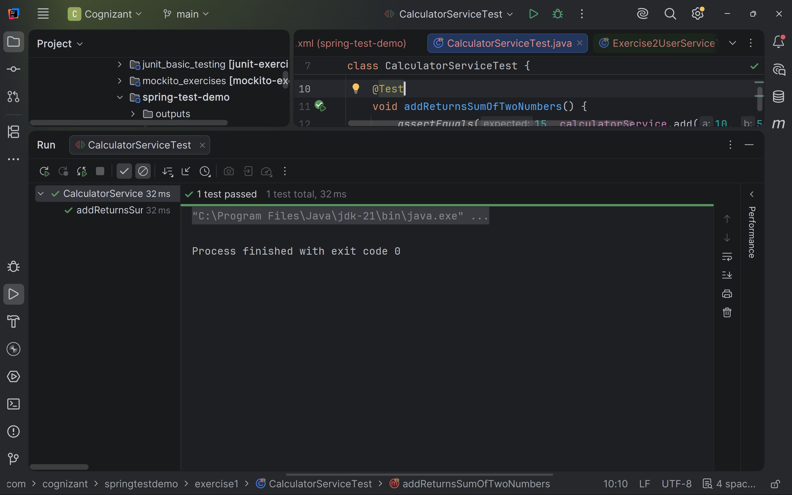
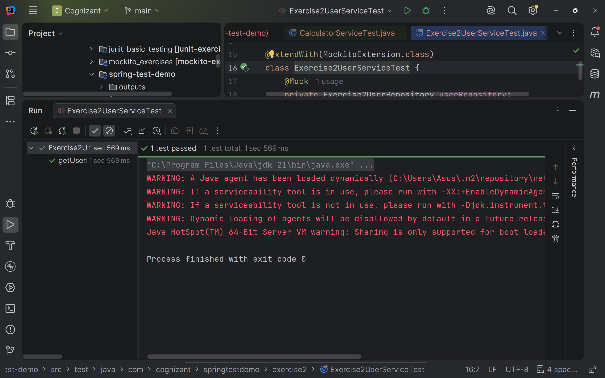
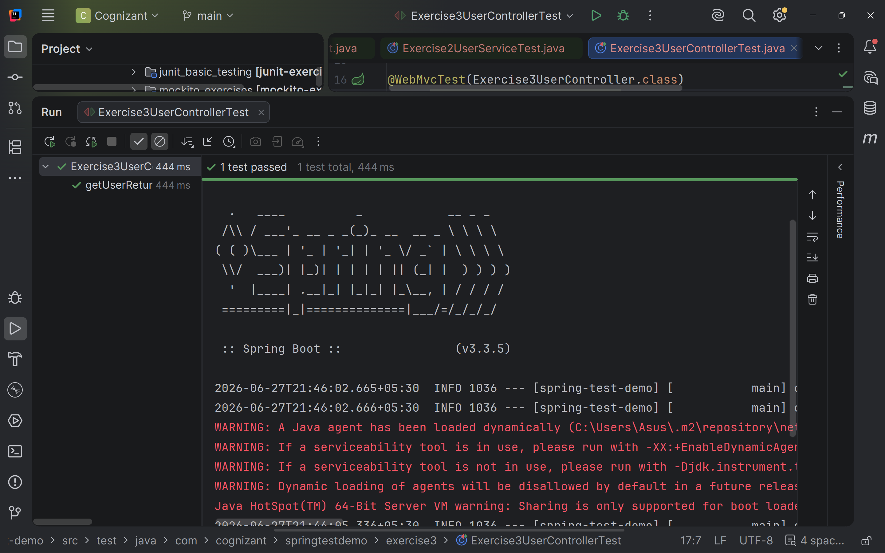
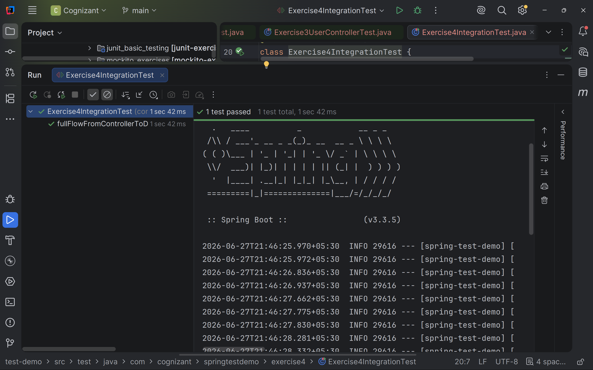
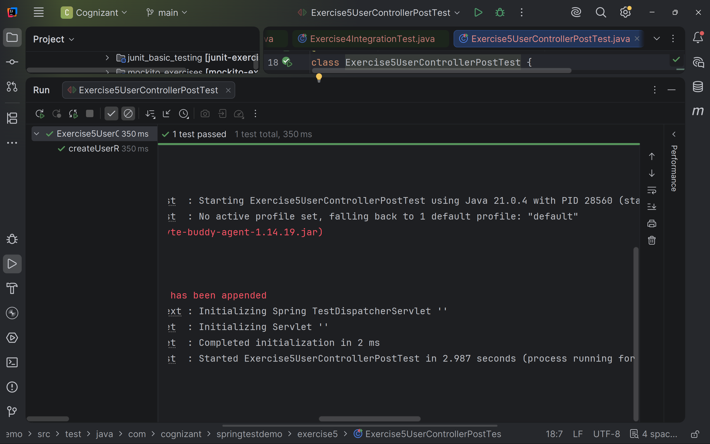
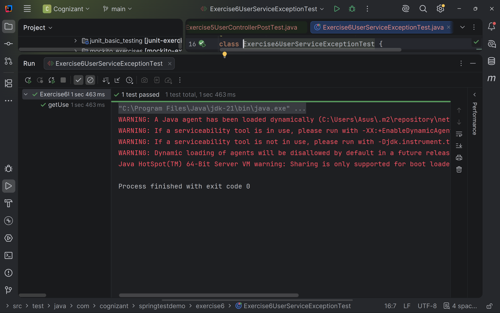
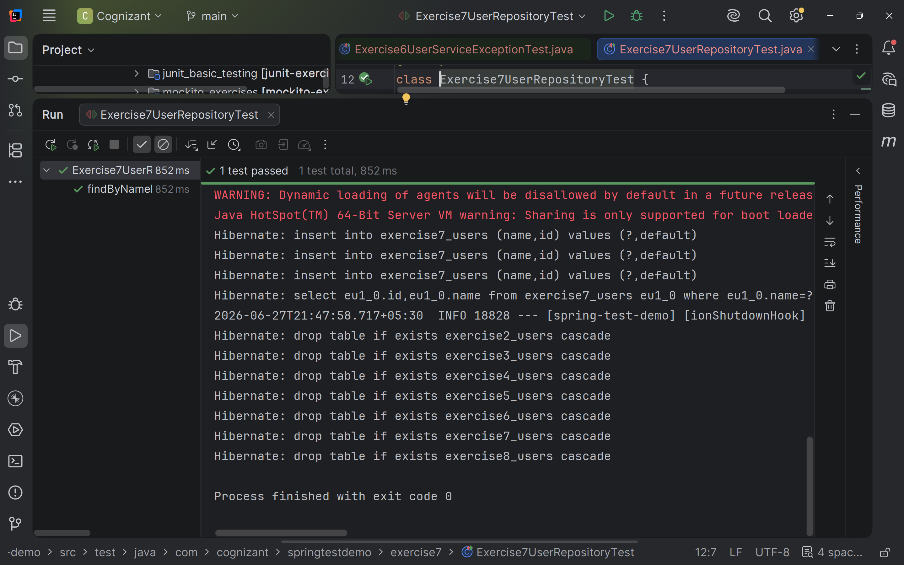
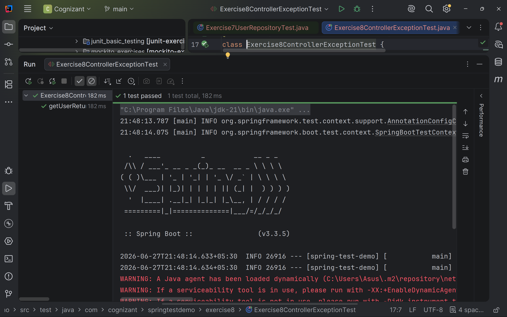
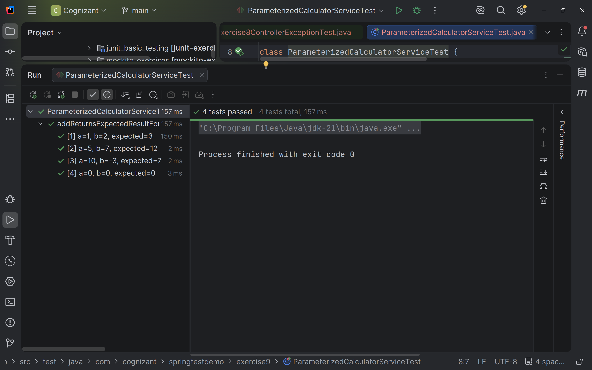

# JUnit Spring Test Exercises

A Spring Boot application implementing all Spring Testing hands-on exercises from the JUnit Spring Test exercise document.

## Table of Contents

- [Project Overview](#project-overview)
- [Project Structure](#project-structure)
- [Hands-on Tracker](#hands-on-tracker)
- [Output Screenshots](#output-screenshots)
- [Technologies Used](#technologies-used)
- [How to Run the Application](#how-to-run-the-application)
- [How to Run All Tests](#how-to-run-all-tests)
- [How to Run Individual Exercise Tests](#how-to-run-individual-exercise-tests)
- [REST Endpoints](#rest-endpoints)
- [Final Completion Status](#final-completion-status)

---

## Project Overview

This project demonstrates the implementation of Spring Testing concepts using:

- JUnit 5
- Mockito
- MockMvc
- Spring Boot Integration Testing
- Spring Data JPA Repository Testing
- Exception Handling Testing
- Parameterized Testing

**Base Package**

```text
com.cognizant.springtestdemo
```

---

## Project Structure

```text
spring-test-demo
│
├── outputs
│   ├── exercise1.png
│   ├── exercise2.png
│   ├── exercise3.png
│   ├── exercise4.png
│   ├── exercise5.png
│   ├── exercise6.png
│   ├── exercise7.png
│   ├── exercise8.png
│   └── exercise9.png
│
├── src
│   ├── main
│   │   └── java
│   │       └── com
│   │           └── cognizant
│   │               └── springtestdemo
│   │                   ├── exercise1
│   │                   ├── exercise2
│   │                   ├── exercise3
│   │                   ├── exercise4
│   │                   ├── exercise5
│   │                   ├── exercise6
│   │                   ├── exercise7
│   │                   ├── exercise8
│   │                   └── exercise9
│   │
│   └── test
│       └── java
│           └── com
│               └── cognizant
│                   └── springtestdemo
│                       ├── exercise1
│                       ├── exercise2
│                       ├── exercise3
│                       ├── exercise4
│                       ├── exercise5
│                       ├── exercise6
│                       ├── exercise7
│                       ├── exercise8
│                       └── exercise9
│
├── pom.xml
└── README.md
```

---

## Hands-on Tracker

| Exercise | Hands-on | Implementation |
|----------|----------|----------------|
| Exercise 1 | Basic Unit Test for a Service Method | Created `CalculatorService` and tested the `add()` method using JUnit assertions |
| Exercise 2 | Mocking a Repository in a Service Test | Created User Entity, Repository, Service and tested repository interaction using Mockito |
| Exercise 3 | Testing a REST Controller with MockMvc | Tested REST GET endpoint using `@WebMvcTest` and MockMvc |
| Exercise 4 | Integration Test with Spring Boot | Tested complete flow from Controller → Service → Repository → H2 Database |
| Exercise 5 | Test Controller POST Endpoint | Added POST endpoint and tested request/response using MockMvc |
| Exercise 6 | Test Service Exception Handling | Tested missing user scenario using `assertThrows()` |
| Exercise 7 | Test Custom Repository Query | Added custom repository query `findByName()` and tested using `@DataJpaTest` |
| Exercise 8 | Test Controller Exception Handling | Added `@ControllerAdvice` and verified HTTP 404 response |
| Exercise 9 | Parameterized Test with JUnit | Used `@ParameterizedTest` with `@CsvSource` for multiple test inputs |

---

## Output Screenshots

```text
outputs/
├── exercise1.png
├── exercise2.png
├── exercise3.png
├── exercise4.png
├── exercise5.png
├── exercise6.png
├── exercise7.png
├── exercise8.png
└── exercise9.png
```

### Exercise 1 - Basic Unit Test for a Service Method



---

### Exercise 2 - Mocking a Repository in a Service Test



---

### Exercise 3 - Testing a REST Controller with MockMvc



---

### Exercise 4 - Integration Test with Spring Boot



---

### Exercise 5 - Test Controller POST Endpoint



---

### Exercise 6 - Test Service Exception Handling



---

### Exercise 7 - Test Custom Repository Query



---

### Exercise 8 - Test Controller Exception Handling



---

### Exercise 9 - Parameterized Test with JUnit



---

## Technologies Used

- Java 17
- Spring Boot
- Spring Web
- Spring Data JPA
- H2 Database
- JUnit 5
- Mockito
- MockMvc
- Maven

---

## How to Run the Application

```bash
mvn spring-boot:run
```

---

## How to Run All Tests

```bash
mvn test
```

---

## How to Run Individual Exercise Tests

### Exercise 1

```bash
mvn -Dtest=CalculatorServiceTest test
```

### Exercise 2

```bash
mvn -Dtest=UserServiceTest test
```

### Exercise 3

```bash
mvn -Dtest=UserControllerTest test
```

### Exercise 4

```bash
mvn -Dtest=Exercise4IntegrationTest test
```

### Exercise 5

```bash
mvn -Dtest=UserControllerPostTest test
```

### Exercise 6

```bash
mvn -Dtest=UserServiceExceptionTest test
```

### Exercise 7

```bash
mvn -Dtest=UserRepositoryTest test
```

### Exercise 8

```bash
mvn -Dtest=GlobalExceptionHandlerTest test
```

### Exercise 9

```bash
mvn -Dtest=CalculatorParameterizedTest test
```

---

## REST Endpoints

| Exercise | Method | Endpoint | Purpose |
|----------|--------|----------|----------|
| Exercise 3 | GET | `/exercise3/users/{id}` | Retrieve user using mocked service |
| Exercise 4 | POST | `/exercise4/users` | Save user into H2 database |
| Exercise 4 | GET | `/exercise4/users/{id}` | Retrieve user from H2 database |
| Exercise 5 | POST | `/exercise5/users` | Test POST endpoint using MockMvc |
| Exercise 8 | GET | `/exercise8/users/{id}` | Verify controller exception handling |

---

## Final Completion Status

All Spring Testing exercises from the JUnit Spring Test document have been successfully implemented inside this **Spring Boot application**.

✔ Basic Unit Testing

✔ Mockito Service Testing

✔ MockMvc Controller Testing

✔ Spring Boot Integration Testing

✔ POST Endpoint Testing

✔ Exception Handling Testing

✔ Spring Data JPA Repository Testing

✔ Controller Advice Testing

✔ Parameterized Testing

The project follows a clean package-wise structure, making each exercise independent while keeping everything within a single Maven-based Spring Boot application.