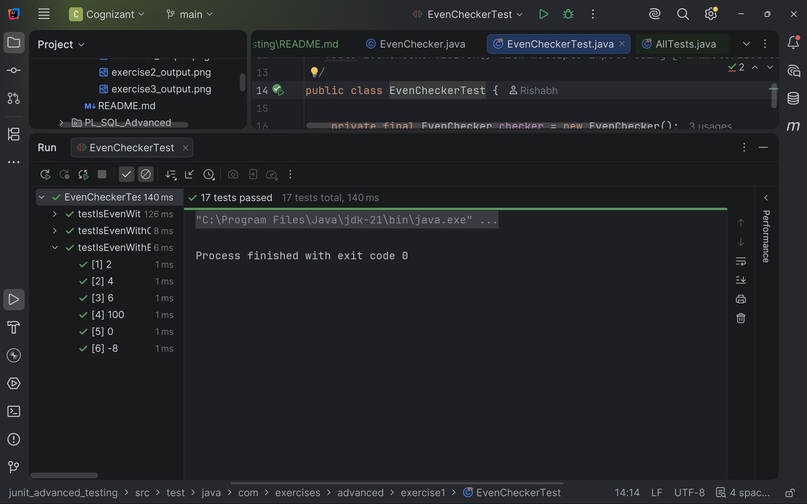
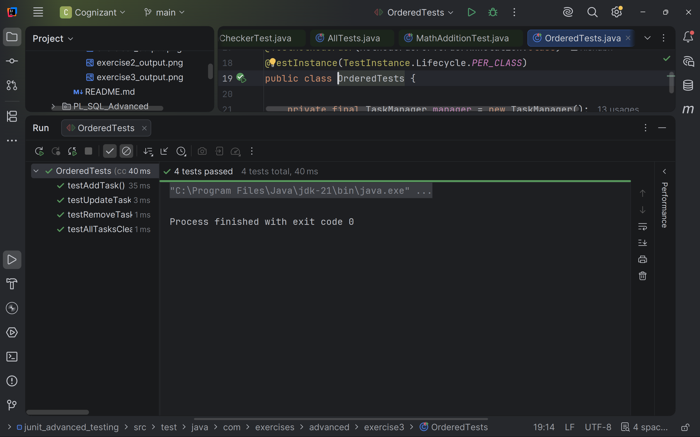
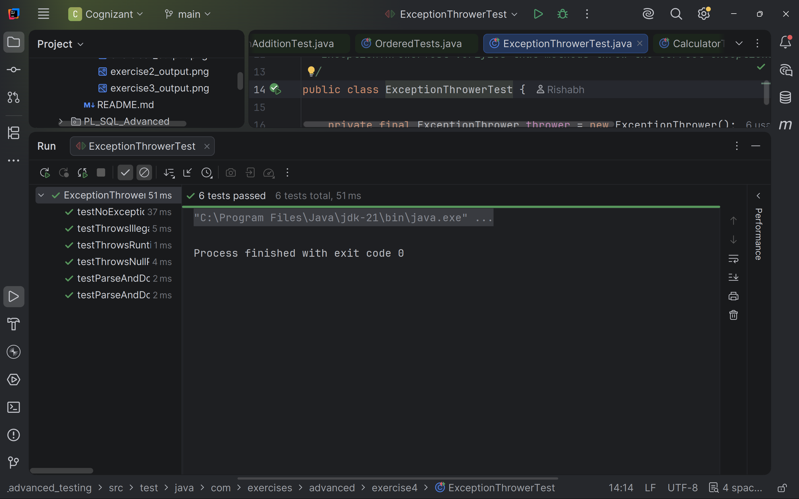
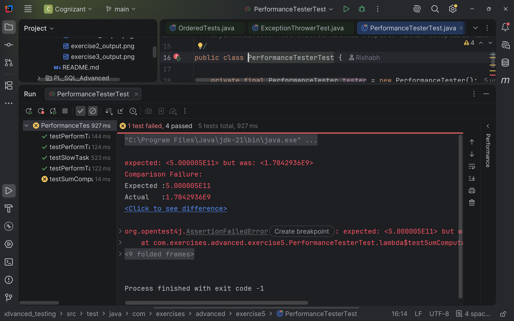

# JUnit Advanced Testing

**Completed by:** Rishabh Dubey

This project contains the successful implementation of all **Advanced JUnit Testing** hands-on exercises from the Cognizant Digital Nurture DeepSkilling program.

The exercises demonstrate advanced testing techniques using **JUnit 5**, including parameterized tests, test suites, execution order, exception testing, and timeout/performance testing. :contentReference[oaicite:0]{index=0}

---

# Overview

JUnit 5 provides several advanced features that help developers write cleaner, reusable, and maintainable test cases.

This hands-on demonstrates:

- Parameterized Tests
- Test Suites
- Ordered Test Execution
- Exception Testing
- Timeout & Performance Testing

---

# Technologies Used

- Java
- Maven
- JUnit 5
- IntelliJ IDEA

---

# Project Structure

```
junit_advanced_testing
│
├── src
│   ├── main
│   │   └── java
│   │       └── com.exercises.advanced
│   │           ├── exercise1
│   │           ├── exercise2
│   │           ├── exercise3
│   │           ├── exercise4
│   │           └── exercise5
│   │
│   └── test
│       └── java
│           └── com.exercises.advanced
│               ├── exercise1
│               ├── exercise2
│               ├── exercise3
│               ├── exercise4
│               └── exercise5
│
└── pom.xml
```

---

# Hands-on Exercises Completed

---

# Exercise 1 — Parameterized Tests

### Objective

Test a method using multiple input values without writing separate test methods.

### Concepts Covered

- `@ParameterizedTest`
- `@ValueSource`
- Parameterized Testing
- Reusable Test Cases

### Implemented Packages

| Package | Link |
|---------|------|
| Main Source | https://github.com/RishBootDev/Cognizant_DN/tree/main/DeepSkilling/Week1/testing/junit_advanced_testing/src/main/java/com/exercises/advanced/exercise1 |
| Test Source | https://github.com/RishBootDev/Cognizant_DN/tree/main/DeepSkilling/Week1/testing/junit_advanced_testing/src/test/java/com/exercises/advanced/exercise1 |

### Output Screenshot



---

# Exercise 2 — Test Suites

### Objective

Group multiple test classes into a single test suite for execution.

### Concepts Covered

- `@Suite`
- `@SelectClasses`
- Test Suite
- Test Organization

### Implemented Packages

| Package | Link |
|---------|------|
| Main Source | https://github.com/RishBootDev/Cognizant_DN/tree/main/DeepSkilling/Week1/testing/junit_advanced_testing/src/main/java/com/exercises/advanced/exercise2 |
| Test Source | https://github.com/RishBootDev/Cognizant_DN/tree/main/DeepSkilling/Week1/testing/junit_advanced_testing/src/test/java/com/exercises/advanced/exercise2 |

### Output Screenshot


---

# Exercise 3 — Test Execution Order

### Objective

Execute test methods in a predefined order.

### Concepts Covered

- `@TestMethodOrder`
- `@Order`
- Ordered Test Execution

### Implemented Packages

| Package | Link |
|---------|------|
| Main Source | https://github.com/RishBootDev/Cognizant_DN/tree/main/DeepSkilling/Week1/testing/junit_advanced_testing/src/main/java/com/exercises/advanced/exercise3 |
| Test Source | https://github.com/RishBootDev/Cognizant_DN/tree/main/DeepSkilling/Week1/testing/junit_advanced_testing/src/test/java/com/exercises/advanced/exercise3 |

### Output Screenshot



---

# Exercise 4 — Exception Testing

### Objective

Verify that methods throw the expected exceptions.

### Concepts Covered

- `assertThrows()`
- Exception Testing
- Runtime Exception Validation

### Implemented Packages

| Package | Link |
|---------|------|
| Main Source | https://github.com/RishBootDev/Cognizant_DN/tree/main/DeepSkilling/Week1/testing/junit_advanced_testing/src/main/java/com/exercises/advanced/exercise4 |
| Test Source | https://github.com/RishBootDev/Cognizant_DN/tree/main/DeepSkilling/Week1/testing/junit_advanced_testing/src/test/java/com/exercises/advanced/exercise4 |

### Output Screenshot



---

# Exercise 5 — Timeout and Performance Testing

### Objective

Ensure that a method completes execution within a specified time limit.

### Concepts Covered

- `assertTimeout()`
- Performance Testing
- Execution Time Validation

### Implemented Packages

| Package | Link |
|---------|------|
| Main Source | https://github.com/RishBootDev/Cognizant_DN/tree/main/DeepSkilling/Week1/testing/junit_advanced_testing/src/main/java/com/exercises/advanced/exercise5 |
| Test Source | https://github.com/RishBootDev/Cognizant_DN/tree/main/DeepSkilling/Week1/testing/junit_advanced_testing/src/test/java/com/exercises/advanced/exercise5 |

### Output Screenshot



---

# JUnit 5 Annotations Used

| Annotation | Purpose |
|------------|---------|
| `@Test` | Marks a test method |
| `@ParameterizedTest` | Executes the same test with multiple inputs |
| `@ValueSource` | Supplies parameter values |
| `@Suite` | Defines a test suite |
| `@SelectClasses` | Selects test classes for the suite |
| `@TestMethodOrder` | Specifies execution order strategy |
| `@Order` | Assigns execution order |
| `assertThrows()` | Verifies expected exceptions |
| `assertTimeout()` | Verifies execution within a time limit |

---

# Features Implemented

- Parameterized Tests
- Test Suites
- Ordered Test Execution
- Exception Testing
- Timeout Testing
- Performance Validation
- Maven Integration
- Automated Unit Testing

---

# Running the Project

Clone the repository

```bash
git clone https://github.com/RishBootDev/Cognizant_DN.git
```

Navigate to the project

```bash
cd DeepSkilling/Week1/testing/junit_advanced_testing
```

Compile

```bash
mvn clean compile
```

Run all tests

```bash
mvn test
```

---

# Concepts Learned

- Advanced Unit Testing
- Parameterized Tests
- Test Suites
- Test Ordering
- Exception Testing
- Performance Testing
- JUnit 5
- Test Automation
- Software Quality Assurance

---

# References

- https://junit.org/junit5/
- https://maven.apache.org/
- https://www.baeldung.com/junit-5
- https://www.baeldung.com/junit-5-parameterized-tests
```