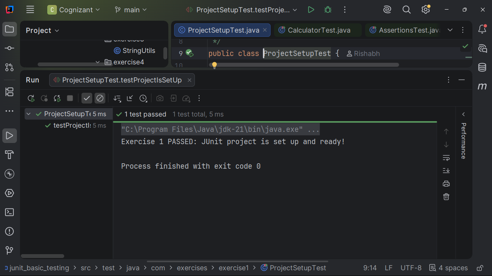
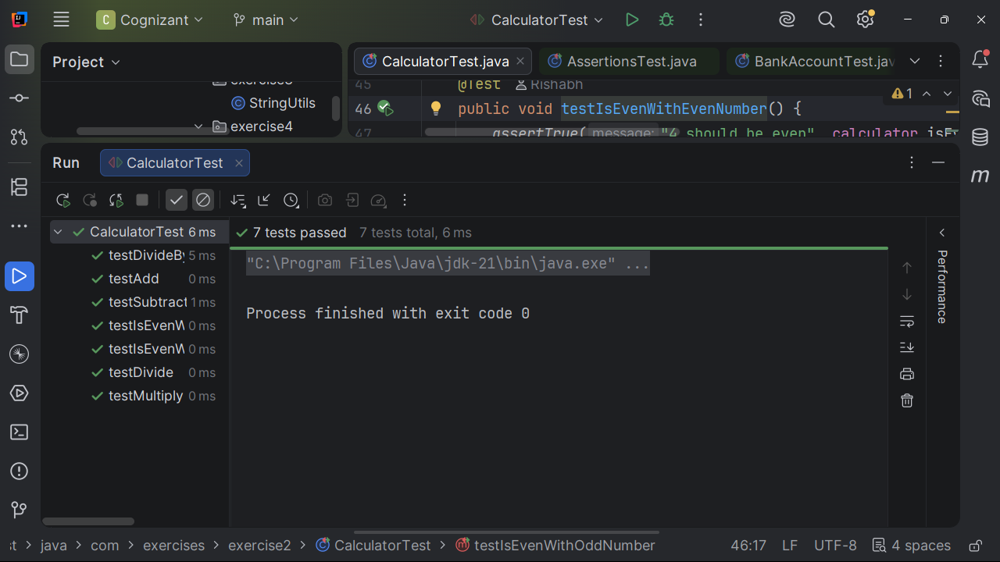
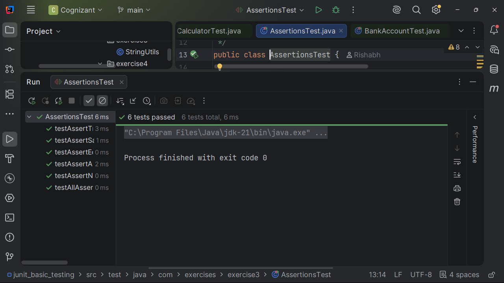
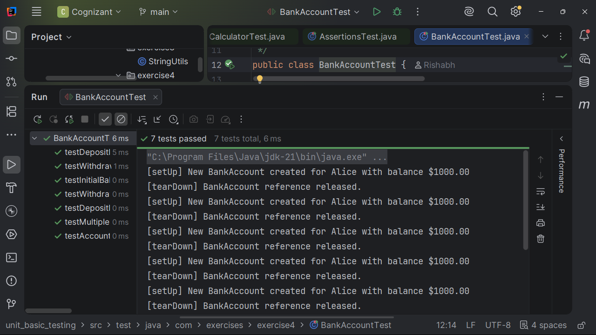

# JUnit Basic Testing

**Completed by:** Rishabh Dubey

This project contains the successful implementation of all **JUnit Basic Testing** hands-on exercises from the Cognizant Digital Nurture DeepSkilling program.

The exercises demonstrate the fundamentals of unit testing in Java using **JUnit**, including project setup, writing test cases, assertions, and the Arrange-Act-Assert (AAA) testing pattern with setup and teardown methods.

---

# Overview

JUnit is one of the most widely used testing frameworks for Java applications. It enables developers to write automated tests that verify application behavior, improve code quality, and simplify regression testing.

This hands-on demonstrates:

- JUnit Project Setup
- Writing Basic Unit Tests
- JUnit Assertions
- Arrange-Act-Assert (AAA) Pattern
- Test Fixtures
- Setup and Teardown Methods

---

# Technologies Used

- Java
- Maven
- JUnit
- IntelliJ IDEA

---

# Hands-on Exercises Completed

---

# Exercise 1 — Setting Up JUnit

### Objective

Set up a Maven project with JUnit dependencies and create the first test class.

### Concepts Covered

- Maven Project
- JUnit Dependency
- Test Package Structure
- First Unit Test

### Implemented Packages

| Package | Link |
|---------|------|
| Main Source | https://github.com/RishBootDev/Cognizant_DN/tree/main/DeepSkilling/Week1/testing/junit_basic_testing/src/main/java/com/exercises/exercise1 |
| Test Source | https://github.com/RishBootDev/Cognizant_DN/tree/main/DeepSkilling/Week1/testing/junit_basic_testing/src/test/java/com/exercises/exercise1 |

### Output Screenshot



---

# Exercise 2 — Writing Basic JUnit Tests

### Objective

Write basic JUnit test cases for Java methods.

### Concepts Covered

- Test Methods
- Expected Results
- Test Execution
- Unit Testing Basics

### Implemented Packages

| Package | Link |
|---------|------|
| Main Source | https://github.com/RishBootDev/Cognizant_DN/tree/main/DeepSkilling/Week1/testing/junit_basic_testing/src/main/java/com/exercises/exercise2 |
| Test Source | https://github.com/RishBootDev/Cognizant_DN/tree/main/DeepSkilling/Week1/testing/junit_basic_testing/src/test/java/com/exercises/exercise2 |

### Output Screenshot



---

# Exercise 3 — Assertions in JUnit

### Objective

Validate application logic using different JUnit assertions.

### Concepts Covered

- assertEquals()
- assertTrue()
- assertFalse()
- assertNull()
- assertNotNull()

### Implemented Packages

| Package | Link |
|---------|------|
| Main Source | https://github.com/RishBootDev/Cognizant_DN/tree/main/DeepSkilling/Week1/testing/junit_basic_testing/src/main/java/com/exercises/exercise3 |
| Test Source | https://github.com/RishBootDev/Cognizant_DN/tree/main/DeepSkilling/Week1/testing/junit_basic_testing/src/test/java/com/exercises/exercise3 |

### Output Screenshot



---

# Exercise 4 — Arrange-Act-Assert (AAA) Pattern, Test Fixtures, Setup and Teardown

### Objective

Organize unit tests using the Arrange-Act-Assert pattern and implement setup and teardown methods.

### Concepts Covered

- Arrange-Act-Assert Pattern
- @Before
- @After
- Test Fixtures
- Reusable Test Initialization

### Implemented Packages

| Package | Link |
|---------|------|
| Main Source | https://github.com/RishBootDev/Cognizant_DN/tree/main/DeepSkilling/Week1/testing/junit_basic_testing/src/main/java/com/exercises/exercise4 |
| Test Source | https://github.com/RishBootDev/Cognizant_DN/tree/main/DeepSkilling/Week1/testing/junit_basic_testing/src/test/java/com/exercises/exercise4 |

### Output Screenshot



---

# JUnit Annotations Used

| Annotation | Purpose |
|------------|---------|
| `@Test` | Marks a test method |
| `@Before` | Runs before each test |
| `@After` | Runs after each test |
| `@BeforeClass` | Runs once before all tests (JUnit 4) |
| `@AfterClass` | Runs once after all tests (JUnit 4) |

---

# Assertions Used

| Assertion | Description |
|------------|-------------|
| `assertEquals()` | Checks expected and actual values |
| `assertTrue()` | Verifies condition is true |
| `assertFalse()` | Verifies condition is false |
| `assertNull()` | Checks object is null |
| `assertNotNull()` | Checks object is not null |

---

# Features Implemented

- Maven JUnit Configuration
- Unit Test Creation
- Test Execution
- Assertions
- AAA Pattern
- Test Fixtures
- Setup Methods
- Teardown Methods
- Automated Testing

---

# Running the Project

Clone the repository

```bash
git clone https://github.com/RishBootDev/Cognizant_DN.git
```

Navigate to the project

```bash
cd DeepSkilling/Week1/testing/junit_basic_testing
```

Compile

```bash
mvn clean compile
```

Run Tests

```bash
mvn test
```

---

# Concepts Learned

- Unit Testing
- Test Automation
- JUnit Framework
- Assertions
- AAA Pattern
- Test Fixtures
- Maven Testing
- Software Quality Assurance

---

# References

- https://junit.org/junit5/
- https://maven.apache.org/
- https://www.baeldung.com/junit