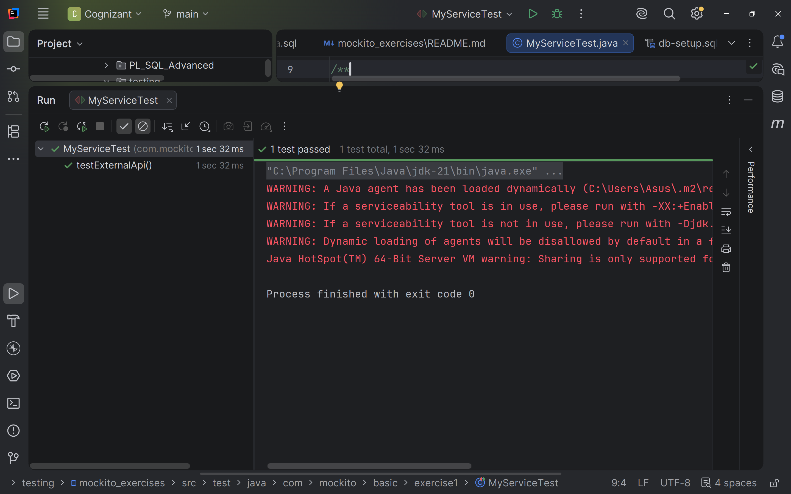
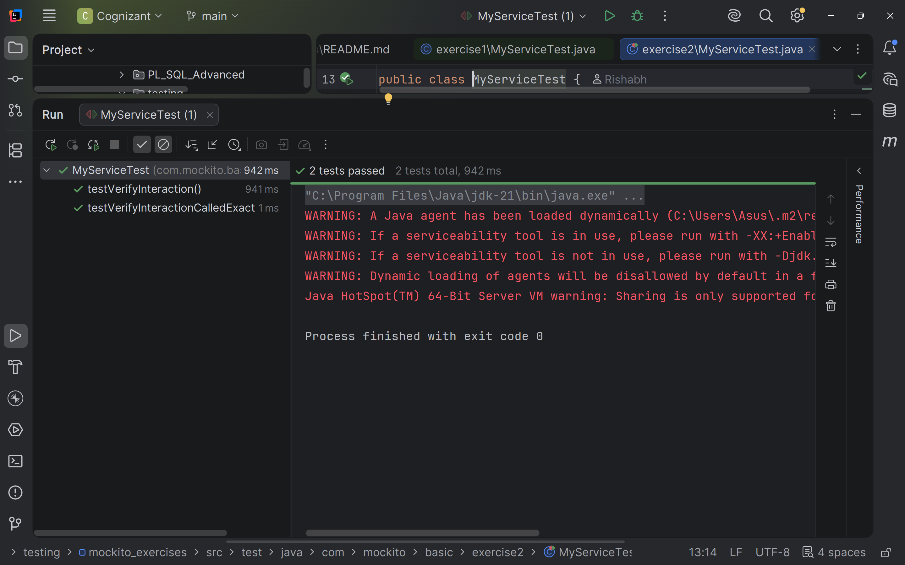
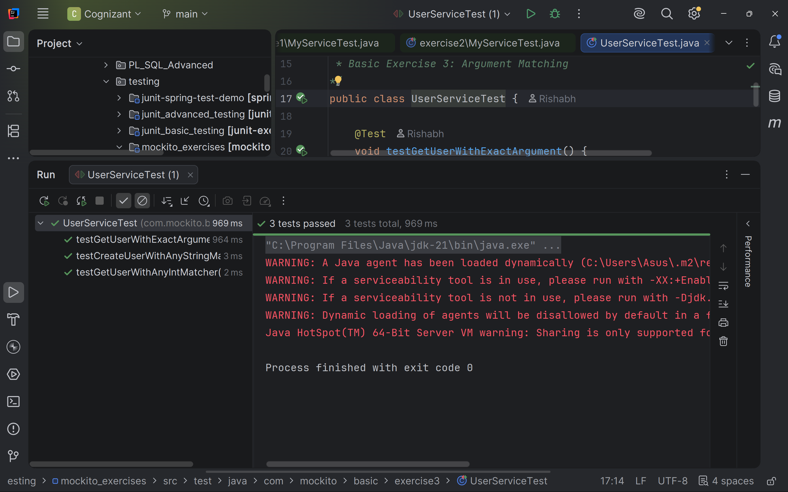
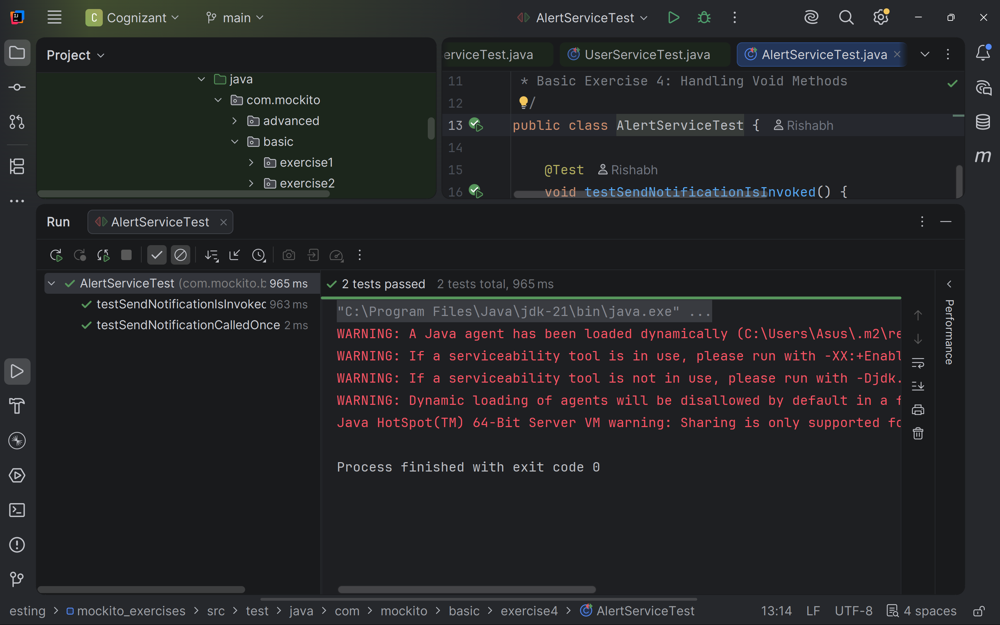
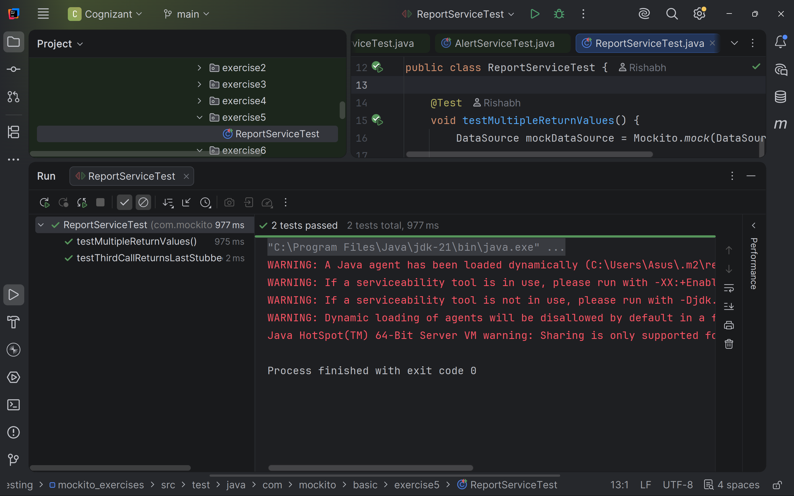
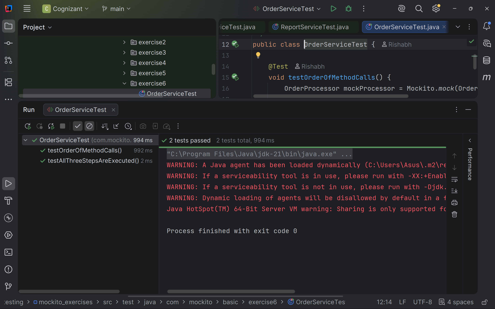
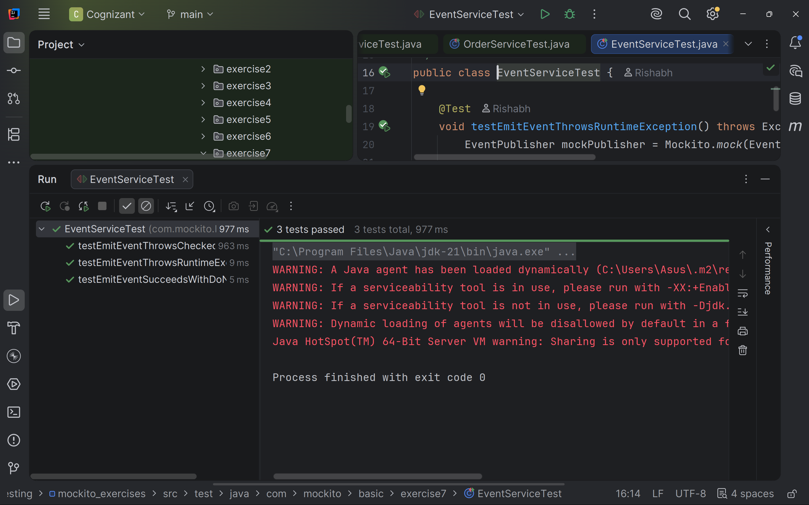

# Mockito Mocking Framework - Hands-on Exercises

A Maven project implementing all **Mockito Hands-on Exercises** and **Advanced Mockito Hands-on Exercises** as part of the **Cognizant Digital Nurture Deep Skilling** program.

This project demonstrates the practical usage of **Mockito** with **JUnit 5** for writing isolated and maintainable unit tests. The exercises cover mocking dependencies such as external APIs, repositories, REST clients, file systems, and network resources while following clean project organization and best testing practices.

---

# Table of Contents

* [Overview](#overview)
* [Hands-on Tracker](#hands-on-tracker)
* [Project Structure](#project-structure)
* [Technologies Used](#technologies-used)
* [How to Run](#how-to-run)
* [Basic Mockito Exercises](#basic-mockito-exercises)
* [Advanced Mockito Exercises](#advanced-mockito-exercises)
* [Mockito Concepts Covered](#mockito-concepts-covered)
* [Dependencies Used](#dependencies-used)
* [Final Completion Status](#final-completion-status)

---

# Overview

This project contains the complete implementation of **12 Mockito Hands-on Exercises**, divided into two categories:

* **Basic Mockito Exercises (7 Exercises)**
* **Advanced Mockito Exercises (5 Exercises)**

Each exercise has been implemented in its own package under both the production source (`src/main/java`) and the corresponding test source (`src/test/java`). This structure makes it easy to understand how business logic and unit tests relate to each other.

The project focuses on learning Mockito from beginner to intermediate level by implementing real-world testing scenarios such as mocking external APIs, repositories, REST clients, file operations, and network interactions.

---

# Hands-on Tracker

| Section  | Exercise   | Description                      | Status |
| -------- | ---------- | -------------------------------- | :----: |
| Basic    | Exercise 1 | Mocking and Stubbing             |    ✅   |
| Basic    | Exercise 2 | Verifying Interactions           |    ✅   |
| Basic    | Exercise 3 | Argument Matching                |    ✅   |
| Basic    | Exercise 4 | Handling Void Methods            |    ✅   |
| Basic    | Exercise 5 | Mocking with Multiple Returns    |    ✅   |
| Basic    | Exercise 6 | Verifying Interaction Order      |    ✅   |
| Basic    | Exercise 7 | Void Methods with Exceptions     |    ✅   |
| Advanced | Exercise 1 | Mocking Databases & Repositories |    ✅   |
| Advanced | Exercise 2 | Mocking External REST APIs       |    ✅   |
| Advanced | Exercise 3 | Mocking File I/O                 |    ✅   |
| Advanced | Exercise 4 | Mocking Network Interactions     |    ✅   |
| Advanced | Exercise 5 | Mocking Multiple Return Values   |    ✅   |

---

# Project Structure

```text
src
├── main
│   └── java
│       └── com
│           └── mockito
│               ├── basic
│               │   ├── exercise1
│               │   ├── exercise2
│               │   ├── exercise3
│               │   ├── exercise4
│               │   ├── exercise5
│               │   ├── exercise6
│               │   └── exercise7
│               │
│               └── advanced
│                   ├── exercise1
│                   ├── exercise2
│                   ├── exercise3
│                   ├── exercise4
│                   └── exercise5
│
└── test
    └── java
        └── com
            └── mockito
                ├── basic
                │   ├── exercise1
                │   ├── exercise2
                │   ├── exercise3
                │   ├── exercise4
                │   ├── exercise5
                │   ├── exercise6
                │   └── exercise7
                │
                └── advanced
                    ├── exercise1
                    ├── exercise2
                    ├── exercise3
                    ├── exercise4
                    └── exercise5
```

---

# Technologies Used

* Java
* Maven
* JUnit 5 (Jupiter)
* Mockito Core
* Mockito JUnit Jupiter Extension

---

# How to Run

Run all unit tests:

```bash
mvn test
```

Perform a clean build before executing the tests:

```bash
mvn clean test
```

---

# Basic Mockito Exercises

## Exercise 1 – Mocking and Stubbing

### Objective

Create a mock object for an external dependency, stub its methods using Mockito, and verify that the service behaves correctly without calling the real implementation.

### Concepts Covered

* Mock Objects
* Stubbing
* `when()`
* `thenReturn()`
* Assertions

### Source Code

* 📂 **Main Code:** [src/main/java/com/mockito/basic/exercise1](src/main/java/com/mockito/basic/exercise1)
* 🧪 **Test Code:** [src/test/java/com/mockito/basic/exercise1](src/test/java/com/mockito/basic/exercise1)

---
### Output Screenshot



---

## Exercise 2 – Verifying Interactions

### Objective

Verify that methods on mocked dependencies are invoked correctly during the execution of business logic.

### Concepts Covered

* `verify()`
* Method Invocation Verification
* Verification Count

### Source Code

* 📂 **Main Code:** [src/main/java/com/mockito/basic/exercise2](src/main/java/com/mockito/basic/exercise2)
* 🧪 **Test Code:** [src/test/java/com/mockito/basic/exercise2](src/test/java/com/mockito/basic/exercise2)

---
### Output Screenshot



---

## Exercise 3 – Argument Matching

### Objective

Verify interactions using Mockito's argument matchers instead of exact values.

### Concepts Covered

* `eq()`
* `anyInt()`
* `anyString()`
* Argument Matchers

### Source Code

* 📂 **Main Code:** [src/main/java/com/mockito/basic/exercise3](src/main/java/com/mockito/basic/exercise3)
* 🧪 **Test Code:** [src/test/java/com/mockito/basic/exercise3](src/test/java/com/mockito/basic/exercise3)

---
### Output Screenshot



---

## Exercise 4 – Handling Void Methods

### Objective

Test methods that do not return any value using Mockito's support for stubbing and verifying void methods.

### Concepts Covered

* `doNothing()`
* `verify()`
* Void Method Testing

### Source Code

* 📂 **Main Code:** [src/main/java/com/mockito/basic/exercise4](src/main/java/com/mockito/basic/exercise4)
* 🧪 **Test Code:** [src/test/java/com/mockito/basic/exercise4](src/test/java/com/mockito/basic/exercise4)

---
### Output Screenshot



---

## Exercise 5 – Mocking and Stubbing with Multiple Returns

### Objective

Stub a mocked method to return different values on consecutive invocations.

### Concepts Covered

* Consecutive Stubbing
* Chained `thenReturn()`
* Multiple Return Values

### Source Code

* 📂 **Main Code:** [src/main/java/com/mockito/basic/exercise5](src/main/java/com/mockito/basic/exercise5)
* 🧪 **Test Code:** [src/test/java/com/mockito/basic/exercise5](src/test/java/com/mockito/basic/exercise5)

---
### Output Screenshot



---

## Exercise 6 – Verifying Interaction Order

### Objective

Verify that methods are executed in the expected sequence using Mockito's `InOrder` verification.

### Concepts Covered

* `InOrder`
* Ordered Verification
* Interaction Sequence

Example Flow

```text
Validate Request
        ↓
Process Request
        ↓
Generate Response
```

### Source Code

* 📂 **Main Code:** [src/main/java/com/mockito/basic/exercise6](src/main/java/com/mockito/basic/exercise6)
* 🧪 **Test Code:** [src/test/java/com/mockito/basic/exercise6](src/test/java/com/mockito/basic/exercise6)

---
### Output Screenshot



---

## Exercise 7 – Handling Void Methods with Exceptions

### Objective

Test void methods that throw exceptions and verify proper exception handling using Mockito.

### Concepts Covered

* `doThrow()`
* Exception Testing
* Void Methods
* Negative Test Cases

### Source Code

* 📂 **Main Code:** [src/main/java/com/mockito/basic/exercise7](src/main/java/com/mockito/basic/exercise7)
* 🧪 **Test Code:** [src/test/java/com/mockito/basic/exercise7](src/test/java/com/mockito/basic/exercise7)

---
### Output Screenshot



---

# Advanced Mockito Exercises

## Exercise 1 – Mocking Databases and Repositories

### Objective

Test a service layer independently of the database by mocking the repository and stubbing repository methods to return predefined data.

### Concepts Covered

* Repository Mocking
* Dependency Injection
* Service Layer Testing
* Database Isolation

### Source Code

* 📂 **Main Code:** [src/main/java/com/mockito/advanced/exercise1](src/main/java/com/mockito/advanced/exercise1)
* 🧪 **Test Code:** [src/test/java/com/mockito/advanced/exercise1](src/test/java/com/mockito/advanced/exercise1)

---

## Exercise 2 – Mocking External REST Services

### Objective

Mock REST client interactions to test service logic without invoking actual external APIs.

### Concepts Covered

* REST Client Mocking
* API Response Stubbing
* External Dependency Isolation

### Source Code

* 📂 **Main Code:** [src/main/java/com/mockito/advanced/exercise2](src/main/java/com/mockito/advanced/exercise2)
* 🧪 **Test Code:** [src/test/java/com/mockito/advanced/exercise2](src/test/java/com/mockito/advanced/exercise2)

---

## Exercise 3 – Mocking File I/O

### Objective

Test file processing logic by mocking file reader and writer classes instead of accessing the real file system.

### Concepts Covered

* File Reader Mocking
* File Writer Mocking
* File Processing Tests
* Dependency Isolation

### Source Code

* 📂 **Main Code:** [src/main/java/com/mockito/advanced/exercise3](src/main/java/com/mockito/advanced/exercise3)
* 🧪 **Test Code:** [src/test/java/com/mockito/advanced/exercise3](src/test/java/com/mockito/advanced/exercise3)

---

## Exercise 4 – Mocking Network Interactions

### Objective

Simulate network communication by mocking network clients and verifying the complete connection workflow.

### Concepts Covered

* Network Client Mocking
* Connection Testing
* Communication Flow
* Service Isolation

### Source Code

* 📂 **Main Code:** [src/main/java/com/mockito/advanced/exercise4](src/main/java/com/mockito/advanced/exercise4)
* 🧪 **Test Code:** [src/test/java/com/mockito/advanced/exercise4](src/test/java/com/mockito/advanced/exercise4)

---

## Exercise 5 – Mocking Multiple Return Values

### Objective

Stub repository methods to return different values on consecutive invocations and verify the service behavior for repeated calls.

### Concepts Covered

* Consecutive Stubbing
* Multiple Return Values
* Repository Mocking
* Sequential Testing

### Source Code

* 📂 **Main Code:** [src/main/java/com/mockito/advanced/exercise5](src/main/java/com/mockito/advanced/exercise5)
* 🧪 **Test Code:** [src/test/java/com/mockito/advanced/exercise5](src/test/java/com/mockito/advanced/exercise5)

---

# Mockito Concepts Covered

The following Mockito concepts are demonstrated throughout this project:

## Mock Creation

* Creating mock objects
* Mocking interfaces and classes
* Dependency isolation

## Stubbing

* `when()`
* `thenReturn()`
* Consecutive stubbing
* Mocking multiple return values

## Verification

* `verify()`
* Verification count
* Interaction verification
* Ordered verification (`InOrder`)

## Argument Matchers

* `eq()`
* `any()`
* `anyString()`
* `anyInt()`

## Void Method Testing

* `doNothing()`
* `doThrow()`
* Exception testing

## Advanced Mocking

* Repository Layer Mocking
* REST API Mocking
* File I/O Mocking
* Network Client Mocking

---

# Dependencies Used

The project uses the following Maven dependencies:

* **JUnit Jupiter** – Test execution framework and assertions
* **Mockito Core** – Mock creation, stubbing, and verification
* **Mockito JUnit Jupiter** – Integration between Mockito and JUnit 5

---
# Final Completion Status

| Module                       |   Exercises |      Status     |
| ---------------------------- | ----------: | :-------------: |
| Basic Mockito Exercises      |   **7 / 7** |   ✅ Completed   |
| Advanced Mockito Exercises   |   **5 / 5** |   ✅ Completed   |
| **Total Hands-on Exercises** | **12 / 12** | **✅ Completed** |

---