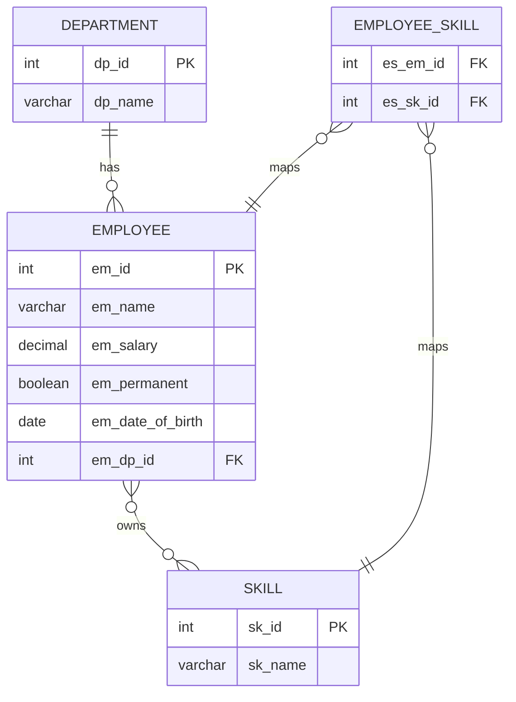
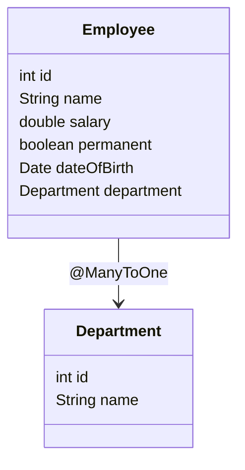
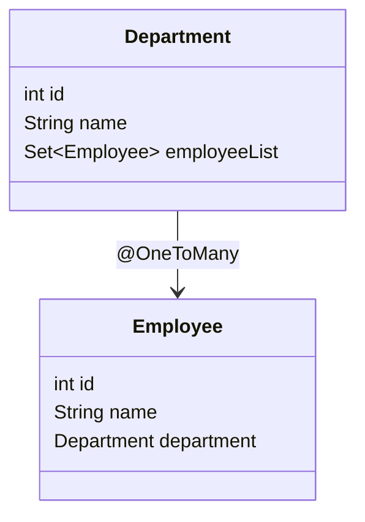
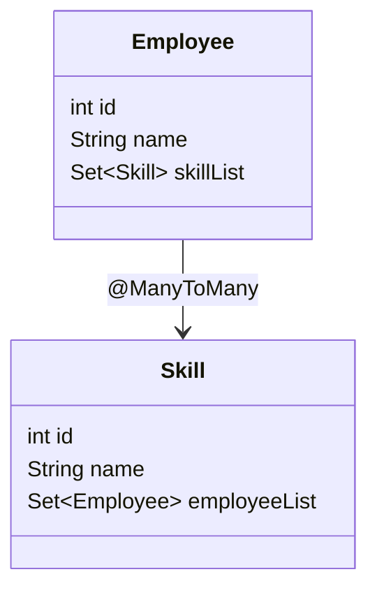

# Spring Data JPA with Hibernate - Hands-on 2

A Spring Boot application implementing Spring Data JPA Query Methods and Hibernate ORM relationships as part of Cognizant Digital Nurture DeepSkilling.

## Table of Contents

- [Overview](#overview)
- [Hands-on Tracker](#hands-on-tracker)
- [ER Diagram](#er-diagram)
- [Relationship Mapping Diagrams](#relationship-mapping-diagrams)
- [Query Method Implementation](#query-method-implementation)
- [Database Scripts](#database-scripts)
- [Run Application](#run-application)
- [Final Completion Status](#final-completion-status)

## Overview

This project demonstrates:

- Spring Data JPA Query Methods
- Country search using query methods
- Stock filtering using query methods
- Payroll table mapping
- `@ManyToOne` relationship
- `@OneToMany` relationship
- `@ManyToMany` relationship
- EAGER and LAZY fetching behavior
- Hibernate entity mapping

## Hands-on Tracker

| Hands-on | Topic | Status | Direct Code Links |
|---|---|---|---|
| Hands-on 1 | Query Methods on Country table | Completed | [Country](src/main/java/com/cognizant/ormlearn/model/Country.java) • [CountryRepository](src/main/java/com/cognizant/ormlearn/repository/CountryRepository.java) • [OrmLearnApplication](src/main/java/com/cognizant/ormlearn/OrmLearnApplication.java) |
| Hands-on 2 | Query Methods on Stock table | Completed | [Stock](src/main/java/com/cognizant/ormlearn/model/Stock.java) • [StockRepository](src/main/java/com/cognizant/ormlearn/repository/StockRepository.java) • [OrmLearnApplication](src/main/java/com/cognizant/ormlearn/OrmLearnApplication.java) |
| Hands-on 3 | Payroll tables and bean mapping | Completed | [Employee](src/main/java/com/cognizant/ormlearn/model/Employee.java) • [Department](src/main/java/com/cognizant/ormlearn/model/Department.java) • [Skill](src/main/java/com/cognizant/ormlearn/model/Skill.java) |
| Hands-on 4 | Many-to-One mapping between Employee and Department | Completed | [Employee](src/main/java/com/cognizant/ormlearn/model/Employee.java) • [Department](src/main/java/com/cognizant/ormlearn/model/Department.java) • [EmployeeService](src/main/java/com/cognizant/ormlearn/service/EmployeeService.java) • [DepartmentService](src/main/java/com/cognizant/ormlearn/service/DepartmentService.java) |
| Hands-on 5 | One-to-Many mapping between Department and Employee | Completed | [Department](src/main/java/com/cognizant/ormlearn/model/Department.java) • [Employee](src/main/java/com/cognizant/ormlearn/model/Employee.java) |
| Hands-on 6 | Many-to-Many mapping between Employee and Skill | Completed | [Employee](src/main/java/com/cognizant/ormlearn/model/Employee.java) • [Skill](src/main/java/com/cognizant/ormlearn/model/Skill.java) • [SkillService](src/main/java/com/cognizant/ormlearn/service/SkillService.java) |

## ER Diagram



## Relationship Mapping Diagrams

### Many-to-One: Employee to Department



### One-to-Many: Department to Employee



### Many-to-Many: Employee to Skill



## Query Method Implementation

### Hands-on 1: Country Query Methods

Implemented query method features:

- Search countries containing text
- Search countries containing text with ascending order
- Search countries starting with a given alphabet

Code links:

- [CountryRepository.java](src/main/java/com/cognizant/ormlearn/repository/CountryRepository.java)
- [Country.java](src/main/java/com/cognizant/ormlearn/model/Country.java)
- [OrmLearnApplication.java](src/main/java/com/cognizant/ormlearn/OrmLearnApplication.java)

### Hands-on 2: Stock Query Methods

Implemented query method features:

- Get Facebook stock records for September 2019
- Get Google stock records where close price is greater than 1250
- Find top 3 stocks with highest volume
- Find 3 lowest Netflix stock records

Code links:

- [StockRepository.java](src/main/java/com/cognizant/ormlearn/repository/StockRepository.java)
- [Stock.java](src/main/java/com/cognizant/ormlearn/model/Stock.java)
- [OrmLearnApplication.java](src/main/java/com/cognizant/ormlearn/OrmLearnApplication.java)

## Database Scripts

Use the SQL files available in the resources folder.

```sql
source src/main/resources/data.sql;
```

Main resource files:

- [application.properties](src/main/resources/application.properties)
- [data.sql](src/main/resources/data.sql)
- [notes.txt](src/main/resources/notes.txt)

## Run Application

Build the project:

```bash
mvn clean install
```

Run the Spring Boot application:

```bash
mvn spring-boot:run
```

## Final Completion Status

| Hands-on | Completion |
|---|---|
| Hands-on 1 | Completed |
| Hands-on 2 | Completed |
| Hands-on 3 | Completed |
| Hands-on 4 | Completed |
| Hands-on 5 | Completed |
| Hands-on 6 | Completed |

## Summary

This project successfully implements Spring Data JPA Query Methods and Hibernate relationship mappings using a single Spring Boot application.

Implemented entities:

- Country
- Stock
- Employee
- Department
- Skill

Implemented relationships:

- Employee to Department using `@ManyToOne`
- Department to Employee using `@OneToMany`
- Employee to Skill using `@ManyToMany`