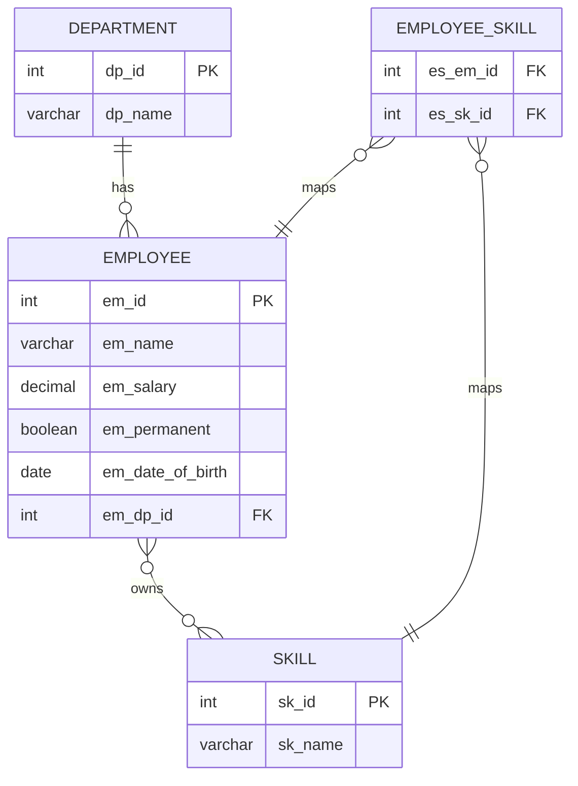
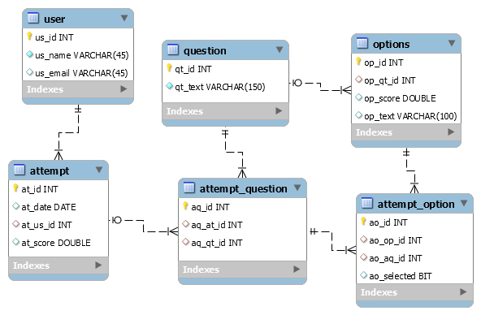
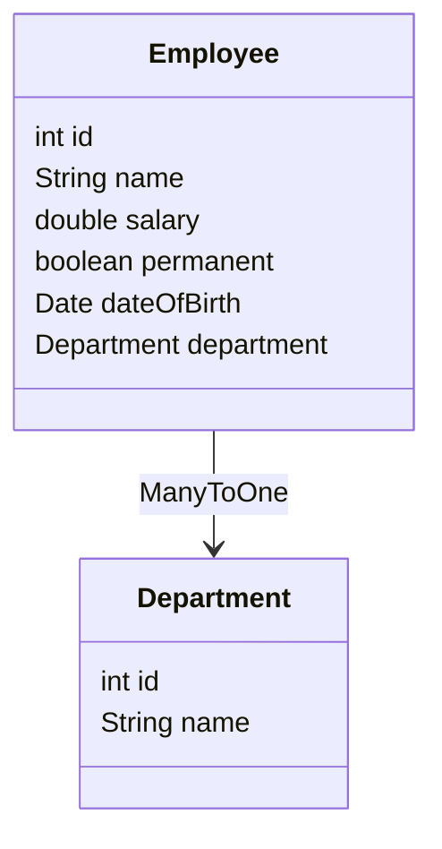
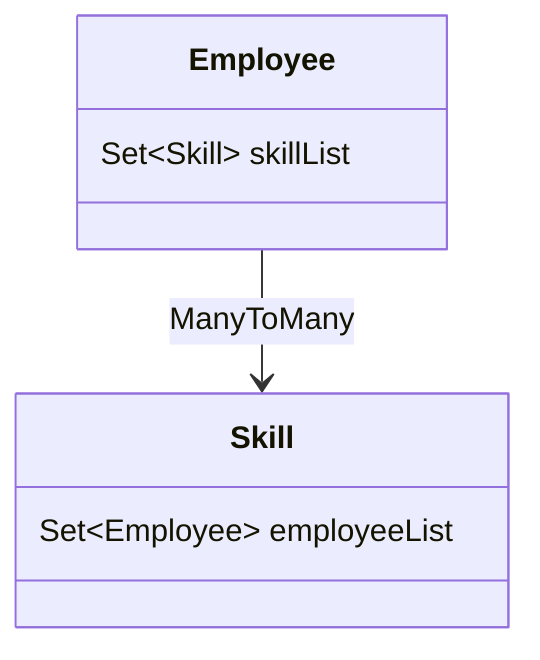

# Spring Data JPA with Hibernate - Hands-on 3

A Spring Boot application implementing Hibernate Query Language (HQL), JPQL, Native Queries, Criteria Query, Aggregate Functions, Fetch Join Optimization, and Quiz Management System using Spring Data JPA as part of Cognizant Digital Nurture DeepSkilling.

---

# Table of Contents

- [Overview](#overview)
- [Hands-on Tracker](#hands-on-tracker)
- [Employee Module ER Diagram](#employee-module-er-diagram)
- [Quiz Module Schema](#quiz-module-schema)
- [Relationship Mapping Diagrams](#relationship-mapping-diagrams)
- [Hands-on Implementations](#hands-on-implementations)
- [Database Scripts](#database-scripts)
- [Run Application](#run-application)
- [Final Completion Status](#final-completion-status)

---

# Overview

This project demonstrates:

- Hibernate Query Language (HQL)
- Java Persistence Query Language (JPQL)
- Fetch Join
- Aggregate Functions
- Native SQL Queries
- Criteria Query
- Quiz Management System
- Employee Management System
- Hibernate Performance Optimization
- Spring Data JPA Repository Queries

---

# Hands-on Tracker

| Hands-on | Topic | Status | Direct Code Links |
|---|---|---|---|
| Hands-on 1 | Introduction to HQL & JPQL | Completed | [EmployeeRepository](src/main/java/com/rishbootdev/ormqueryhandson/repository/EmployeeRepository.java) |
| Hands-on 2 | Get Permanent Employees using HQL | Completed | [EmployeeRepository](src/main/java/com/rishbootdev/ormqueryhandson/repository/EmployeeRepository.java) • [EmployeeService](src/main/java/com/rishbootdev/ormqueryhandson/service/EmployeeService.java) • [OrmQueryHandsonApplication](src/main/java/com/rishbootdev/ormqueryhandson/OrmQueryHandsonApplication.java) |
| Hands-on 3 | Fetch Quiz Attempt Details using HQL | Completed | [Attempt](src/main/java/com/rishbootdev/ormqueryhandson/model/Attempt.java) • [AttemptRepository](src/main/java/com/rishbootdev/ormqueryhandson/repository/AttemptRepository.java) • [AttemptService](src/main/java/com/rishbootdev/ormqueryhandson/service/AttemptService.java) |
| Hands-on 4 | Get Average Salary using HQL | Completed | [EmployeeRepository](src/main/java/com/rishbootdev/ormqueryhandson/repository/EmployeeRepository.java) • [EmployeeService](src/main/java/com/rishbootdev/ormqueryhandson/service/EmployeeService.java) |
| Hands-on 5 | Native Query | Completed | [EmployeeRepository](src/main/java/com/rishbootdev/ormqueryhandson/repository/EmployeeRepository.java) |
| Hands-on 6 | Criteria Query | Completed | Criteria Query Implementation |

---

# Employee Module ER Diagram



---

# Quiz Module Schema

The following schema is implemented for **Hands-on 3 - Fetch Quiz Attempt Details using HQL**.

<p align="center">

</p>

---

# Relationship Mapping Diagrams

## Employee → Department



---

## Employee ↔ Skill



---

# Hands-on Implementations

## Hands-on 1

### Introduction to HQL & JPQL

Implemented concepts

- Hibernate Query Language
- Java Persistence Query Language
- @Query Annotation
- Repository Query Methods

Implementation Files

- EmployeeRepository.java

---

## Hands-on 2

### Get Permanent Employees using HQL

Implemented Features

- Custom HQL Queries
- Fetch Join
- LEFT JOIN FETCH
- Optimized Hibernate Queries
- Lazy Loading
- Eager Loading Optimization

Implementation Files

- EmployeeRepository.java
- EmployeeService.java
- OrmQueryHandsonApplication.java

Sample Query

```java
@Query("SELECT e FROM Employee e LEFT JOIN FETCH e.department LEFT JOIN FETCH e.skillList WHERE e.permanent = true")
List<Employee> getAllPermanentEmployees();
```

Implemented Concepts

- HQL
- Fetch Join
- JOIN FETCH
- Performance Optimization
- LazyInitializationException Resolution

---

## Hands-on 3

### Fetch Quiz Attempt Details using HQL

This hands-on demonstrates a complete Quiz Management System using Hibernate Fetch Join.

Entities Implemented

- User
- Attempt
- AttemptQuestion
- AttemptOption
- Question
- Option

Repositories

- AttemptRepository

Services

- AttemptService

Implemented Features

- Fetch User Details
- Fetch Quiz Attempt
- Fetch Questions
- Fetch Options
- Fetch Correct Answers
- Fetch Selected Answers
- Fetch Scores
- Optimized HQL Fetch Join
  Implementation Files

- Attempt.java
- AttemptQuestion.java
- AttemptOption.java
- Question.java
- Option.java
- User.java
- AttemptRepository.java
- AttemptService.java

Sample HQL

```java
SELECT a
FROM Attempt a
LEFT JOIN FETCH a.user
LEFT JOIN FETCH a.attemptQuestionList aq
LEFT JOIN FETCH aq.question
LEFT JOIN FETCH aq.attemptOptionList ao
LEFT JOIN FETCH ao.option
WHERE a.user.id=:userId
AND a.id=:attemptId
```

Implemented Concepts

- Multiple Fetch Join
- Nested Object Mapping
- Hibernate Fetch Optimization
- Bidirectional Relationships
- Quiz Attempt Report Generation

---

## Hands-on 4

### Get Average Salary using HQL

Implemented aggregate functions using Hibernate Query Language.

Features

- AVG()
- Named Parameters
- @Param Annotation
- Department-wise Salary Calculation

Implementation Files

- EmployeeRepository.java
- EmployeeService.java
- OrmQueryHandsonApplication.java

Sample Query

```java
@Query("SELECT AVG(e.salary) FROM Employee e WHERE e.department.id=:id")
double getAverageSalary(@Param("id") int id);
```

Implemented Concepts

- Aggregate Functions
- AVG()
- Named Parameters
- Repository Queries

---

## Hands-on 5

### Native Query

Implemented native SQL queries using Spring Data JPA.

Features

- Native SQL
- Employee Retrieval
- Repository Native Queries

Implementation Files

- EmployeeRepository.java
- EmployeeService.java

Sample Query

```java
@Query(value="SELECT * FROM employee", nativeQuery=true)
List<Employee> getAllEmployeesNative();
```

Implemented Concepts

- Native SQL
- Repository Native Queries
- Database Specific Queries

---

## Hands-on 6

### Criteria Query

Implemented dynamic query generation using Criteria API.

Implemented Concepts

- CriteriaBuilder
- CriteriaQuery
- Root
- Predicate
- Dynamic Query Building

Criteria Query
```

---

# Database Scripts

Use the SQL scripts available inside the resources folder.

Employee Payroll Database

```sql
source payroll.sql;
```

Quiz Database

```sql
source quiz.sql;
```

Main Resource Files

- application.properties
- payroll.sql
- quiz.sql

---

# Run Application

Build the project

```bash
mvn clean install
```

Run the application

```bash
mvn spring-boot:run
```

---

# Learning Outcomes

After completing this project, you will understand:

- Hibernate Query Language (HQL)
- Java Persistence Query Language (JPQL)
- Spring Data JPA Repository Queries
- @Query Annotation
- Fetch Join Optimization
- Lazy Loading
- Eager Loading
- Aggregate Functions
- Native SQL Queries
- Criteria API
- Dynamic Query Building
- Entity Relationships
- Performance Optimization using Fetch Join

---

# Final Completion Status

| Hands-on | Completion |
|---|---|
| Hands-on 1 | Completed |
| Hands-on 2 | Completed |
| Hands-on 3 | Completed |
| Hands-on 4 | Completed |
| Hands-on 5 | Completed |
| Hands-on 6 | Completed |

---

# Summary

This project successfully implements Hibernate Query Language (HQL), Java Persistence Query Language (JPQL), Fetch Join Optimization, Native SQL Queries, Aggregate Functions, and Criteria Query using Spring Data JPA and Hibernate.

Implemented Modules

### Employee Management

- Employee
- Department
- Skill

Features

- HQL Queries
- Fetch Join
- Aggregate Functions
- Native Queries

### Quiz Management

- User
- Attempt
- AttemptQuestion
- AttemptOption
- Question
- Option

Features

- Quiz Attempt Retrieval
- Nested Fetch Join
- Complete Quiz Report Generation
- Optimized Hibernate Queries

Overall Concepts Covered

- HQL
- JPQL
- Fetch Join
- Lazy Loading
- Eager Loading
- Native SQL
- Aggregate Functions
- Criteria API
- Dynamic Query Building
- Spring Data JPA
- Hibernate ORM
- Repository Pattern

This Spring Boot application demonstrates all the required hands-on implementations from the **Spring Data JPA with Hibernate - Hands-on 3** document using a single integrated project following the Cognizant Digital Nurture DeepSkilling curriculum.