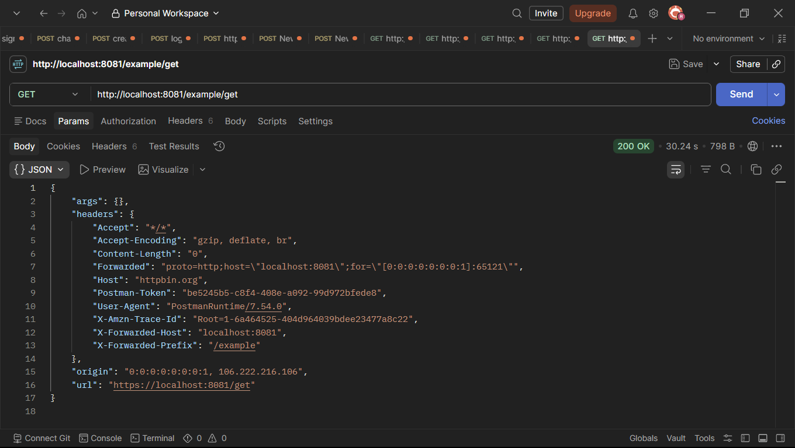
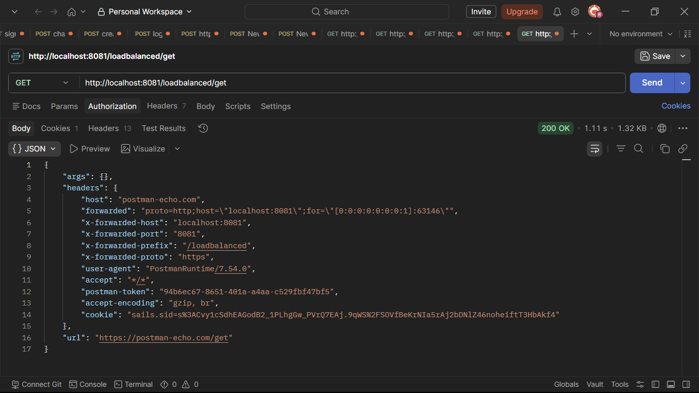
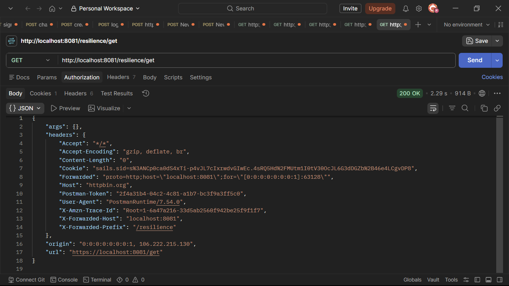

# API Gateway Load Balancing Exercises

A complete **Spring Boot 3** and **Spring Cloud Gateway** project implementing all hands-on exercises from **Sample Hands-on Exercises on Edge Services and API Gateway with Spring Boot 3 and Spring Cloud**.

This project demonstrates how an **API Gateway** acts as an edge service by routing client requests, applying global filters, performing client-side load balancing, and implementing resilience patterns using **Resilience4j Circuit Breaker**.

---

# Table of Contents

- Overview
- Technology Stack
- Project Features
- Project Architecture
- Hands-on Completion Tracker
- Project Structure
- Exercise 1 – Implementing Edge Services for Routing and Filtering
- Exercise 2 – Load Balancing in an API Gateway
- Exercise 3 – Resilience Patterns in an API Gateway
- Configuration Summary
- Maven Dependencies
- Running the Application
- Testing the Gateway

---

# Overview

This hands-on project demonstrates the implementation of modern **API Gateway** capabilities using **Spring Boot 3**, **Spring Cloud Gateway**, and **Spring Cloud**.

The exercises focus on:

- API Routing
- Edge Services
- Request Filtering
- Global Gateway Filters
- Client-side Load Balancing
- Spring Cloud LoadBalancer
- Resilience Patterns
- Circuit Breaker
- Fallback Mechanism
- Gateway Monitoring

The implementation follows the concepts and exercises provided in the hands-on document.

---

# Technology Stack

| Technology | Version |
|------------|---------|
| Java | 21 |
| Spring Boot | 3.x |
| Spring Cloud | 2023.x |
| Spring Cloud Gateway | Latest Compatible |
| Spring Cloud LoadBalancer | Latest Compatible |
| Resilience4j | Latest Compatible |
| Maven | 3.x |
| Gateway Port | **8081** |

---

# Project Features

- Spring Cloud Gateway
- Route Predicates
- Gateway Filters
- Global Logging Filter
- Request Logging
- Response Logging
- Spring Cloud LoadBalancer
- Random Load Balancing
- Circuit Breaker
- Fallback Controller
- Spring Boot Actuator
- Health Monitoring

---

# Project Architecture

```text
                         Client
                            │
                            ▼
                 Spring Cloud Gateway
                            │
      ┌─────────────────────┼─────────────────────┐
      │                     │                     │
      ▼                     ▼                     ▼
 Logging Filter      Load Balancer       Circuit Breaker
      │                     │                     │
      ▼                     ▼                     ▼
External Service      Example Service      Fallback API
```

---

# Hands-on Completion Tracker

| Status | Exercise | Description |
|----------|-----------|------------|
| ✅ Completed | Exercise 1 | Implementing Edge Services for Routing and Filtering |
| ✅ Completed | Exercise 2 | Load Balancing in an API Gateway |
| ✅ Completed | Exercise 3 | Resilience Patterns in an API Gateway |

---

# Project Structure

```text
api-gateway-load-balancing-exercises
│
├── outputs
│   ├── exercise1.png
│   ├── exercise2.png
│   └── exercise3.png
│
├── src
│   ├── main
│   │
│   ├── java
│   │   └── com
│   │       └── cognizant
│   │           └── apigateway
│   │
│   │               ApiGatewayLoadBalancingExercisesApplication.java
│   │
│   │               config
│   │               ├── LoadBalancerConfiguration.java
│   │               └── ResilienceConfiguration.java
│   │
│   │               controller
│   │               └── FallbackController.java
│   │
│   │               filter
│   │               └── LoggingFilter.java
│   │
│   └── resources
│       └── application.yml
│
├── pom.xml
└── README.md
```

---

# Exercise 1 – Implementing Edge Services for Routing and Filtering

## Objective

Implement an API Gateway that routes incoming client requests to backend services while applying a custom global logging filter.

---

## Concepts Covered

- Spring Cloud Gateway
- Route Predicates
- Route Configuration
- Global Gateway Filters
- Request Logging
- Response Logging

---

## Implemented Features

- Spring Cloud Gateway configuration
- Path Predicate Routing
- `/example/**` route
- Global Logging Filter
- Request URI logging
- Response Status logging
- Non-blocking request processing using Spring WebFlux

---

## Files Implemented

| File | Purpose |
|------|----------|
| ApiGatewayLoadBalancingExercisesApplication.java | Main Spring Boot Application |
| LoggingFilter.java | Global Request Logging Filter |
| application.yml | Gateway Route Configuration |

---

## Gateway Route

```text
/example/**

↓

Logging Filter

↓

External Service
```

---

## Test Command

```bash
curl http://localhost:8081/example/get
```

---

## Expected Output

- Incoming request logged
- Request routed successfully
- Response status logged

---

## Output Screenshot

```markdown

```

---

# Exercise 2 – Load Balancing in an API Gateway

## Objective

Implement client-side load balancing using **Spring Cloud Gateway** and **Spring Cloud LoadBalancer**.

---

## Concepts Covered

- Spring Cloud Gateway
- Spring Cloud LoadBalancer
- Service Discovery
- Random Load Balancing
- Static Discovery Client

---

## Implemented Features

- `lb://example-service`
- Random Load Balancer
- Multiple backend service instances
- Static Service Discovery
- Gateway Route Mapping

---

## Files Implemented

| File | Purpose |
|------|----------|
| LoadBalancerConfiguration.java | Random Load Balancer Configuration |
| application.yml | Load Balanced Route Configuration |

---

## Request Flow

```text
Client

↓

Gateway

↓

Random Load Balancer

↓

Service Instance A
or
Service Instance B
```

---

## Test Command

```bash
curl http://localhost:8081/loadbalanced/get
```

Run the above command multiple times to observe requests distributed across different service instances.

---

## Expected Output

- Requests distributed randomly
- Gateway forwards requests successfully
- Load Balancer selects backend instance

---

## Output Screenshot

```markdown

```

---
# Exercise 3 – Resilience Patterns in an API Gateway

## Objective

Implement resilience patterns using **Resilience4j Circuit Breaker** integrated with **Spring Cloud Gateway** to improve system fault tolerance and provide graceful fallback responses when downstream services become unavailable.

---

## Concepts Covered

- Resilience4j
- Circuit Breaker Pattern
- Fault Tolerance
- Gateway Filters
- Fallback Mechanism
- Spring Boot Actuator
- Health Monitoring

---

## Implemented Features

- Spring Cloud Gateway Circuit Breaker Filter
- Circuit Breaker instance named **exampleCircuitBreaker**
- Sliding Window Configuration
- Failure Rate Threshold Configuration
- Automatic Fallback Routing
- Health Indicator Registration
- Actuator Integration

---

## Files Implemented

| File | Purpose |
|------|----------|
| ResilienceConfiguration.java | Circuit Breaker Configuration |
| FallbackController.java | Handles fallback responses |
| application.yml | Resilience4j Configuration |

---

## Request Flow

```text
                Client
                   │
                   ▼
             API Gateway
                   │
                   ▼
          Circuit Breaker Filter
                   │
        ┌──────────┴──────────┐
        │                     │
        ▼                     ▼
 Backend Service      Fallback Controller
```

---

## Circuit Breaker Workflow

```text
Request

↓

Gateway

↓

Circuit Breaker

↓

Backend Available ?
      │
 ┌────┴────┐
 │         │
Yes        No
 │         │
 ▼         ▼
Backend   Fallback API
Response  Response
```

---

## Test Commands

### Gateway Route

```bash
curl http://localhost:8081/resilience/get
```

### Fallback Endpoint

```bash
curl http://localhost:8081/fallback/example
```

---

## Expected Output

- Gateway forwards requests normally while backend is healthy.
- Circuit Breaker monitors failures.
- Requests are redirected to the fallback endpoint when the backend service is unavailable.
- Health information is exposed through Spring Boot Actuator.

---

## Output Screenshot

```markdown

```

---

# Configuration Summary

| Configuration | Purpose |
|---------------|---------|
| Gateway Routes | Request Routing |
| Route Predicates | Route Matching |
| Global Filter | Request Logging |
| Spring Cloud LoadBalancer | Client-side Load Balancing |
| Circuit Breaker | Fault Tolerance |
| Fallback Controller | Graceful Error Handling |
| Spring Boot Actuator | Monitoring & Health Checks |

---

# Maven Dependencies

The project uses the following major dependencies:

- Spring Boot Starter WebFlux
- Spring Cloud Gateway
- Spring Cloud LoadBalancer
- Spring Boot Starter Actuator
- Resilience4j Spring Boot 3
- Lombok (Optional)
- Spring Boot Starter Test

---

# Running the Application

## Clone the Repository

```bash
git clone <repository-url>
```

---

## Navigate to Project

```bash
cd api-gateway-load-balancing-exercises
```

---

## Build the Project

```bash
mvn clean install
```

---

## Run the Application

```bash
mvn spring-boot:run
```

The Gateway application will start on:

```text
http://localhost:8081
```

---

# Testing the Gateway

## Exercise 1

```bash
curl http://localhost:8081/example/get
```

---

## Exercise 2

```bash
curl http://localhost:8081/loadbalanced/get
```

Execute the command multiple times to verify load balancing between service instances.

---

## Exercise 3

```bash
curl http://localhost:8081/resilience/get
```

---

## Fallback Endpoint

```bash
curl http://localhost:8081/fallback/example
```

---

# Important Endpoints

| Purpose | URL |
|----------|-----|
| Exercise 1 Routing | `http://localhost:8081/example/get` |
| Exercise 2 Load Balancing | `http://localhost:8081/loadbalanced/get` |
| Exercise 3 Circuit Breaker | `http://localhost:8081/resilience/get` |
| Fallback Endpoint | `http://localhost:8081/fallback/example` |
| Gateway Routes | `http://localhost:8081/actuator/gateway/routes` |
| Health Endpoint | `http://localhost:8081/actuator/health` |

---

# Exercise Mapping

| Exercise | PDF Requirement | Project Implementation |
|-----------|-----------------|------------------------|
| Exercise 1 | Implement Edge Services for Routing and Filtering | Gateway Routes + Global Logging Filter |
| Exercise 2 | Implement Load Balancing in API Gateway | Spring Cloud LoadBalancer + Random Load Balancer |
| Exercise 3 | Implement Resilience Patterns | Resilience4j Circuit Breaker + Fallback Controller |

---