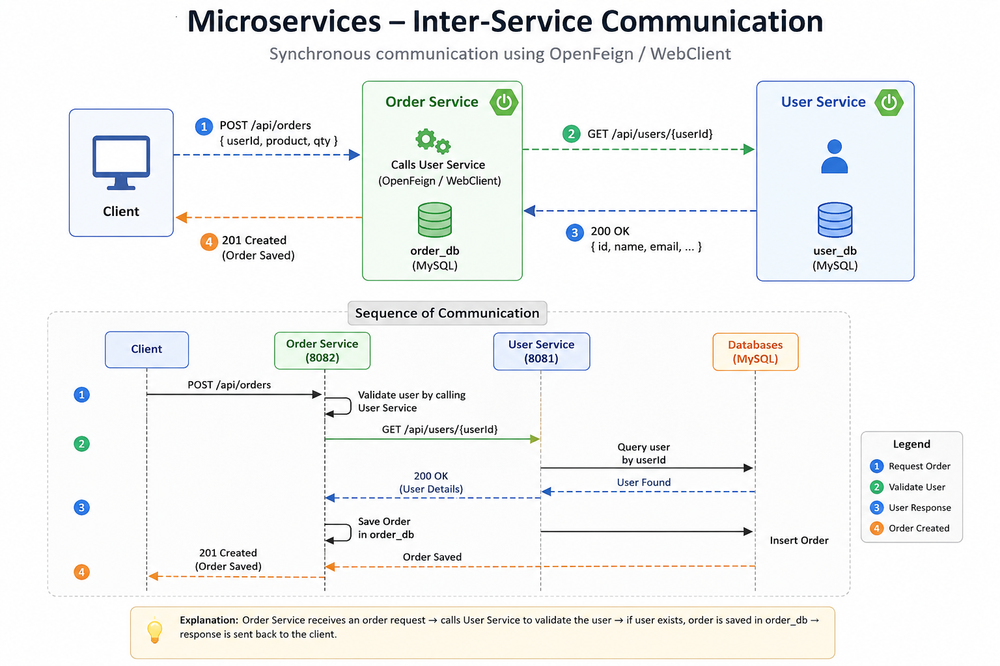
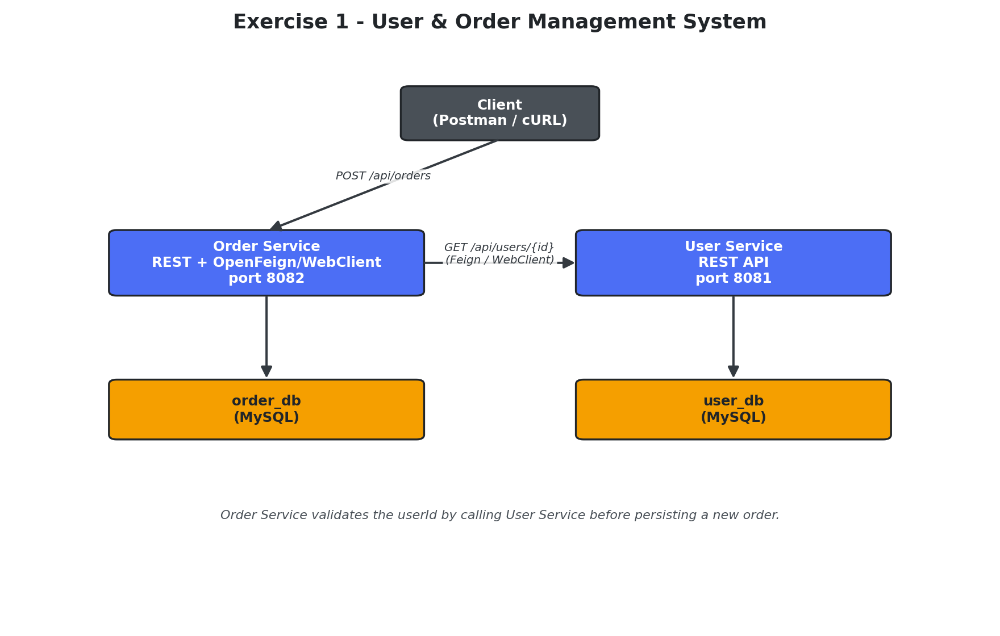
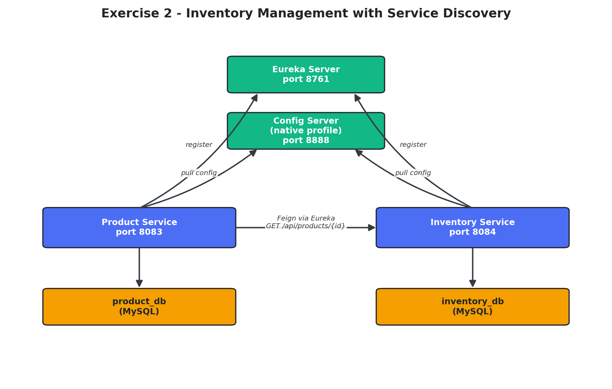
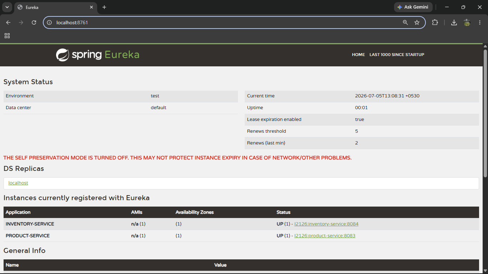
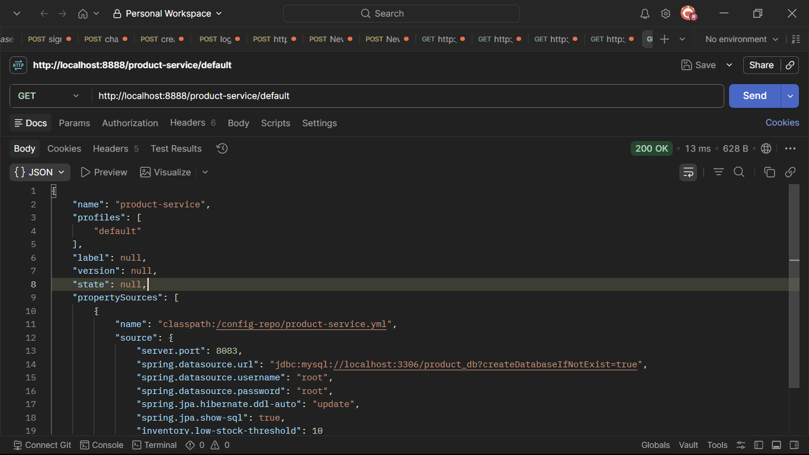
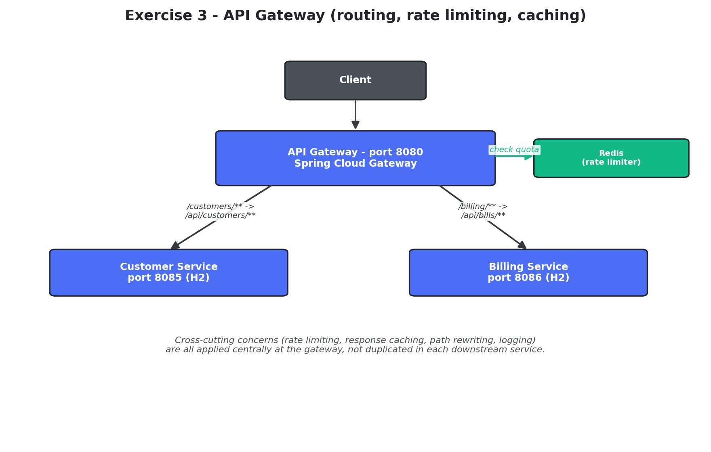
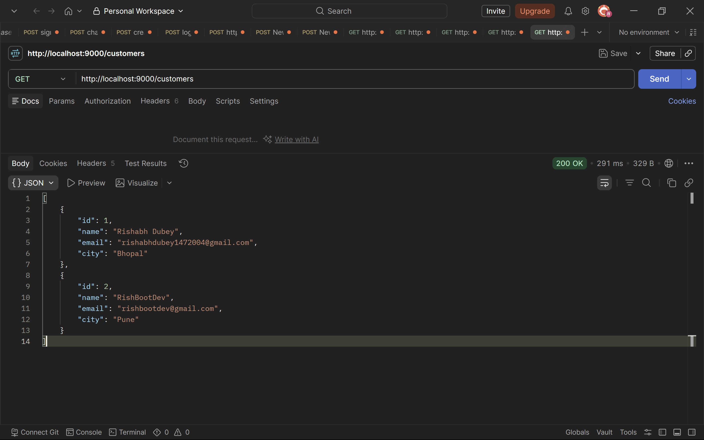
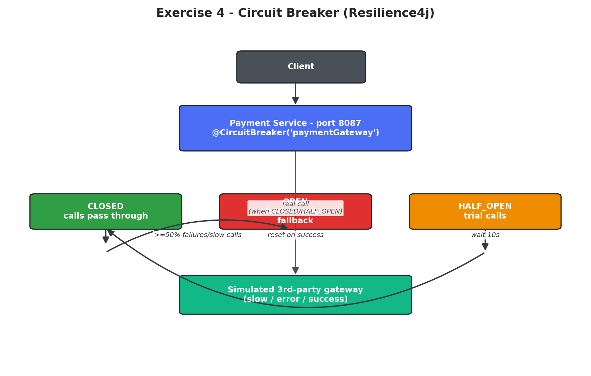
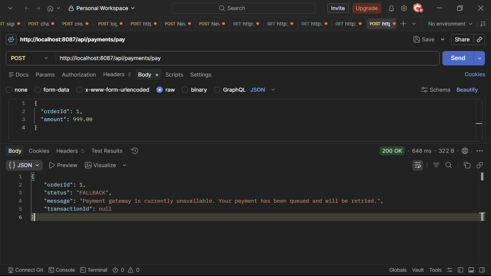

#  Microservices using Spring Boot 3 Exercises

A collection of hands-on **Spring Boot 3** microservices exercises demonstrating the core concepts of distributed systems using the **Spring Cloud** ecosystem.

The repository covers:

- REST-based Inter-Service Communication
- OpenFeign, WebClient & RestClient
- Service Discovery with Eureka
- Centralized Configuration Server
- API Gateway
- Circuit Breaker using Resilience4j

Each exercise is implemented as an independent Maven project with its own documentation.

---

#  Exercises

| Exercise | Topic | Technologies |
|----------|-------|--------------|
| **Exercise 1** | User & Order Management | Spring Boot, REST APIs, OpenFeign, WebClient, MySQL |
| **Exercise 2** | Inventory Management | Eureka Server, Config Server |
| **Exercise 3** | API Gateway | Spring Cloud Gateway |
| **Exercise 4** | Circuit Breaker | Resilience4j |

---

#  Repository Layout

```text
1. Microservices using Spring Boot 3 exercises/
│
├── README.md
│
├── output/                              <- Architecture diagrams & execution outputs
│   ├── output1.png                      <- Exercise 1 Architecture
│   ├── output2.png                      <- Exercise 2 Architecture
│   ├── output3.png                      <- Exercise 3 Architecture
│   ├── output4.png                      <- Exercise 4 Architecture
│   ├── exercise1.png                    <- Exercise 1 Output
│   ├── exercise2.png                    <- Exercise 2 Output
│   ├── exercise3.png                    <- Exercise 3 Output
│   └── exercise4.png                    <- Exercise 4 Output
│
├── exercise-1-user-order-management/
│   ├── README.md
│   ├── user-service/
│   └── order-service/
│
├── exercise-2-inventory-management/
│   ├── README.md
│   ├── eureka-server/
│   ├── config-server/
│   ├── product-service/
│   └── inventory-service/
│
├── exercise-3-api-gateway/
│   ├── README.md
│   ├── api-gateway/
│   ├── customer-service/
│   └── billing-service/
│
└── exercise-4-circuit-breaker/
    ├── README.md
    └── payment-service/
```

---

#  Exercise 1 – User & Order Management System

## Overview

This exercise demonstrates **REST-based synchronous communication** between two Spring Boot microservices.

The **Order Service** validates a user by invoking the **User Service** before persisting an order. This communication can be implemented using:

- **OpenFeign** – Declarative HTTP client for clean service-to-service communication.
- **WebClient** – Reactive HTTP client capable of asynchronous and synchronous communication.
- **RestClient** – Modern synchronous HTTP client introduced in Spring Framework 6.

These approaches allow independent deployment while maintaining loose coupling between services.

---

## 🏗 Inter-Service Communication

<p align="center">

</p>
<p align="center">

</p>

---

###  Project

```
exercise-1-user-order-management
├── user-service
└── order-service
```

 **Documentation:** [`exercise-1-user-order-management/README.md`](exercise-1-user-order-management/README.md)

---

#  Exercise 2 – Inventory Management with Service Discovery

##  Overview

This exercise demonstrates **dynamic service registration and discovery** using **Spring Cloud Netflix Eureka**.

Instead of hardcoding service URLs, microservices register themselves with the Eureka Server and discover each other dynamically. Configuration is centralized using **Spring Cloud Config Server**, making application properties easier to manage across multiple services.

---

## ️ Service Discovery Architecture

<p align="center">

</p>

---

##  Eureka Running ans services registered

<p align="center">

</p>

---

##  Configurations injected

<p align="center">

</p>

---

###  Project

```
exercise-2-inventory-management
├── eureka-server
├── config-server
├── product-service
└── inventory-service
```

**Documentation:** [`exercise-2-inventory-management/README.md`](exercise-2-inventory-management/README.md)

---

# Exercise 3 – API Gateway

##  Overview

This exercise implements **Spring Cloud Gateway** as the single entry point for client requests.

The Gateway routes requests to backend microservices while supporting:

- Route Mapping
- Path Rewriting
- Rate Limiting
- Request Filtering

This architecture simplifies client interaction and centralizes request processing.

---

##  API Gateway Architecture

<p align="center">

</p>

---

##  Postman Output

<p align="center">

</p>

---

###  Project

```
exercise-3-api-gateway
├── api-gateway
├── customer-service
└── billing-service
```

**Documentation:** [`exercise-3-api-gateway/README.md`](exercise-3-api-gateway/README.md)

---

# Exercise 4 – Circuit Breaker

##  Overview

This exercise demonstrates **fault-tolerant microservices** using **Resilience4j Circuit Breaker**.

When a downstream service becomes slow or unavailable, the Circuit Breaker prevents cascading failures by invoking fallback methods, allowing the application to continue serving requests gracefully.

This pattern significantly improves the resilience and reliability of distributed systems.

---

## ️ Circuit Breaker Flow

<p align="center">

</p>

---

##  Execution Output

<p align="center">

</p>

---

###  Project

```
exercise-4-circuit-breaker
└── payment-service
```

**Documentation:** [`exercise-4-circuit-breaker/README.md`](exercise-4-circuit-breaker/README.md)

---

#  Exercise Documentation

| Exercise | README |
|----------|--------|
| Exercise 1 | [User & Order Management](exercise-1-user-order-management/README.md) |
| Exercise 2 | [Inventory Management](exercise-2-inventory-management/README.md) |
| Exercise 3 | [API Gateway](exercise-3-api-gateway/README.md) |
| Exercise 4 | [Circuit Breaker](exercise-4-circuit-breaker/README.md) |

---

<div align="center">

###  Spring Boot 3 • Spring Cloud • Distributed Systems • Microservices 

</div>