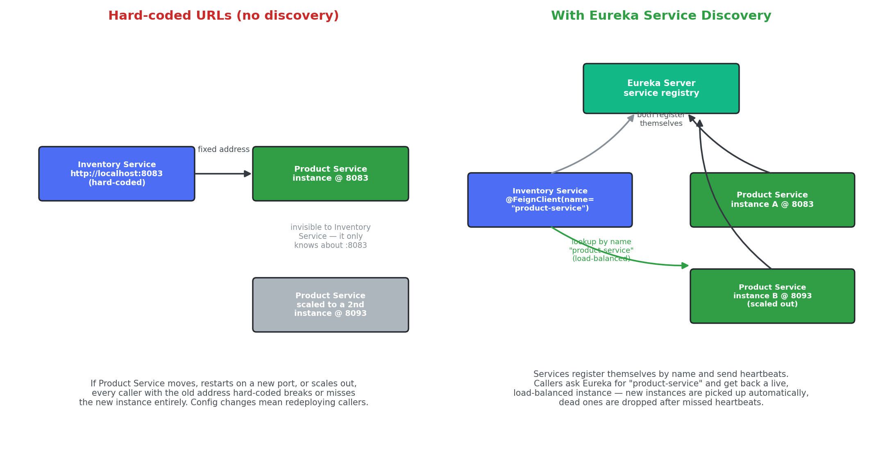
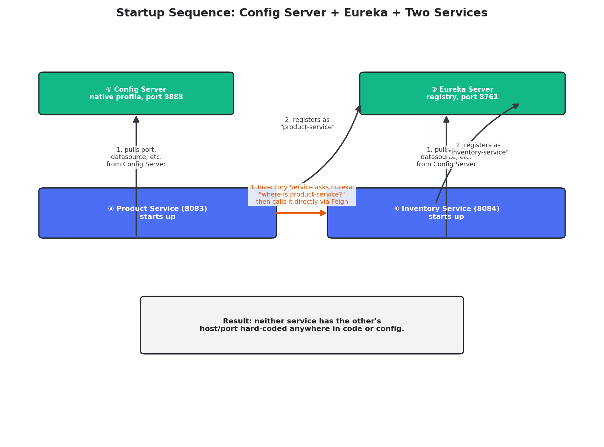
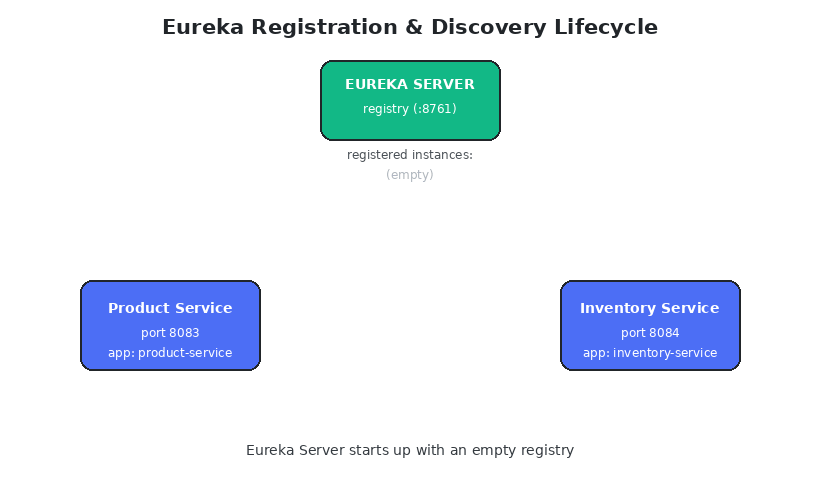

# Exercise 2 – Inventory Management System with Service Discovery

Four Spring Boot applications demonstrating service discovery
(Eureka) and centralized configuration (Spring Cloud Config):

| Service            | Port | Role                                           |
|---------------------|------|-------------------------------------------------|
| `eureka-server`      | 8761 | Service registry                                 |
| `config-server`      | 8888 | Centralized configuration (native profile)        |
| `product-service`    | 8083 | Manages products & stock, registers with Eureka   |
| `inventory-service`  | 8084 | Tracks stock, discovers Product Service via Eureka|

---

## Why service discovery?

In a hard-coded setup, every caller needs to know exactly where a
dependency lives — its host and port — baked into config or code. That
falls apart the moment something moves, restarts on a different port,
or scales out to multiple instances:



**Hard-coded URLs:** Inventory Service only knows about
`http://localhost:8083`. If Product Service is scaled out to a second
instance, or moved to a different port, Inventory Service has no way
of finding out — it either breaks or silently misses the new instance.

**With Eureka:** every service registers itself by name
(`product-service`, `inventory-service`) and sends periodic
heartbeats. Callers ask Eureka "where is `product-service` right now?"
instead of hard-coding an address, so new instances are picked up
automatically and dead ones are dropped once their heartbeats stop.
This is exactly what `@FeignClient(name = "product-service")` does in
this project — there's no URL anywhere in `inventory-service`'s code
or config.

## How the pieces come up together



1. **Config Server** and **Eureka Server** start first — they're pure
   infrastructure, nothing depends on them being registered anywhere.
2. **Product Service** and **Inventory Service** each pull their own
   configuration (port, datasource, feature flags) from Config Server
   at startup via `spring.config.import=optional:configserver:...`.
3. Both then **register themselves** with Eureka using their
   `spring.application.name` as the service id.
4. When Inventory Service needs product data, it asks Eureka for
   `product-service` by name and calls whichever live instance comes
   back — via `ProductServiceClient`, an OpenFeign client with **no
   hard-coded host or port**.

## Registration & discovery, step by step



This walks through the full lifecycle you'd see if you watched the
Eureka dashboard while starting everything up:

1. Eureka Server starts with an **empty registry**.
2. Product Service starts, pulls its config, and **registers itself**
   — it now shows up as `product-service @8083 (UP)`.
3. Product Service keeps sending **heartbeats** every 30 seconds to
   prove it's still alive; miss enough of them and Eureka evicts the
   instance.
4. Inventory Service starts up the same way and **registers itself**
   too.
5. When Inventory Service needs product details, it **asks Eureka**
   for `product-service` and gets back a live address to call — this
   is the `GET /api/inventory/product/{id}` flow in this project,
   which enriches the response with a live product name fetched this
   way.
6. If an instance stops sending heartbeats, Eureka eventually
   **evicts** it from the registry, so callers stop being routed to a
   dead instance.

## Startup order (important!)
```bash
# 1
cd eureka-server   && mvn spring-boot:run
# 2 (new terminal)
cd config-server    && mvn spring-boot:run
# 3 (new terminal)
cd product-service  && mvn spring-boot:run
# 4 (new terminal)
cd inventory-service && mvn spring-boot:run
```

Config Server and Eureka Server must be up before Product Service and
Inventory Service start, since both pull configuration from
`localhost:8888` and register with Eureka at `localhost:8761`.

## Flow
```
                 ┌───────────────────┐
                 │   Eureka Server    │  (8761)
                 └─────────▲──────────┘
                register   │   register
        ┌───────────────────┴───────────────────┐
        │                                        │
┌───────┴────────┐                     ┌─────────┴─────────┐
│ Product Service │◄────Feign/Eureka───│ Inventory Service  │
│     (8083)      │                     │      (8084)        │
└───────▲─────────┘                     └─────────▲──────────┘
        │ pulls config                            │ pulls config
        └──────────────────┬───────────────────────┘
                 ┌──────────┴───────────┐
                 │   Config Server       │  (8888, native profile)
                 └───────────────────────┘
```

See each service's own README for full endpoint documentation.
