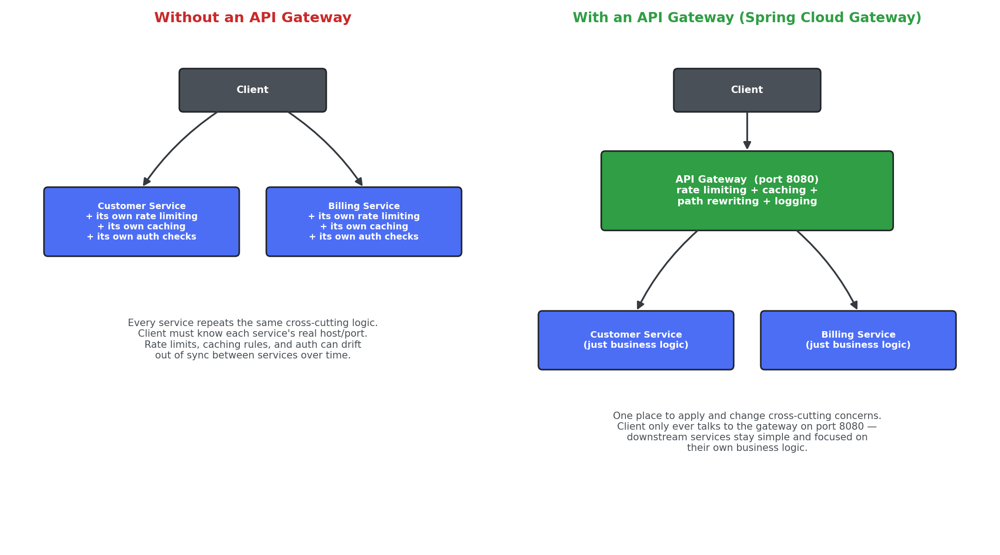
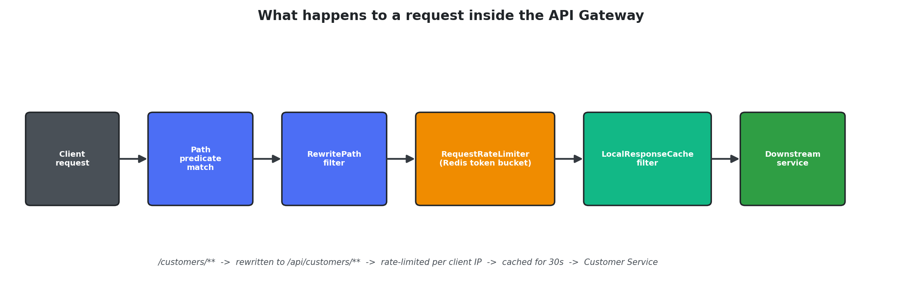
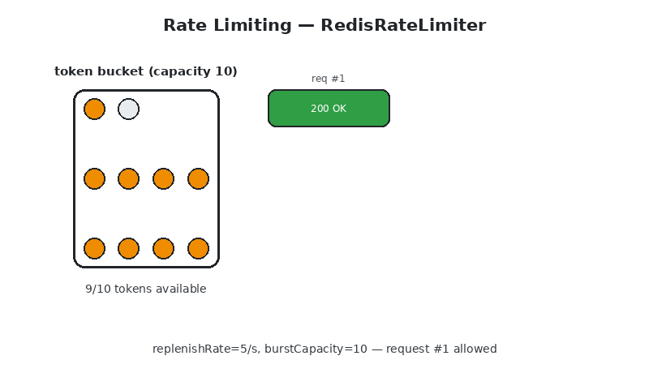

# Exercise 3 – API Gateway

Three Spring Boot applications demonstrating routing, rate limiting,
caching, and path rewriting with Spring Cloud Gateway.

| Service            | Port | Role                                  |
|----------------------|------|-----------------------------------------|
| `api-gateway`         | 9000 | Single entry point / reverse proxy       |
| `customer-service`    | 8085 | Customer CRUD (H2 in-memory)              |
| `billing-service`     | 8086 | Billing CRUD (H2 in-memory)               |

---

## Why an API Gateway?

Without a gateway, every client needs to know the real host/port of
every backend service, and every service ends up re-implementing the
same cross-cutting logic — rate limiting, caching, logging,
potentially auth — on its own:



**Without a gateway:** each service duplicates the same
infrastructure-level concerns, which drift out of sync over time (one
service's rate limit gets tuned, another's doesn't). Clients are also
coupled to the internal topology of the system.

**With a gateway:** the client only ever talks to one address (`:9000`).
Cross-cutting concerns live in exactly one place, downstream services
stay focused purely on business logic, and the internal service
topology can change without clients noticing.

## What happens to a request



Every request that hits the gateway passes through a chain of filters
before (and after) it's forwarded downstream:

1. **Path predicate** — `Path=/customers/**` or `Path=/billing/**`
   decides which route matches.
2. **`RewritePath`** — rewrites the public path to the service's real
   internal path (`/customers/**` → `/api/customers/**`).
3. **`RequestRateLimiter`** — checks a Redis-backed token bucket for
   the requesting client's IP before letting the call through.
4. **`LocalResponseCache`** — serves a cached response directly for
   repeated GETs within the TTL, or forwards to the real service and
   caches the result.
5. **Downstream service** — only sees a clean, already-rewritten
   request and just runs its own business logic.

A custom `LoggingGlobalFilter` also runs on every route, logging the
method/URI on the way in and the response status on the way out.

## Rate limiting and caching, visualized



- **Rate limiting** uses a token-bucket algorithm
  (`RedisRateLimiter(replenishRate=5, burstCapacity=10)`): each client
  IP has a bucket of up to 10 tokens, one consumed per request, and
  refilled at 5 tokens/second. Once the bucket is empty, further
  requests get `HTTP 429 Too Many Requests` until it refills — the
  animation shows the bucket draining across a burst of requests, the
  429s that follow, and the bucket topping back up a few seconds
  later.
- **Response caching** via `LocalResponseCache`: the first `GET` to a
  route is a cache miss and is forwarded to the real service; any
  identical `GET` within the 30-second TTL is served straight back
  from the gateway's cache, without the downstream service seeing it
  at all.

## Configuration reference
```yaml
spring:
  cloud:
    gateway:
      filter:
        local-response-cache:
          enabled: true
          time-to-live: 30s
          size: 50MB
      routes:
        - id: customer-service-route
          uri: http://localhost:8085
          predicates:
            - Path=/customers/**
          filters:
            - RewritePath=/customers/(?<segment>.*), /api/customers/${segment}
            - name: RequestRateLimiter
              args:
                redis-rate-limiter.replenishRate: 5
                redis-rate-limiter.burstCapacity: 10
                key-resolver: "#{@ipKeyResolver}"
            - name: LocalResponseCache
```
(the `billing-service-route` mirrors this, targeting `/billing/**` →
`/api/bills/**`)

## Flow
```
                    ┌──────────────┐
   Client  ───────► │ API Gateway  │  (9000)
                    └───┬──────┬───┘
       /customers/**│      │/billing/**
     (rewritten to  │      │ (rewritten to
      /api/customers/**)   │  /api/bills/**)
                    ▼      ▼
        ┌─────────────┐  ┌──────────────┐
        │  Customer   │  │   Billing    │
        │  Service    │  │   Service    │
        │   (8085)    │  │   (8086)     │
        └─────────────┘  └──────────────┘

  Cross-cutting: rate limiting (Redis) + local response caching
  + request/response logging, all applied at the gateway.
```

## Running the exercise
```bash
docker run -p 6379:6379 redis        # required for rate limiting

cd customer-service && mvn spring-boot:run   # terminal 1
cd billing-service  && mvn spring-boot:run   # terminal 2
cd api-gateway       && mvn spring-boot:run  # terminal 3
```

All client traffic goes through the gateway on port `9000`:
```bash
curl http://localhost:9000/customers
curl http://localhost:9000/billing
```

Fire more than 10 requests at either route in quick succession to see
the rate limiter respond with `429`, and repeat the same `GET` within
30 seconds to see the cached response come back near-instantly.

See each service's own README for full details, including how the
rate limiter and cache are configured.
