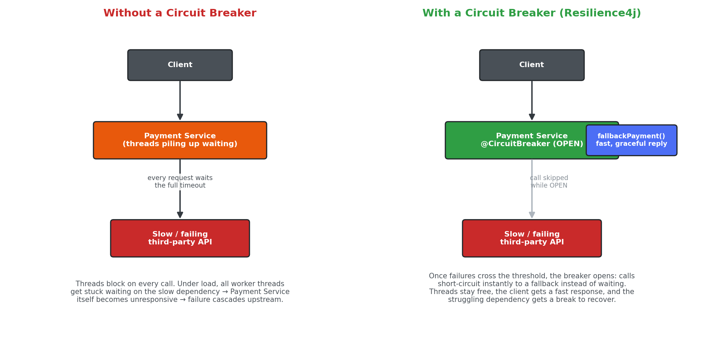
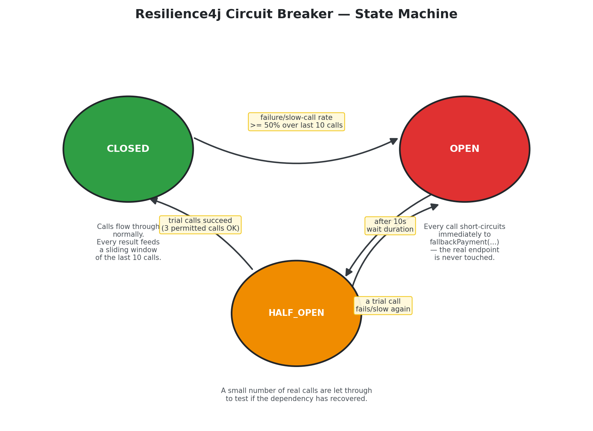
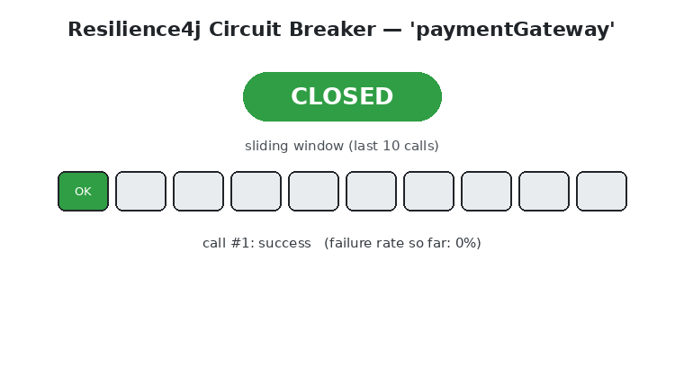

# Exercise 4 – Resilient Microservices with Circuit Breaker

Spring Boot application demonstrating the Circuit Breaker pattern
with Resilience4j.

| Service            | Port | Role                                                        |
|----------------------|------|--------------------------------------------------------------|
| `payment-service`     | 8087 | Calls a simulated slow/unreliable third-party payment gateway |

---

## Why a Circuit Breaker?

In a microservices architecture, services call each other over the
network constantly. The network — and the services on the other end of
it — are never 100% reliable: a downstream dependency can get slow,
start timing out, or fail outright. Without protection, one struggling
dependency can take down everything upstream of it too:



**Without a circuit breaker:** every request still tries the slow
dependency and waits for the full timeout. Under load, all available
threads end up blocked waiting on the same slow dependency, so the
calling service itself grinds to a halt — a single weak link cascades
failure back to the client and to anything else calling that service.

**With a circuit breaker:** once failures/slow calls cross a
threshold, the breaker "trips" open. Every subsequent call
short-circuits immediately to a fallback — no thread is spent waiting
on a doomed call, the client still gets a fast (if degraded) response,
and the struggling dependency gets breathing room to recover instead
of being hit with even more traffic.

This is exactly the scenario the exercise describes: *"A Payment
Service calls a slow third-party API."*

## The three states

A Resilience4j circuit breaker moves between three states based on the
outcomes of recent calls:



| State | What happens |
|---|---|
| **CLOSED** | Normal operation. Every call goes through to the real dependency. Results (success / failure / slow) are recorded in a sliding window of the last N calls. |
| **OPEN** | The failure/slow-call rate crossed the configured threshold. Every call is rejected immediately and routed straight to the fallback — the real dependency is not touched at all. |
| **HALF_OPEN** | After a wait period, the breaker cautiously lets a small number of trial calls through to check whether the dependency has recovered. |

From `HALF_OPEN`, enough successful trial calls move the breaker back
to `CLOSED`; a failed trial sends it straight back to `OPEN` and the
wait timer restarts.

### This project's configuration
```yaml
resilience4j:
  circuitbreaker:
    instances:
      paymentGateway:
        sliding-window-size: 10                 # look at the last 10 calls
        minimum-number-of-calls: 5               # need at least 5 before judging
        failure-rate-threshold: 50               # >=50% failures -> OPEN
        slow-call-rate-threshold: 50             # >=50% slow calls -> OPEN
        slow-call-duration-threshold: 2s         # a call counts as "slow" past 2s
        wait-duration-in-open-state: 10s         # stay OPEN for 10s before testing again
        permitted-number-of-calls-in-half-open-state: 3
        automatic-transition-from-open-to-half-open-enabled: true
```

### Watching it happen, step by step



This is what a real run looks like against `ThirdPartyPaymentSimulatorController`
(~20% of calls error out immediately, ~40% sleep for 4 seconds and blow
past the 2s slow-call threshold, the rest succeed quickly):

1. **CLOSED** — calls stream through normally while the sliding window
   fills up with a mix of successes and failures/slow calls.
2. Once at least 5 calls have been recorded and the failure/slow-call
   rate hits 50%+, the breaker **trips to OPEN**.
3. While **OPEN**, every call is rejected instantly — you'll see the
   response come back as `"status": "FALLBACK"` in milliseconds instead
   of waiting on a timeout.
4. After the 10s wait duration, the breaker moves to **HALF_OPEN** and
   lets 3 trial calls through.
5. If those trial calls succeed, the breaker **closes** again and
   normal traffic resumes. If they fail, it goes straight back to
   `OPEN` for another 10s.

## Fallback logic
```java
@CircuitBreaker(name = "paymentGateway", fallbackMethod = "fallbackPayment")
public PaymentResponse processPayment(PaymentRequest request) { ... }

public PaymentResponse fallbackPayment(PaymentRequest request, Throwable throwable) {
    // returns a "FALLBACK" status instead of propagating the failure
}
```

## Monitoring fallback / state-transition events
`CircuitBreakerEventLogger` subscribes to the breaker's event publisher
and logs every state transition, error, success, and rejected call.
You'll see log lines like:
```
WARN  Circuit Breaker 'paymentGateway' state transition: CLOSED -> OPEN
WARN  Circuit Breaker 'paymentGateway' rejected a call - circuit is OPEN
```

Circuit breaker health/metrics are also exposed via Actuator:
```
GET http://localhost:8087/actuator/health
GET http://localhost:8087/actuator/circuitbreakers
GET http://localhost:8087/actuator/circuitbreakerevents
```

## Flow
```
Client ──POST /api/payments/pay──► Payment Service
                                       │
                              @CircuitBreaker
                                       │
                          ┌────────────┴────────────┐
                          ▼                          ▼
              (circuit CLOSED/HALF_OPEN)     (circuit OPEN)
              try real call via WebClient    skip straight to
              to /simulate/charge            fallbackPayment(...)
                          │
              success / slow / error
              feeds the breaker's
              sliding window
```

The "third-party API" is simulated within the same service
(`ThirdPartyPaymentSimulatorController`) so the exercise is runnable
standalone — see `payment-service/README.md` for details on exactly
how failures/slow calls are injected and how the breaker reacts.

## Endpoints

| Method | Path                | Description                                  |
|--------|---------------------|-----------------------------------------------|
| POST   | `/api/payments/pay` | Process a payment (circuit-breaker protected)   |

### Sample request
```http
POST http://localhost:8087/api/payments/pay
Content-Type: application/json

{
  "orderId": 1,
  "amount": 999.00
}
```

## Running the exercise
```bash
cd payment-service
mvn spring-boot:run
```

Then send repeated requests to `POST http://localhost:8087/api/payments/pay`
(Postman's Runner, or a simple shell loop, works well — fire 15–20
requests back-to-back) and watch the console logs for circuit breaker
state transitions (`CLOSED -> OPEN -> HALF_OPEN -> CLOSED`) and
fallback events, or poll:
```
GET http://localhost:8087/actuator/circuitbreakers
```

See [`payment-service/README.md`](payment-service/README.md) for full
configuration details, sample requests, and monitoring endpoints.
