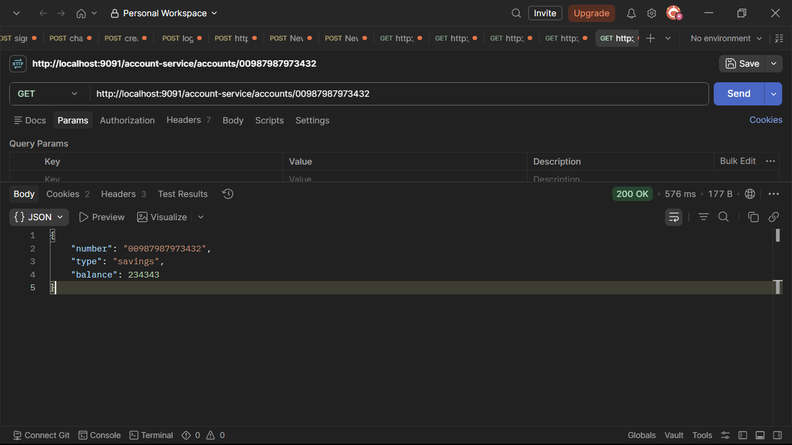
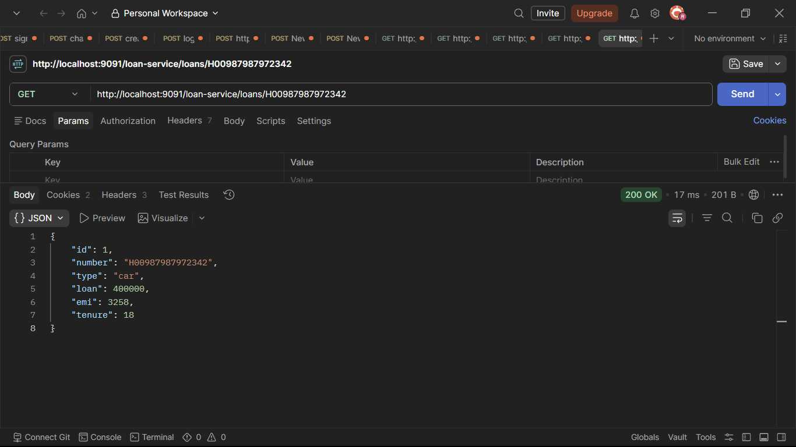
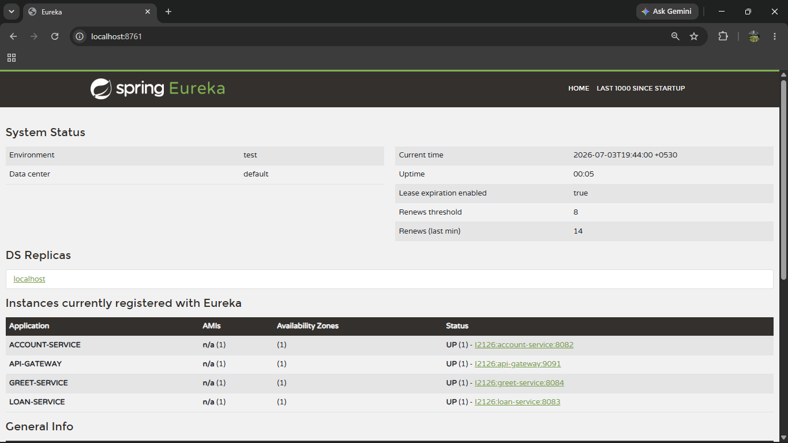
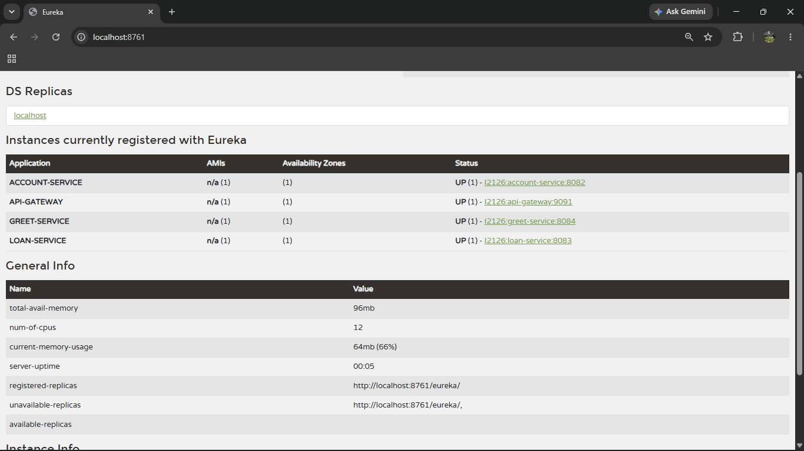
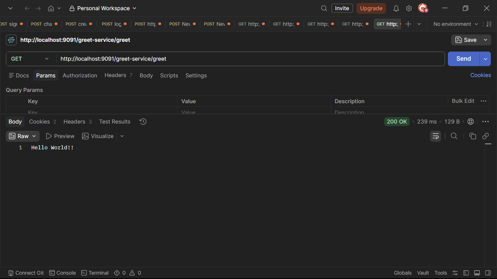
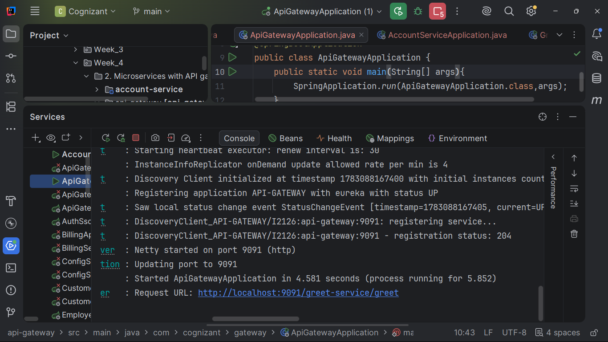

# Microservices with API Gateway

A complete **Spring Boot 3** and **Java 21** implementation of the **Microservices with API Gateway** hands-on exercises. This project demonstrates how multiple independent microservices communicate through **Spring Cloud Gateway** while being registered with **Eureka Discovery Server**.

---

## Microservices Architecture

Microservices architecture divides a large application into multiple small, independently deployable services. Each service owns its own business logic and database, while **Spring Cloud Gateway** provides centralized routing and **Eureka Discovery Server** enables dynamic service discovery.

<p align="center">
    
</p>

---

## Technology Stack

| Technology | Version |
|------------|---------|
| Java | 21 |
| Spring Boot | 3.x |
| Spring Cloud | Latest Compatible |
| Spring Cloud Gateway | ✓ |
| Eureka Discovery Server | ✓ |
| Spring Data JPA | ✓ |
| MySQL | ✓ |
| Maven | ✓ |

---

# Project Information

| Item | Value |
|------|-------|
| Base Package | `com.cognizant.eureka` |
| Java Version | 21 |
| Spring Boot | 3 |
| Database | MySQL |
| Service Discovery | Eureka |
| API Gateway | Spring Cloud Gateway |

---

# Services Overview

| Service | Port     | Purpose |
|---------|----------|---------|
| Eureka Discovery Server | **8761** | Service Registry |
| Account Service | **8080** | Account Microservice |
| Loan Service | **8081** | Loan Microservice |
| Greet Service | **8082** | Greeting Microservice |
| API Gateway | **9091** | Centralized Gateway |

---

# Hands-on Completion Tracker

| Status | Exercise | Codebase | Output |
|---------|----------|----------|--------|
| ✅ | Exercise  – Create Account Microservice | [account-service](./account-service) |  |
| ✅ | Exercise  – Create Loan Microservice | [loan-service](./loan-service) |  |
| ✅ | Exercise  – Create Eureka Discovery Server | [eureka-discovery-server](./eureka-discovery-server) |  |
| ✅ | Exercise – Register Microservices with Eureka | [account-service](./account-service) / [loan-service](./loan-service) |  |
| ✅ | Exercise  – Create Greet Service | [greet-service](./greet-service) |  |
| ✅ | Exercise  – Create API Gateway | [api-gateway](./api-gateway) |  |
| ✅ | Exercise  – Configure Global Logging Filter | [api-gateway](./api-gateway) |  |

---

# Project Structure

```text
Microservices with API Gateway
│
├── account-service
├── loan-service
├── greet-service
├── api-gateway
├── eureka-discovery-server
├── outputs
│   ├── output1.png
│   ├── output2.png
│   ├── output3.png
│   ├── output4.png
│   ├── output5.png
│   ├── output6.png
│   └── output7.png
└── README.md
```

---

# Create Account Microservice

### Description

Developed an independent **Account Microservice** exposing REST APIs for retrieving account information. The service uses **Spring Boot 3**, **Spring Data JPA**, and **MySQL**.

### Implementation

- Spring Boot REST API
- Spring Data JPA
- MySQL Integration
- Account Controller
- Account Repository
- Account Service Layer

### Endpoint

```text
GET http://localhost:8080/accounts/{accountNumber}
```

Example

```text
GET http://localhost:8080/accounts/00987987973432
```

### Output

```text
outputs/output1.png
```



---

# Create Loan Microservice

### Description

Implemented an independent **Loan Microservice** that exposes loan-related REST APIs.

### Implementation

- Spring Boot REST API
- Spring Data JPA
- MySQL Integration
- Loan Controller
- Loan Repository
- Loan Service Layer

### Endpoint

```text
GET http://localhost:8081/loans/{loanNumber}
```

Example

```text
GET http://localhost:8081/loans/H00987987972342
```

### Output

```text
outputs/output2.png
```



---

# Create Eureka Discovery Server

### Description

Configured **Spring Cloud Netflix Eureka Discovery Server** to act as the central registry for all microservices.

### Implementation

- Eureka Server
- Service Registry
- Spring Cloud Discovery
- Dashboard

### Endpoint

```text
http://localhost:8761
```

### Output

```text
outputs/output3.png
```



---

# Register Microservices with Eureka

### Description

Registered the **Account Service** and **Loan Service** with Eureka Discovery Server for automatic service discovery.

### Implementation

- Eureka Client
- Service Registration
- Heartbeat Configuration
- Dynamic Discovery

### Verification

Open Eureka Dashboard

```text
http://localhost:8761
```

Verify that

- ACCOUNT-SERVICE
- LOAN-SERVICE

are successfully registered.

### Output

```text
outputs/output4.png
```



---
# Create Greet Service

### Description

Developed a simple **Greeting Microservice** that exposes a REST endpoint returning a welcome message. This service is later accessed through the API Gateway.

### Implementation

- Spring Boot REST API
- Simple Greeting Controller
- Eureka Client Registration
- Service Discovery

### Endpoint

```text
GET http://localhost:8082/greet
```

### Expected Response

```text
Hello World!!
```

### Output

```text
outputs/output5.png
```


---

# Create API Gateway

### Description

Implemented **Spring Cloud API Gateway** to provide a single entry point for all microservices. The gateway dynamically routes client requests to the appropriate service using Eureka Discovery.

### Implementation

- Spring Cloud Gateway
- Dynamic Route Configuration
- Eureka Discovery Client
- Service Routing
- Centralized API Access

### Gateway Endpoints

#### Greet Service

```text
GET http://localhost:9091/greet-service/greet
```

#### Account Service

```text
GET http://localhost:9091/account-service/accounts/00987987973432
```

#### Loan Service

```text
GET http://localhost:9091/loan-service/loans/H00987987972342
```

### Output

```text
outputs/output6.png
```



---

# Configure Global Logging Filter

### Description

Added a **Global Logging Filter** in Spring Cloud Gateway to intercept every incoming request and outgoing response. This demonstrates centralized request monitoring at the gateway level.

### Implementation

- Global Gateway Filter
- Request Logging
- Response Logging
- Logging Before Routing
- Logging After Response

### Test Using Gateway

```text
GET http://localhost:9091/greet-service/greet
```

Observe the Gateway console logs for request and response details.

### Output

```text
outputs/output7.png
```



---

# Run Order

Start the services in the following order:

```bash
cd eureka-discovery-server
mvn spring-boot:run

cd ../account-service
mvn spring-boot:run

cd ../loan-service
mvn spring-boot:run

cd ../greet-service
mvn spring-boot:run

cd ../api-gateway
mvn spring-boot:run
```

---

# API Testing

## Eureka Dashboard

```text
http://localhost:8761
```

---

## Account Service (Direct)

```text
GET http://localhost:8080/accounts/00987987973432
```

---

## Loan Service (Direct)

```text
GET http://localhost:8081/loans/H00987987972342
```

---

## Greet Service (Direct)

```text
GET http://localhost:8082/greet
```

---

## Through API Gateway

### Greet Service

```text
GET http://localhost:9091/greet-service/greet
```

### Account Service

```text
GET http://localhost:9091/account-service/accounts/00987987973432
```

### Loan Service

```text
GET http://localhost:9091/loan-service/loans/H00987987972342
```

# Project Highlights

- ✅ Java 21
- ✅ Spring Boot 3
- ✅ Spring Cloud
- ✅ Spring Cloud Gateway
- ✅ Eureka Discovery Server
- ✅ RESTful Microservices
- ✅ Spring Data JPA
- ✅ MySQL Integration
- ✅ API Gateway Routing
- ✅ Dynamic Service Discovery
- ✅ Centralized Request Logging
- ✅ Maven Multi-Service Project

---

# Final Completion Status

All exercises from the **Microservices with API Gateway** hands-on document have been successfully implemented using **Spring Boot 3**, **Java 21**, **Spring Cloud Gateway**, **Eureka Discovery Server**, **Spring Data JPA**, and **MySQL**.

| Exercise | Status |
|----------|--------|
| Create Account Microservice | ✅ Completed |
| Create Loan Microservice | ✅ Completed |
| Create Eureka Discovery Server | ✅ Completed |
| Register Microservices with Eureka | ✅ Completed |
| Create Greet Service | ✅ Completed |
| Create API Gateway | ✅ Completed |
| Configure Global Logging Filter | ✅ Completed |

---

<p align="center">
<b>⭐ Spring Boot 3 • Java 21 • Spring Cloud • Eureka • API Gateway • Microservices ⭐</b>
</p>