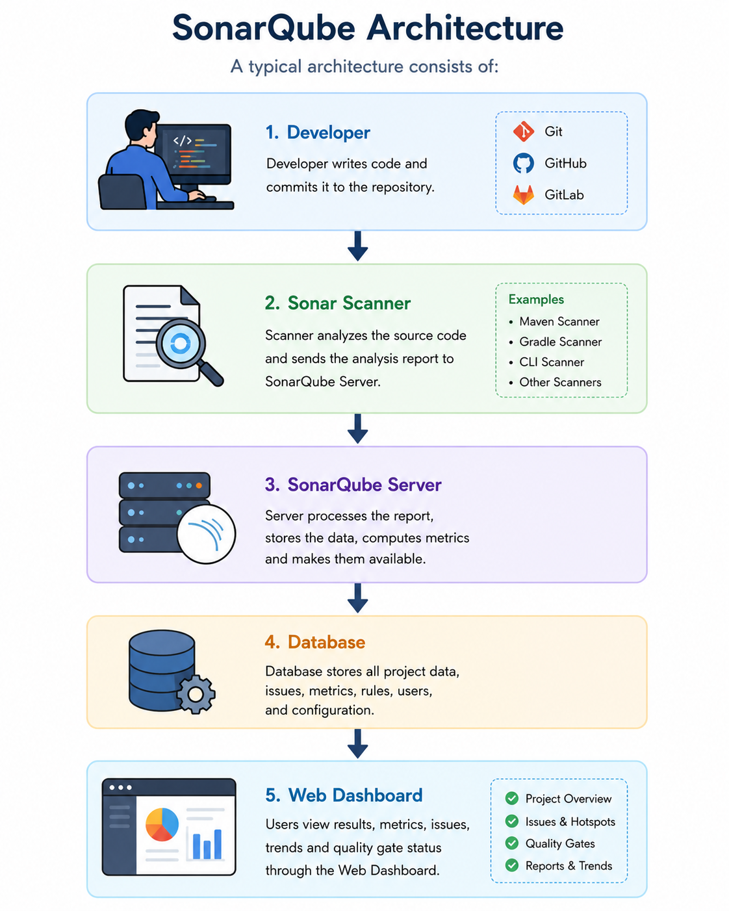
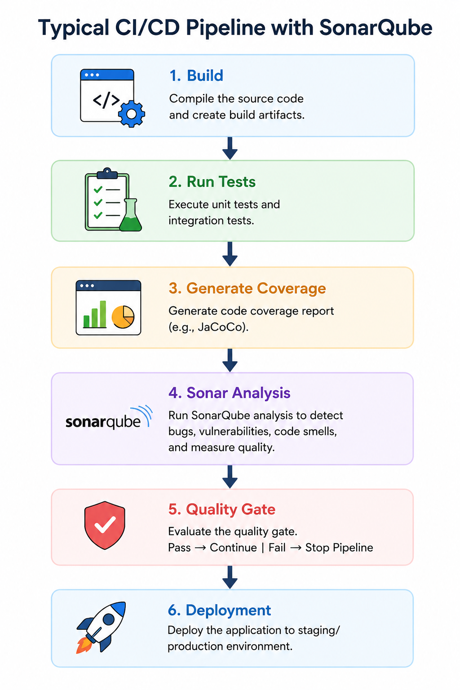

# SonarQube

> **Continuous Code Quality & Security Analysis Platform**

# Introduction

SonarQube is an open-source platform that performs **continuous inspection of source code**.

It helps developers identify:

* Bugs
* Security vulnerabilities
* Code smells
* Duplicate code
* Test coverage
* Technical debt

before the software reaches production.

It is widely used in enterprise software development and DevOps pipelines.

---

# What is SonarQube?

SonarQube is a **Static Code Analysis Tool**.

It scans source code without executing it and generates a detailed quality report.

The analysis helps developers write:

* Cleaner code
* Secure code
* Maintainable code
* Reliable code

---

# Why SonarQube?

Writing code that simply works is not enough.

Modern applications must also be:

* Secure
* Maintainable
* Readable
* Testable
* Reliable

SonarQube ensures these qualities are continuously monitored.

---

# Key Features

* Static Code Analysis
* Security Analysis
* Code Smell Detection
* Bug Detection
* Duplicate Code Detection
* Test Coverage Reports
* Technical Debt Estimation
* Security Hotspot Detection
* Branch Analysis
* Pull Request Analysis
* Quality Gates
* Quality Profiles
* CI/CD Integration
* IDE Integration

---

# Why Companies Use SonarQube

Many large organizations integrate SonarQube into their development lifecycle because it:

* Improves code quality
* Reduces production bugs
* Detects security risks early
* Enforces coding standards
* Reduces maintenance cost
* Helps during code reviews
* Automates quality checks

---

# Benefits

* Better software quality
* Faster code reviews
* Early bug detection
* Reduced technical debt
* Increased maintainability
* Improved developer productivity
* Better team collaboration
* Standardized coding practices

---

# SonarQube Architecture

A typical architecture consists of:

    

---

# Main Components

## Sonar Scanner

Responsible for scanning source code.

Examples:

* Maven Scanner
* Gradle Scanner
* CLI Scanner
* Jenkins Scanner
* GitHub Actions

---

## SonarQube Server

Processes reports generated by the scanner.

Stores issues.

Calculates metrics.

Displays dashboards.

---

## Database

Stores:

* Projects
* Metrics
* Users
* Analysis History
* Rules
* Quality Gates

---

## Web Dashboard

Provides a graphical interface to view:

* Issues
* Metrics
* Reports
* Trends
* Coverage

---

# Supported Languages

SonarQube supports many languages including:

* Java
* Kotlin
* Python
* JavaScript
* TypeScript
* C
* C++
* C#
* Go
* PHP
* Ruby
* Scala
* Swift

and many more.

---

# Static Code Analysis

Static analysis means analyzing code **without executing it**.

It detects:

* Logic problems
* Bad coding practices
* Security flaws
* Maintainability issues

---

# Bugs

A bug is code that may produce incorrect behavior.

Examples:

* Null pointer access
* Infinite loops
* Incorrect conditions
* Dead code

---

# Code Smells

Code smells are not bugs.

They indicate poor design.

Examples:

* Long methods
* Duplicate logic
* Large classes
* Complex conditions
* Deep nesting
* Magic numbers

---

# Vulnerabilities

Security vulnerabilities are weaknesses that attackers may exploit.

Examples:

* SQL Injection
* Cross Site Scripting
* Hardcoded passwords
* Weak cryptography
* Command injection

---

# Security Hotspots

A hotspot is code requiring manual security review.

It may not be a vulnerability but deserves attention.

Examples:

* File uploads
* Cryptographic operations
* Authentication logic

---

# Technical Debt

Technical debt measures future maintenance effort.

Examples:

* Poor naming
* Duplicate code
* Complex methods
* Missing documentation

SonarQube estimates how long it would take to fix these issues.

---

# Code Coverage

Coverage measures how much code is tested.

Usually integrated using:

* JaCoCo
* Cobertura

Higher coverage generally improves confidence in the code.

---

# Duplicate Code

SonarQube identifies repeated blocks of code.

Benefits of reducing duplication:

* Easier maintenance
* Smaller codebase
* Fewer bugs

---

# Reliability Rating

Measures bug severity.

Ratings:

* A
* B
* C
* D
* E

A is the best.

---

# Security Rating

Measures vulnerability severity.

Ratings:

* A
* B
* C
* D
* E

---

# Maintainability Rating

Measures technical debt.

Lower debt means higher maintainability.

---

# Quality Gates

A Quality Gate determines whether a project passes predefined quality criteria.

Typical conditions include:

* No new bugs
* No critical vulnerabilities
* Coverage above threshold
* Duplicate code below threshold

---

# Quality Profiles

A Quality Profile defines which rules are applied during analysis.

Different teams can maintain different profiles.

---

# Rules

SonarQube includes thousands of built-in rules.

Example categories:

* Naming conventions
* Exception handling
* Performance
* Security
* Concurrency
* Collections
* Object-oriented design

---

# Metrics

Common metrics include:

* Lines of Code
* Bugs
* Vulnerabilities
* Code Smells
* Coverage
* Duplications
* Technical Debt
* Complexity

---

# Dashboard

The dashboard displays:

* Overall Quality Gate
* Reliability
* Security
* Maintainability
* Recent Issues
* Historical Trends
* Coverage Reports
* Duplication Reports

---

# Issue Severity

SonarQube categorizes issues as:

* Info
* Minor
* Major
* Critical
* Blocker

Higher severity should be fixed first.

---

# Continuous Integration

SonarQube integrates with:

* Jenkins
* GitHub Actions
* GitLab CI/CD
* Azure DevOps
* Bitbucket Pipelines

Typical pipeline:

  

---

# IDE Integration

Developers can use SonarLint inside IDEs.

Supported IDEs include:

* IntelliJ IDEA
* Eclipse
* Visual Studio Code

SonarLint provides instant feedback while coding.

---

# Branch Analysis

Developer Edition and above support branch analysis.

This allows quality monitoring for feature branches separately.

---

# Pull Request Analysis

SonarQube can analyze pull requests before merging.

It reports:

* New bugs
* New vulnerabilities
* New code smells
* Coverage changes

---

# SonarScanner

The scanner is responsible for:

* Reading project files
* Collecting metrics
* Sending reports to SonarQube Server

It supports:

* Maven
* Gradle
* CLI
* .NET
* NPM

---

# SonarQube Editions

## Community Edition

* Free
* Open Source
* Suitable for individuals and small teams

---

## Developer Edition

Adds:

* Branch Analysis
* Pull Request Analysis
* More languages

---

## Enterprise Edition

Adds:

* Portfolio management
* Advanced governance
* Reporting

---

## Data Center Edition

Designed for:

* Large enterprises
* High availability
* Distributed deployments

---

# Best Practices

* Scan every commit.
* Keep Quality Gates enabled.
* Fix new issues before release.
* Write unit tests.
* Monitor technical debt.
* Reduce duplicate code.
* Review security hotspots regularly.
* Use SonarLint while developing.
* Integrate with CI/CD pipelines.
* Update Quality Profiles periodically.

---

# Common Questions

### What is SonarQube?

A platform for continuous code quality and security analysis.

---

### Is SonarQube a testing tool?

No.

It performs static analysis.

---

### Does SonarQube execute code?

No.

It analyzes source code without running it.

---

### Difference between SonarQube and SonarLint?

SonarQube:

* Central server
* Team collaboration
* Dashboards
* Historical reports

SonarLint:

* IDE plugin
* Instant feedback
* Local analysis

---

### What is a Quality Gate?

A set of conditions that determines whether code satisfies the organization's quality standards.

---

### What is Technical Debt?

The estimated effort required to fix maintainability issues in the codebase.

---

### What is a Code Smell?

A maintainability issue that indicates poor design but does not necessarily cause incorrect behavior.

---

### What is Static Code Analysis?

Analyzing source code without executing it to detect quality and security issues.

---

### Why integrate SonarQube with CI/CD?

To automatically verify code quality on every build and prevent low-quality code from being merged or deployed.

---
