# SonarQube Integration With Spring Boot

This project demonstrates a complete local SonarQube integration with a Spring Boot Maven application. The application is located in `SpringBootDemo` and uses JaCoCo for test coverage, Maven Sonar Scanner for analysis, and SonarQube Community Edition running locally on port `9000`.

## Project Structure

```text
sonarqube
|-- README.md
|-- images
|-- notes
|-- SpringBootDemo
    |-- pom.xml
    |-- sonar-project.properties
    |-- src/main/java/com/cognizant/springbootdemo
    |-- src/test/java/com/cognizant/springbootdemo
```

## Application Overview

The Spring Boot sample application uses a car-purchase domain. It contains business logic for:

- Creating a car purchase profile
- Calculating down payment
- Calculating loan amount
- Calculating monthly EMI
- Checking premium car eligibility
- Recommending purchase type
- Formatting purchase reference and budget messages

The test suite covers the main service logic, validation cases, parameterized scenarios, Spring context loading, and helper logic used for SonarQube analysis.

## Step 1: Run SonarQube Locally

SonarQube was started using Docker Desktop. The container exposes SonarQube on port `9000`.

```powershell
docker run -d --name sonarqube -p 9000:9000 sonarqube:lts-community
```

Open SonarQube in the browser:

```text
http://localhost:9000
```

Default login for local setup:

```text
Username: admin
Password: admin
```

After first login, SonarQube may ask you to change the password. In this app, the password used in the scanner command is `root`.

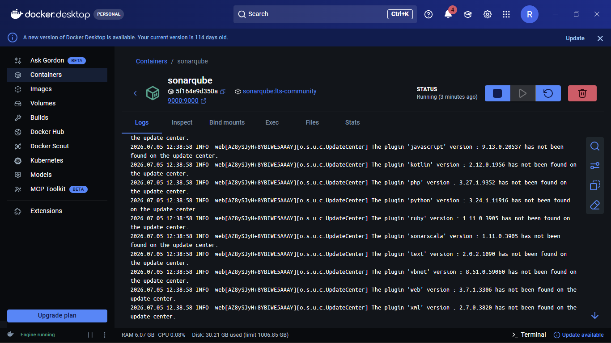

## Step 2: Create A SonarQube Project

In SonarQube, create a project manually and use this project key:

```text
SpringBootDemo
```

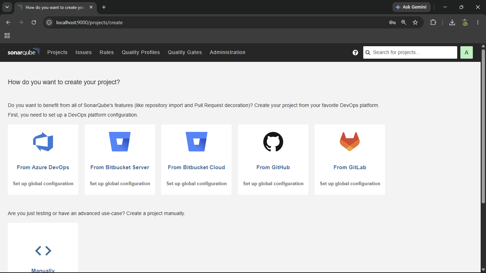

## Step 3: Configure Maven For SonarQube And JaCoCo

The Maven project includes the Sonar Maven plugin and JaCoCo plugin in `SpringBootDemo/pom.xml`.

Important Sonar properties:

```xml
<sonar.projectKey>SpringBootDemo</sonar.projectKey>
<sonar.projectName>SpringBootDemo</sonar.projectName>
<sonar.sources>src/main/java</sonar.sources>
<sonar.tests>src/test/java</sonar.tests>
<sonar.java.binaries>target/classes</sonar.java.binaries>
<sonar.junit.reportPaths>target/surefire-reports</sonar.junit.reportPaths>
<sonar.coverage.jacoco.xmlReportPaths>target/site/jacoco/jacoco.xml</sonar.coverage.jacoco.xmlReportPaths>
<sonar.scm.exclusions.disabled>true</sonar.scm.exclusions.disabled>
```

The same configuration is also available in `SpringBootDemo/sonar-project.properties` for standalone scanner usage.

## Step 4: Run Tests And Generate Coverage

From the Spring Boot application folder:

```powershell
cd D:\Cognizant\src\Cognizant_DN\DeepSkilling\Week_4\sonarqube\SpringBootDemo
.\mvnw.cmd clean verify
```

This command:

- Compiles the application
- Runs all JUnit tests
- Generates JaCoCo coverage data
- Creates the coverage XML file used by SonarQube

JaCoCo XML report path:

```text
SpringBootDemo/target/site/jacoco/jacoco.xml
```

## Step 5: Run SonarQube Analysis

`
```powershell
mvn clean verify sonar:sonar -Dsonar.projectKey=your-project-key -Dsonar.host.url=http://localhost:9000 -Dsonar.token=your-sonarqube-token
```

Expected scanner output includes:

```text
BUILD SUCCESS
ANALYSIS SUCCESSFUL
7 files indexed
```

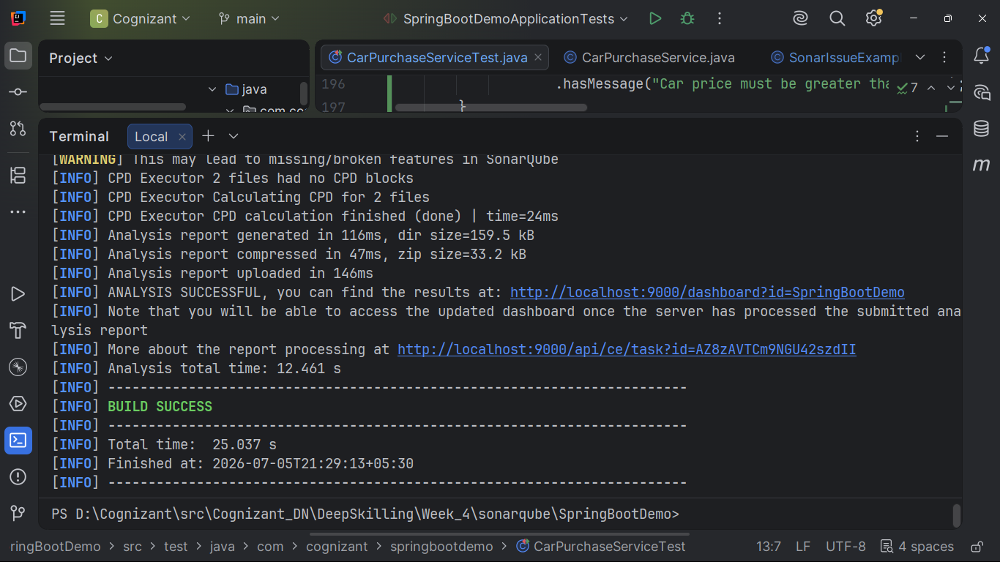

## Step 6: Initial Failed Quality Gate

During the learning demo, intentional bugs, code smells, security hotspots, and low coverage were introduced to understand how SonarQube reports problems.

The project initially failed the quality gate because of:

- Bugs
- Code smells
- Security hotspots
- Low coverage on new code

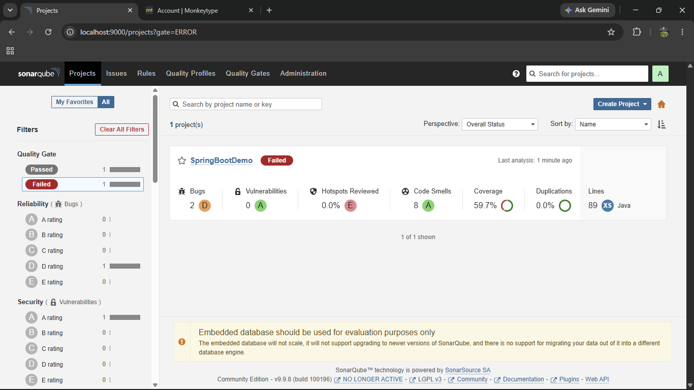

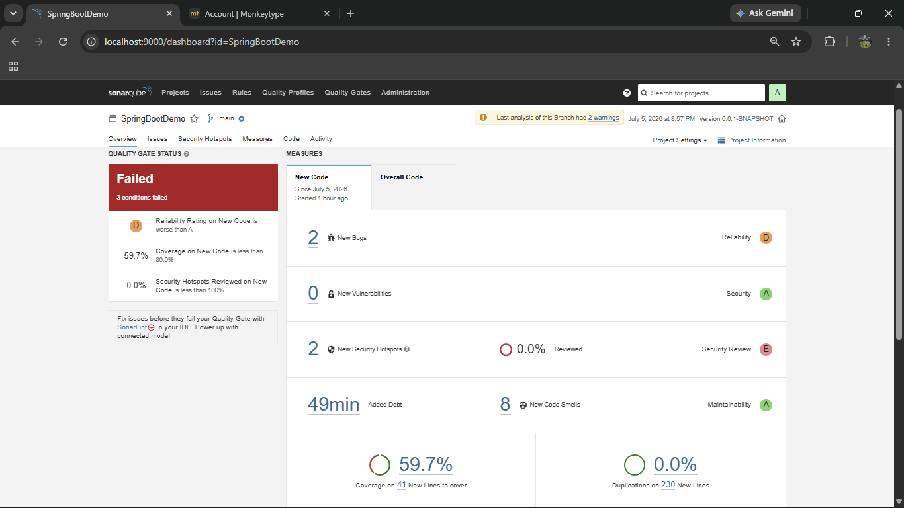

## Step 7: Review Issues In SonarQube

SonarQube reported issues such as:

- Reusing `Random` incorrectly
- Comparing strings using `==`
- Hardcoded password-like value
- Unused fields
- Empty code blocks
- Duplicated literals

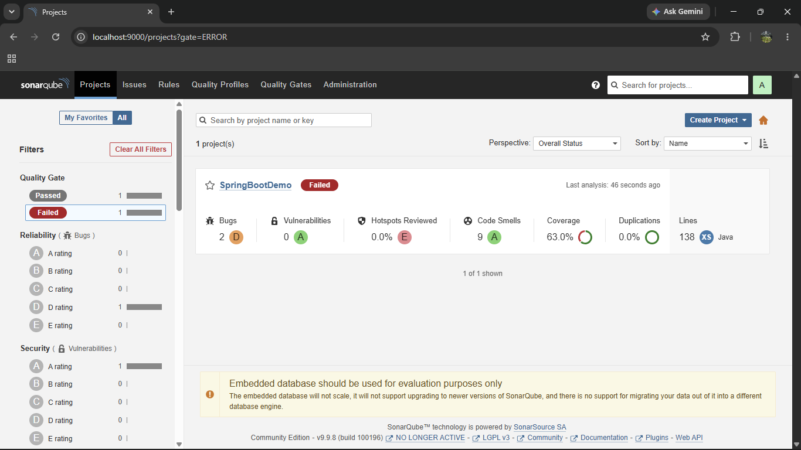

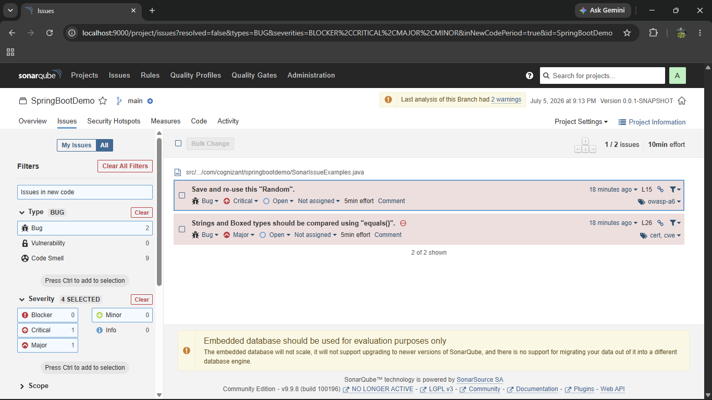

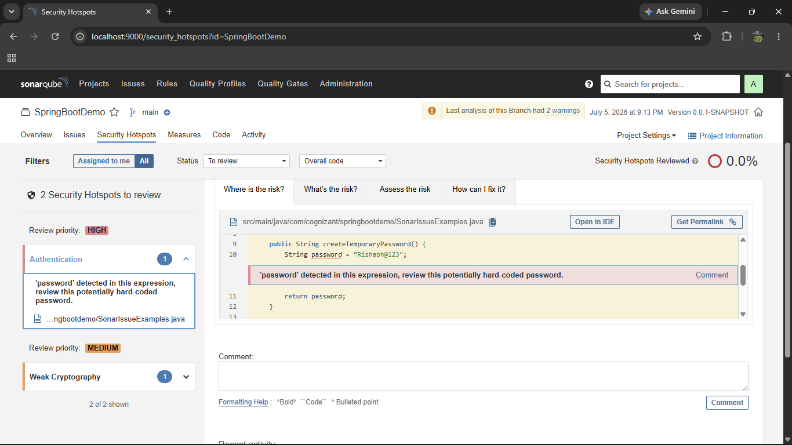

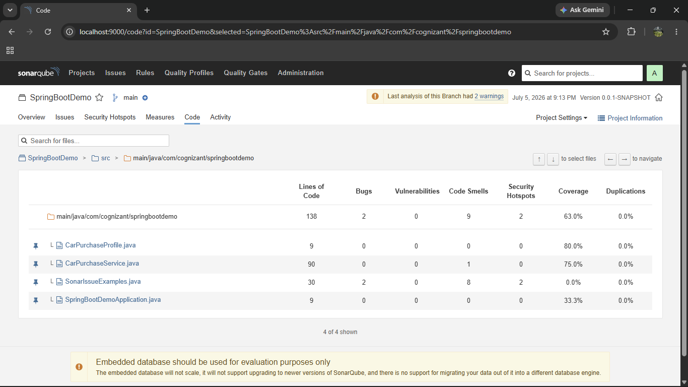

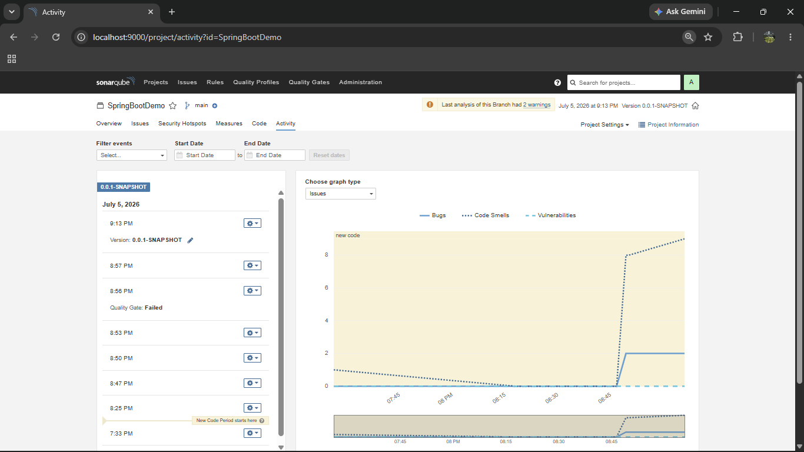

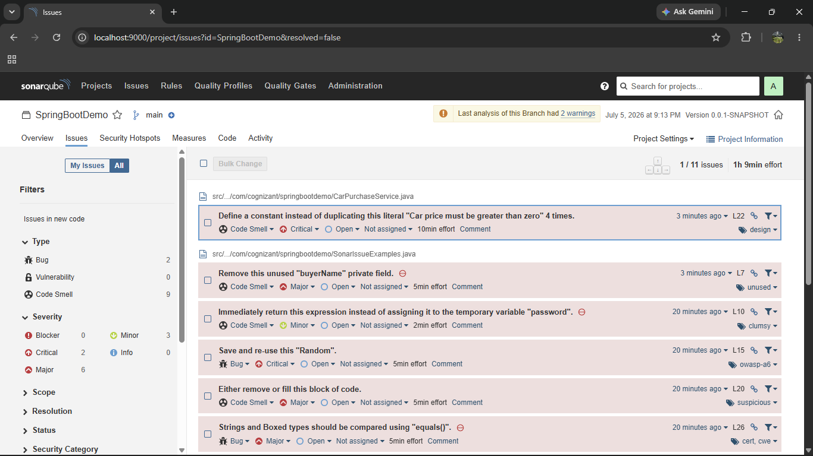

## Step 8: Fix Bugs And Improve Coverage

The intentional issues were fixed by:

- Replacing `Random` with `SecureRandom`
- Removing hardcoded password-like logic
- Using `.equals()` for string comparison
- Removing empty blocks
- Removing unused fields and methods
- Replacing console output with return values
- Adding focused unit tests
- Adding parameterized tests
- Adding validation tests
- Covering helper classes

Final test result:

```text
Tests run: 43
Failures: 0
Errors: 0
```

Final coverage reached approximately:

```text
93.8%
```

## Step 9: Final Passing Quality Gate

After fixes and test coverage improvements, the SonarQube quality gate passed.

Final dashboard summary:

- Bugs: 0
- Vulnerabilities: 0
- Quality Gate: Passed
- Coverage: 93.8%
- Duplications: 0.0%
- Lines: 140

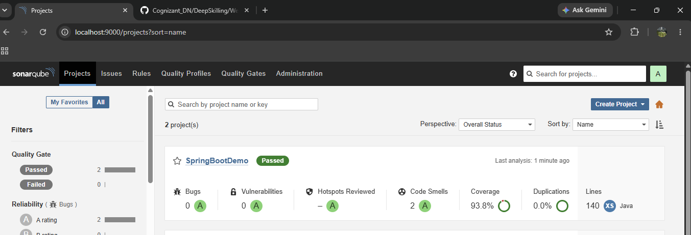

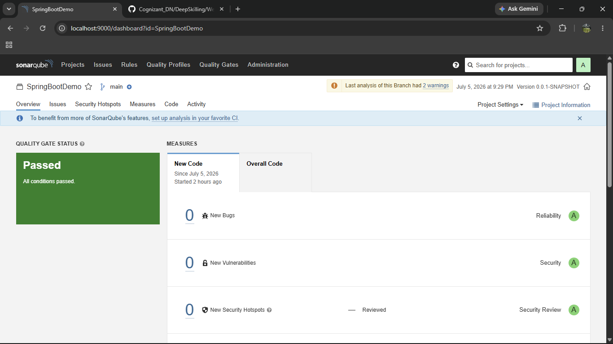

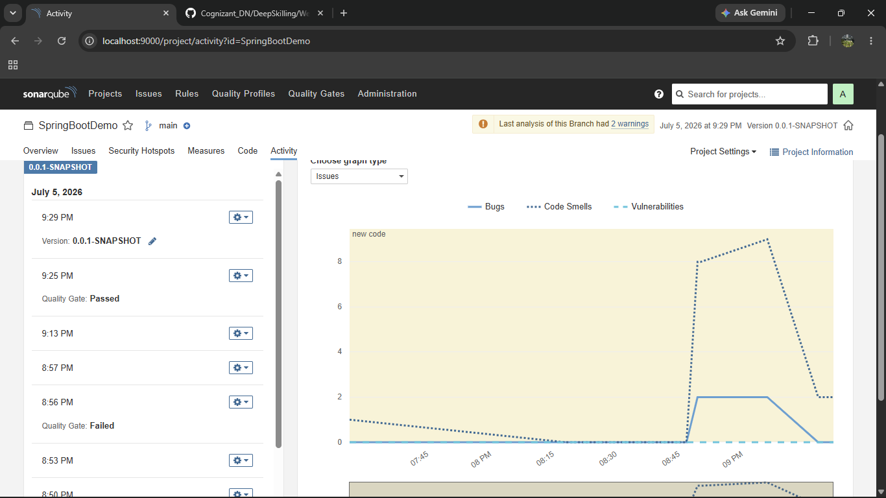


## Useful Commands

Run tests and coverage:

```powershell
.\mvnw.cmd clean verify
```

Open SonarQube:

```text
http://localhost:9000/dashboard?id=SpringBootDemo
```

Open JaCoCo report:

```text
SpringBootDemo/target/site/jacoco/index.html
```
