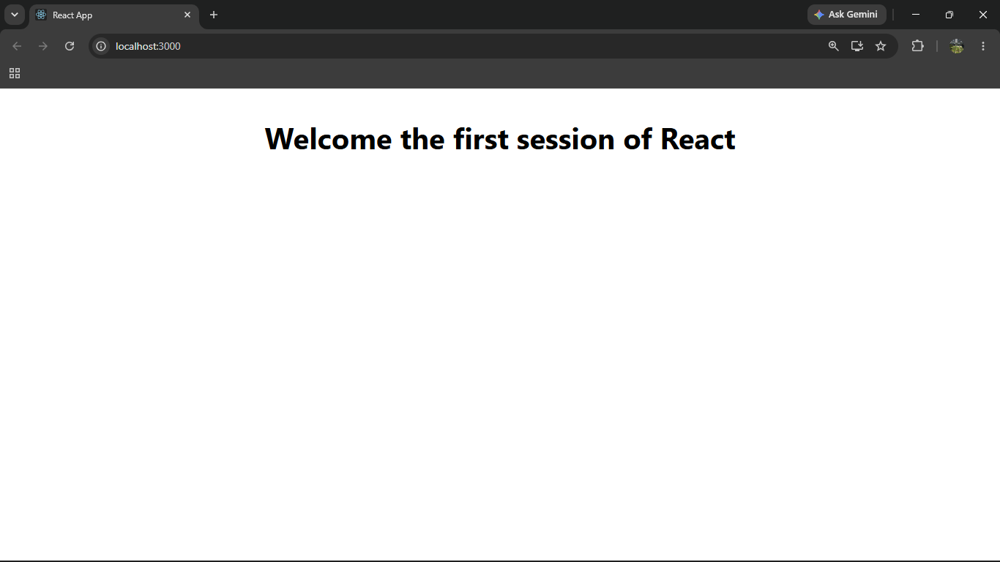

# ReactJS Hands-on Lab 1

This project implements the exercise from `1. ReactJS-HOL.docx`.
It was created from the command line with Create React App and displays the
required heading:

> Welcome the first session of React

## Implementation

- `src/App.js` defines the React component and renders the heading.
- `src/App.css` centers the content and adds simple page spacing.

## Run the application

From this project folder, run:

```bash
npm start
```

Then open [http://localhost:3000](http://localhost:3000) in a browser.



## Test and build

```bash
npm test -- --watchAll=false
npm run build
```
