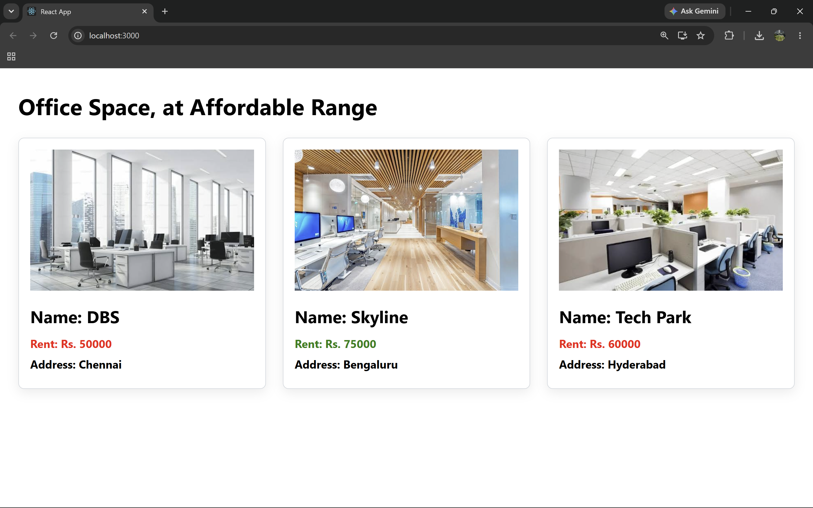

# ReactJS Hands-on Lab 10

This project implements the exercise described in `10. ReactJS-HOL.docx`.
It demonstrates the use of React JSX to create elements, attributes, JavaScript expressions, and inline CSS for displaying office space rental details.

## Objectives

- Use JSX syntax in React applications.
- Use inline CSS in JSX.
- Render JSX elements to the DOM.
- Display office details using JavaScript objects.

## Project Creation

The React application was created from the command line using:

```bash
npx create-react-app officespacerentalapp
```

## Browser Output

`output/output.png`



---

## Implementation Steps

### 1. Created the React application

A React application named `officespacerentalapp` was created using the Create React App command.

```bash
npx create-react-app officespacerentalapp
```

### 2. Implemented the Office Space component

The application was implemented using React JSX to:

- Display the page heading.
- Display the office space image.
- Create an office object containing the **Name**, **Rent**, and **Address**.
- Create a list of office objects and display the details using JSX expressions.

### 3. Applied inline CSS

Conditional inline CSS was applied to display:

- **Red** color when the office rent is **below ₹60000**.
- **Green** color when the office rent is **above ₹60000**.

### 4. Ran and verified the application

The application was started using:

```bash
npm start
```

The browser successfully displayed the office space details with the heading, office image, office information, and the rent highlighted using the required conditional colors.

## Available Commands

| Command | Purpose |
| --- | --- |
| `npm start` | Starts the development server |