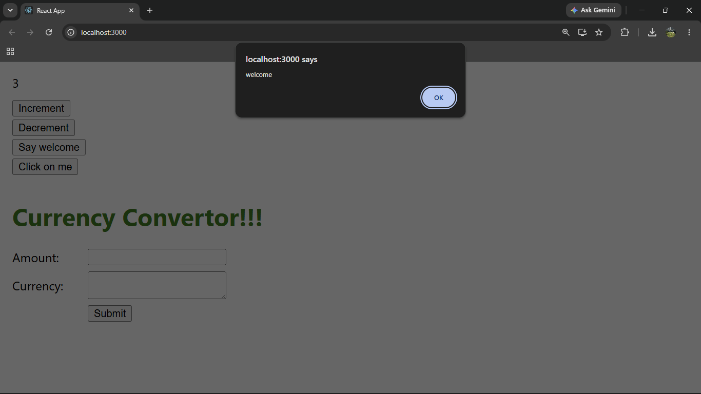
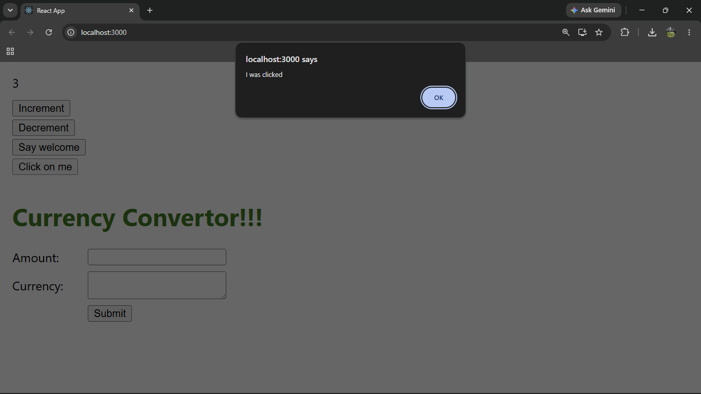
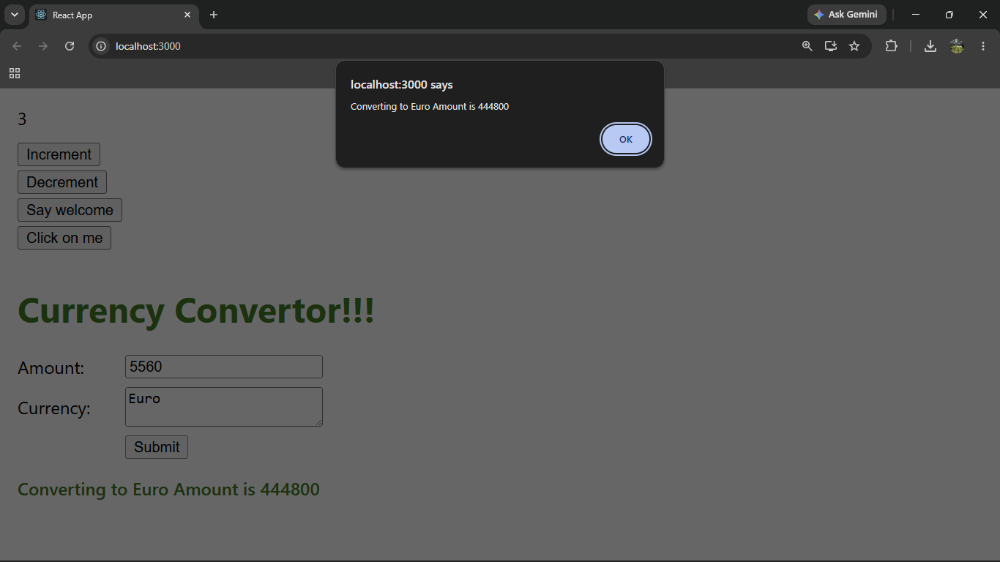

# ReactJS Hands-on Lab 11

This project implements the exercise described in `11. ReactJS-HOL.docx`.
It demonstrates React event handling, event handlers, the `this` keyword, synthetic events, and form submit handling using a currency convertor.

## Project Creation

The React application was created from the command line using:

```bash
npx create-react-app eventexamplesapp
```

## Browser Output

`output/output1.png`


`output/output2.png`



`output/output3.png`



`output/output4.png`



---

## Implementation Steps

### 1. Created the React application

A React application named `eventexamplesapp` was created.

```bash
npx create-react-app eventexamplesapp
```

### 2. Created Increment and Decrement buttons

The Increment button increases the counter value.
The Decrement button decreases the counter value.
The Increment button invokes multiple methods:

- One method increments the counter.
- One method displays `Hello! Member1`.

### 3. Created Say welcome button

The Say welcome button displays `welcome`.
The value `welcome` is passed as an argument to the event handler.

### 4. Created synthetic event button

The Click on me button displays `I was clicked` using a React synthetic event.

### 5. Created Currency Convertor component

The `CurrencyConvertor` component accepts the amount and currency values.
The Submit button invokes the `handleSubmit` event and displays the converted value.
For amount `80` and currency `Euro`, the output is:

```text
Converting to Euro Amount is 6400
```

### 6. Ran the application

The application was started using:

```bash
npm start
```

## Available Commands

| Command | Purpose |
| --- | --- |
| `npm start` | Starts the development server |
