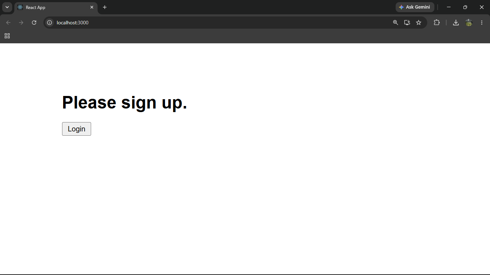
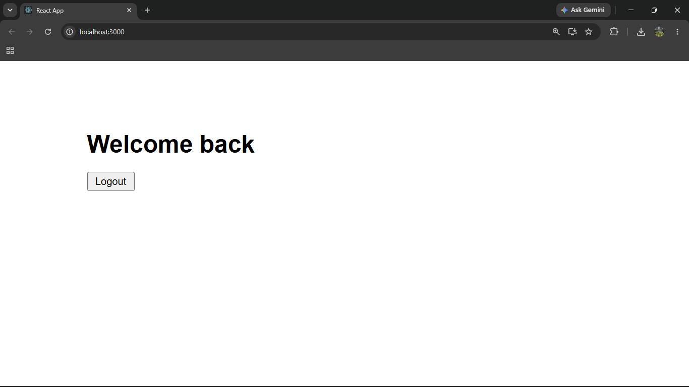

# ReactJS Hands-on Lab 12

This project implements the exercise described in `12. ReactJS-HOL.docx`.
It demonstrates conditional rendering in React using Login and Logout buttons.

## Project Creation

The React application was created from the command line using:

```bash
npx create-react-app ticketbookingapp
```

## Browser Output

`output/output1.png`



`output/output2.png`



---

## Implementation Steps

### 1. Created the React application

A React application named `ticketbookingapp` was created.

```bash
npx create-react-app ticketbookingapp
```

### 2. Created Login and Logout buttons

The Login button is displayed for the guest user.
The Logout button is displayed for the logged-in user.

### 3. Implemented Greeting component

The `Greeting` component checks whether the user is logged in.
If the user is logged in, `Welcome back` is displayed.
If the user is not logged in, `Please sign up.` is displayed.

### 4. Rendered the correct page

The guest screen displays `Please sign up.` with the Login button.
The logged-in screen displays `Welcome back` with the Logout button.

### 5. Ran the application

The application was started using:

```bash
npm start
```

## Available Commands

| Command | Purpose |
| --- | --- |
| `npm start` | Starts the development server |
