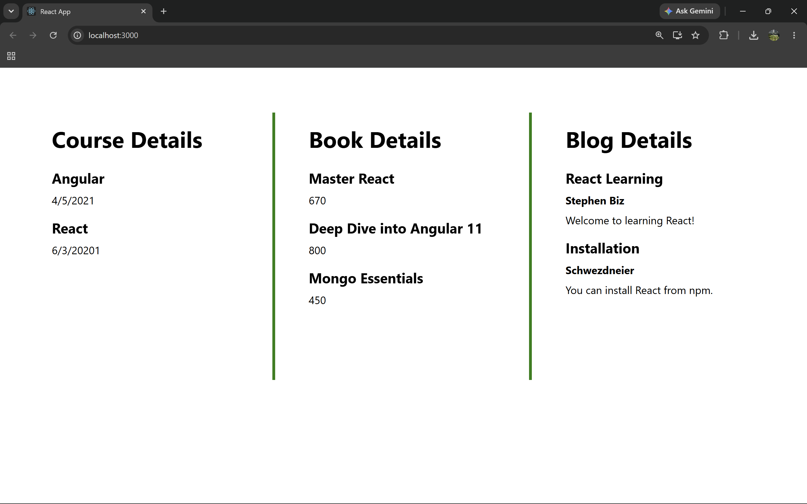

# ReactJS Hands-on Lab 13

This project implements the exercise described in `13. ReactJS-HOL.docx`.
It demonstrates conditional rendering, rendering multiple components, list rendering, keys, extracted components, and the `map()` function.

## Project Creation

The React application was created from the command line using:

```bash
npx create-react-app bloggerapp
```

## Browser Output

`output/output1.png`



---

## Implementation Steps

### 1. Created the React application

A React application named `bloggerapp` was created.

```bash
npx create-react-app bloggerapp
```

### 2. Created components folder

All detail components were placed inside the `src/components` folder.

### 3. Created Book Details component

The `BookDetails` component displays the book list using `map()`.

Each book item uses a unique key.

### 4. Created Blog Details component

The `BlogDetails` component displays blog title, author, and description.

### 5. Created Course Details component

The `CourseDetails` component displays course names and dates.

### 6. Implemented conditional rendering

Conditional rendering was implemented using different approaches such as:

- Logical `&&`
- Ternary expression
- Returning `null`
- Helper function

### 7. Rendered all components

The application displays:

- Course Details
- Book Details
- Blog Details

The final browser output shows all three sections in columns with green vertical separators.

### 8. Ran the application

The application was started using:

```bash
npm start
```

## Available Commands

| Command | Purpose |
| --- | --- |
| `npm start` | Starts the development server |
