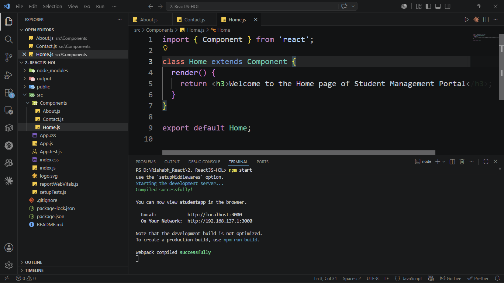
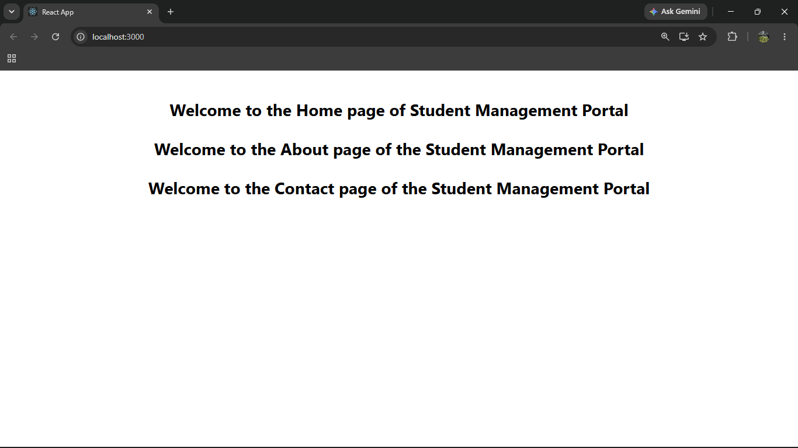

# ReactJS Hands-on Lab 2

This project implements the exercise described in `2. ReactJS-HOL.docx`.
It demonstrates how to create and render multiple React class components in a
single application.

## Objective

The application creates and displays three components:

| Component | Displayed message |
| --- | --- |
| `Home` | Welcome to the Home page of Student Management Portal |
| `About` | Welcome to the About page of the Student Management Portal |
| `Contact` | Welcome to the Contact page of the Student Management Portal |


## Project structure

```text
2. ReactJS-HOL/
|-- output/
|-- public/
|-- src/
|   |-- Components/
|   |   |-- About.js
|   |   |-- Contact.js
|   |   `-- Home.js
|   |-- App.css
|   |-- App.js
|   `-- index.js
|-- package.json
`-- README.md
```
## Implementation steps

### Step 1: Created the React project

The React application named **StudentApp** was created using the Create React App CLI.

```bash
npx create-react-app StudentApp
```

---

### Step 2: Created the Components folder

A new folder named **Components** was created inside the `src` directory. The `Home.js` component file was added to this folder.

---

### Step 3: Implemented the Home component

A React class component named `Home` was implemented in `Home.js`. The component renders the following message:

```text
Welcome to the Home page of Student Management Portal
```

---

### Step 4: Implemented the About component

A new React class component named `About` was created in `About.js` to display the About page message of the Student Management Portal.

---

### Step 5: Implemented the Contact component

A React class component named `Contact` was created in `Contact.js` to display the Contact page message of the Student Management Portal.

---

### Step 6: Updated App.js

The `Home`, `About`, and `Contact` components were imported into `App.js` and rendered within the main application component.

```javascript
import './App.css';
import Home from './Components/Home';
import About from './Components/About';
import Contact from './Components/Contact';

function App() {
  return (
    <div className="container">
      <Home />
      <About />
      <Contact />
    </div>
  );
}

export default App;
```

---

### Step 7: Executed the application

The application was executed from the project directory using the following command:

```bash
npm start
```

---

### Step 8: Verified the output

The application was opened in a web browser using:

```text
http://localhost:3000
```

The browser successfully displayed the following messages:

- Welcome to the Home page of Student Management Portal
- Welcome to the About page of the Student Management Portal
- Welcome to the Contact page of the Student Management Portal

## Application execution output

`output/temp.png`



## Browser output

`output/output.png`



## Available commands

| Command | Purpose |
|----------|---------|
| `npm start` | Starts the development server |
| `npm test -- --watchAll=false` | Runs the test once |
| `npm run build` | Creates an optimized production build |