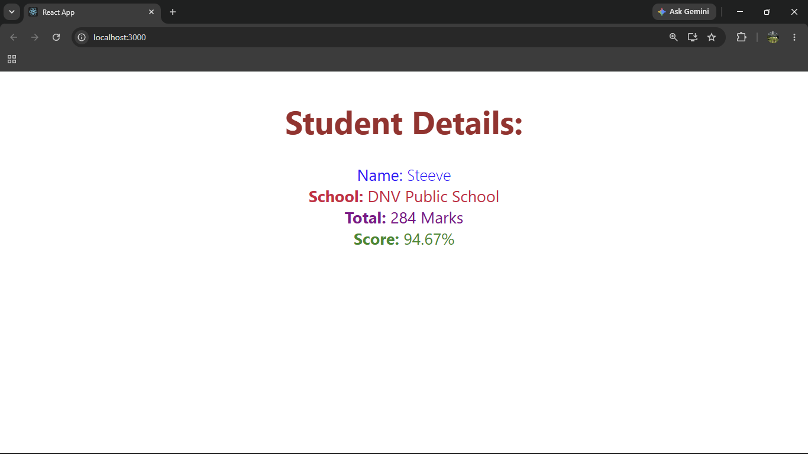

# ReactJS Hands-on Lab 3

This project implements the exercise described in `3. ReactJS-HOL.docx`.
It demonstrates a React function component that receives student information through props, calculates a score, and applies component-specific styling.

## Objective

Create a `CalculateScore` function component that accepts:

| Prop | Purpose | Sample value |
| --- | --- | --- |
| `Name` | Student name | Steeve |
| `School` | School name | DNV Public School |
| `total` | Total marks earned | 284 |
| `goal` | Number used to calculate the average score | 3 |

The score is calculated using:

```text
Score = total / goal
Score = 284 / 3
Score = 94.67%
```

## Project Structure

```text
3. ReactJS-HOL/
|-- output/
|-- public/
|-- src/
|   |-- Components/
|   |   `-- CalculateScore.js
|   |-- Stylesheets/
|   |   `-- mystyle.css
|   |-- App.js
|   `-- index.js
|-- package.json
`-- README.md
```

## Implementation Steps

### Step 1: Created the React project

A React application named **scorecalculatorapp** was created using the Create React App command.

```bash
npx create-react-app scorecalculatorapp
```

---

### Step 2: Created the Components folder

A new folder named **Components** was created inside the `src` directory. A new file named `CalculateScore.js` was added to this folder.

---

### Step 3: Implemented the CalculateScore component

The `CalculateScore` function component was implemented to accept the following properties:

- `Name`
- `School`
- `total`
- `goal`

The component calculates the student's average score by dividing the total marks by the goal and displays the student details along with the calculated percentage.

---

### Step 4: Created the Stylesheets folder

A new folder named **Stylesheets** was created under the `src` directory, and a stylesheet named `mystyle.css` was added.

The stylesheet was used to format the student details and apply separate styles to the Name, School, Total, and Score fields.

---

### Step 5: Updated App.js

The `CalculateScore` function component was imported into `App.js` and invoked by passing the required properties.

```jsx
import CalculateScore from "./Components/CalculateScore";

function App() {
  return (
    <div>
      <CalculateScore
        Name={"Steeve"}
        School={"DNV Public School"}
        total={284}
        goal={3}
      />
    </div>
  );
}

export default App;
```

---

### Step 6: Executed the application

The application was executed from the project directory using the following command:

```bash
npm start
```

---

### Step 7: Verified the output

The application was opened in a web browser using:

```text
http://localhost:3000
```

The browser successfully displayed the following student details:

- Name: Steeve
- School: DNV Public School
- Total: 284 Marks
- Score: 94.67%

## Browser Output

`output/output.png`



## Expected Browser Result

```text
Student Details:

Name: Steeve
School: DNV Public School
Total: 284 Marks
Score: 94.67%
```

## Available Commands

| Command | Purpose |
| --- | --- |
| `npm start` | Starts the development server |
| `npm test -- --watchAll=false` | Runs the automated test once |
| `npm run build` | Creates an optimized production build |