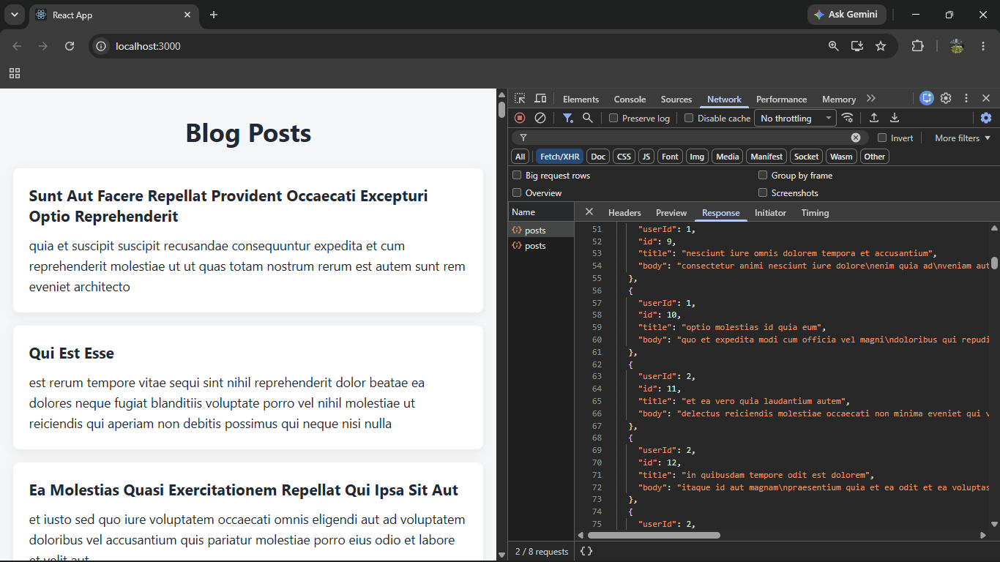
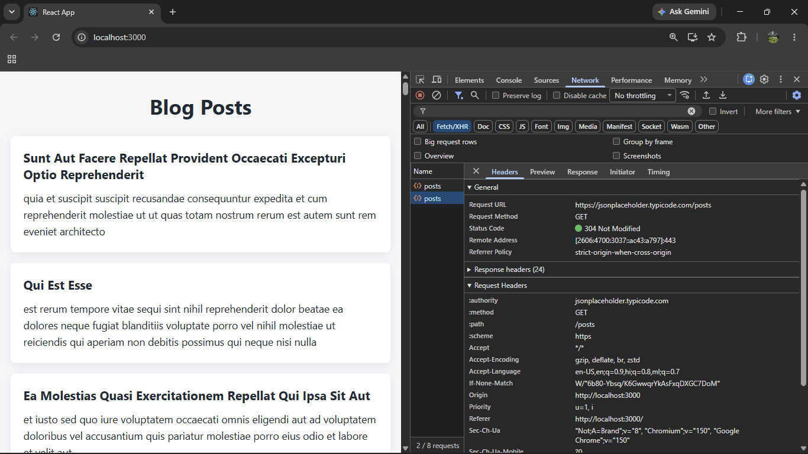

# ReactJS Hands-on Lab 4

This project implements the exercise described in `4. ReactJS-HOL.docx`.
It demonstrates React class-component lifecycle methods by loading and displaying blog posts from an external API.

## Objectives

- Create a model class for individual posts.
- Create a class-based `Posts` component.
- Initialize component state using a constructor.
- Load remote data using the Fetch API.
- Invoke data loading using `componentDidMount()`.
- Display post titles and bodies.
- Handle component errors using `componentDidCatch()`.

## Data Source

Posts are loaded from:

https://jsonplaceholder.typicode.com/posts

## Browser Output

`output/output1.png`
`output/output2.png`




## Project Structure

```text
4.ReactJS-HOL/
├── output/
├── public/
├── src/
│   ├── App.css
│   ├── App.js
│   ├── index.css
│   ├── index.js
│   ├── logo.svg
│   ├── Post.js
│   ├── Posts.css
│   ├── Posts.js
│   ├── reportWebVitals.js
│   └── setupTests.js
├── package.json
├── package-lock.json
└── README.md
```

## Implementation Steps

### Step 1: Created the React project

A React application named **blogapp** was created using the Create React App command.

```bash
npx create-react-app blogapp
```

---

### Step 2: Opened the project in Visual Studio Code

The React application was opened in Visual Studio Code to begin implementing the required components and lifecycle methods.

---

### Step 3: Created the Post model

A new file named `Post.js` was created inside the `src` directory.

The `Post` model was implemented with the following properties:

- `id`
- `title`
- `body`

These properties are used to represent individual blog posts received from the API.

---

### Step 4: Created the Posts class component

A new class component named `Posts` was created inside `Posts.js`.

The component extends `React.Component` and serves as the primary component responsible for loading and displaying the blog posts.

---

### Step 5: Initialized the component state

The component constructor was implemented to initialize the state with a collection of blog posts before data is loaded from the API.

---

### Step 6: Implemented the loadPosts() method

A method named `loadPosts()` was created to fetch blog posts from the following endpoint:

```text
https://jsonplaceholder.typicode.com/posts
```

The retrieved posts are assigned to the component state for rendering.

---

### Step 7: Implemented componentDidMount()

The `componentDidMount()` lifecycle method was implemented to invoke the `loadPosts()` method immediately after the component is mounted.

This ensures that the blog posts are fetched automatically when the application starts.

---

### Step 8: Implemented the render() method

The `render()` method was implemented to display the title and body of each blog post using HTML heading and paragraph elements.

---

### Step 9: Implemented componentDidCatch()

The `componentDidCatch()` lifecycle method was implemented to catch component errors and display them as alert messages whenever an unexpected error occurs.

---

### Step 10: Updated App.js

The `Posts` component was imported into `App.js` and rendered as the main application component.

```jsx
import Posts from "./Posts";

function App() {
  return (
    <div>
      <Posts />
    </div>
  );
}

export default App;
```

---

### Step 11: Executed the application

The application was executed from the project directory using the following command:

```bash
npm start
```

---

### Step 12: Verified the output

The application was opened in a web browser using:

```text
http://localhost:3000
```

The browser successfully displayed the list of blog posts retrieved from the JSONPlaceholder API. Each post displayed its title as a heading and its body as paragraph text.

## Component Lifecycle Flow

```text
Constructor
      │
      ▼
Component State Initialized
      │
      ▼
componentDidMount()
      │
      ▼
loadPosts()
      │
      ▼
Fetch API Request
      │
      ▼
State Updated
      │
      ▼
render()
      │
      ▼
Blog Posts Displayed
```

## Available Commands

| Command | Purpose |
| --- | --- |
| `npm start` | Starts the development server |
| `npm run build` | Creates an optimized production build |