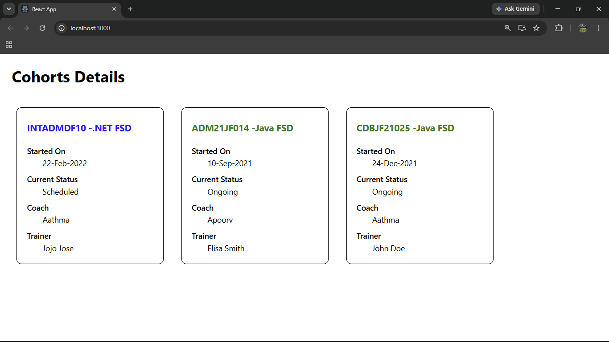

# ReactJS Hands-on Lab 5

This project implements the exercise described in `5. ReactJS-HOL.docx`.
It demonstrates styling React components using CSS Modules, `className`, and inline styles to display a dashboard of cohort details.

## Scenario

The My Academy team at Cognizant requires a dashboard to display details of ongoing and completed cohorts. The application styles reusable React components using CSS Modules and conditional inline styling.

## Objectives

- Style a React component.
- Define styles using CSS Modules.
- Apply styles using `className` and `style` properties.
- Display ongoing cohorts with green headings.
- Display all other cohort headings with blue headings.

## Browser Output

`output/output.png`



---

## Implementation Steps

### Step 1: Extracted the React application

The provided React application was extracted into the project directory.

---

### Step 2: Opened the project directory

The project directory was opened through Command Prompt by navigating to the extracted React application folder.

---

### Step 3: Restored the project dependencies

All required Node.js packages were restored using:

```bash
npm install
```

---

### Step 4: Opened the application in Visual Studio Code

The React application was opened in Visual Studio Code for implementing the required styling changes.

---

### Step 5: Created the CSS Module

A new CSS Module named `CohortDetails.module.css` was created.

The `box` class was implemented with the following properties:

- Width: **300px**
- Display: **inline-block**
- Margin: **10px**
- Padding (Top & Bottom): **10px**
- Padding (Left & Right): **20px**
- Border: **1px solid black**
- Border Radius: **10px**

---

### Step 6: Styled the `<dt>` element

A CSS rule was added for the HTML `<dt>` element using a tag selector.

```css
dt {
    font-weight: 500;
}
```

---

### Step 7: Imported the CSS Module

The `CohortDetails.module.css` file was imported into the `CohortDetails` component.

---

### Step 8: Applied the CSS Module

The `box` CSS Module class was applied to the container `<div>` using the `className` property.

---

### Step 9: Applied conditional heading styles

Conditional inline styling was implemented for the `<h3>` element.

- **Green** font color for **Ongoing** cohorts.
- **Blue** font color for all other cohort statuses.

---

### Step 10: Executed the application

The application was executed using:

```bash
npm start
```

---

### Step 11: Verified the output

The application was opened in a web browser using:

```text
http://localhost:3000
```

The dashboard successfully displayed all cohort cards with the required CSS Module styling and conditional heading colors as specified in the hands-on.

## Styling Flow

```text
Cohort Data
      │
      ▼
CohortDetails Component
      │
      ▼
CSS Module (box)
      │
      ▼
Conditional Inline Style
      │
      ▼
Green / Blue Heading
      │
      ▼
Rendered Cohort Card
```

## Available Commands

| Command | Purpose |
| --- | --- |
| `npm install` | Restores project dependencies |
| `npm start` | Starts the development server |