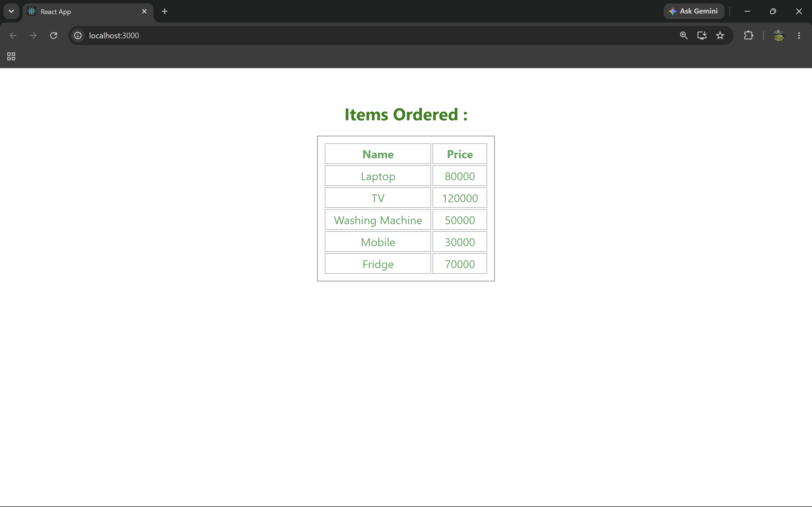

# ReactJS Hands-on Lab 7

This project implements the exercise described in `7. ReactJS-HOL.docx`.
It demonstrates the use of React class components, props, default props, array rendering, and ReactDOM rendering through a simple online shopping application.

## Objectives

- Define Props.
- Explain Default Props.
- Identify the differences between State and Props.
- Explain `ReactDOM.render()`.
- Use Props to pass data between components.
- Display shopping items dynamically.

## Browser Output

`output/output.png`



---

## Implementation Steps

### Step 1: Created the React application

A React application named **shoppingapp** was created using the Create React App command.

```bash
npx create-react-app shoppingapp
```

---

### Step 2: Created the Cart class component

A class component named `Cart` was implemented.

The component receives shopping items through props and displays them in a table with the following columns:

- Item Name
- Price

---

### Step 3: Created the OnlineShopping class component

A class component named `OnlineShopping` was created.

An array of `Cart` objects was initialized with the following five shopping items:

| Item Name | Price |
| --- | ---: |
| Laptop | 80000 |
| TV | 120000 |
| Washing Machine | 50000 |
| Mobile | 30000 |
| Fridge | 70000 |

---

### Step 4: Passed data using Props

The shopping items array was passed from the `OnlineShopping` component to the `Cart` component using React Props.

---

### Step 5: Displayed the shopping items

The `Cart` component iterated through the shopping items using `map()` and rendered the data dynamically in an HTML table.

---

### Step 6: Rendered the application

The `OnlineShopping` component was rendered from `App.js`, and the application was mounted using `ReactDOM.render()` through `index.js`.

---

### Step 7: Executed the application

The application was started using:

```bash
npm start
```

---

### Step 8: Verified the output

The application was opened in a web browser using:

```text
http://localhost:3000
```

The browser successfully displayed the **Items Ordered** heading along with the shopping items and their corresponding prices in a tabular format.
