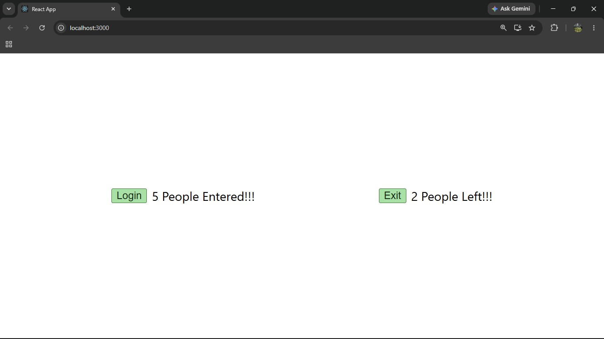

# ReactJS Hands-on Lab 8

This project implements the exercise described in `8. ReactJS-HOL.docx`.
It demonstrates the use of the React State object through a mall entry and exit counter.

## Objective

Create a React application named `counterapp` with a component named `CountPeople`.

The component maintains:

- `entrycount` for the number of people entering the mall.
- `exitcount` for the number of people exiting the mall.

## Browser Output

`output/output.png`



## Implementation Steps

### 1. Created the Counter Application

A React application named `counterapp` was created with a class component named `CountPeople`.

```bash
npx create-react-app counterapp
```

### 2. Implemented the State and Methods

The constructor and React State object were used to store `entrycount` and `exitcount`.

Two methods were implemented:

- `updateEntry()` increments `entrycount` when the **Login** button is clicked.
- `updateExit()` increments `exitcount` when the **Exit** button is clicked.

### 3. Ran and Verified the Application

The application was started using:

```bash
npm start
```

The browser displayed the Login and Exit buttons with their respective counters.