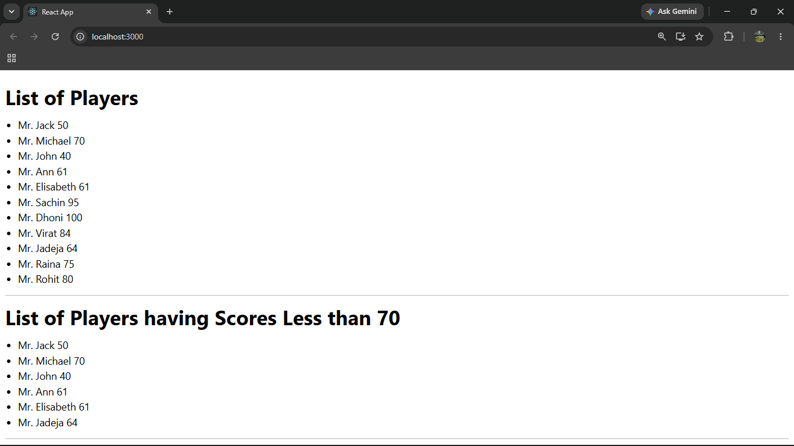
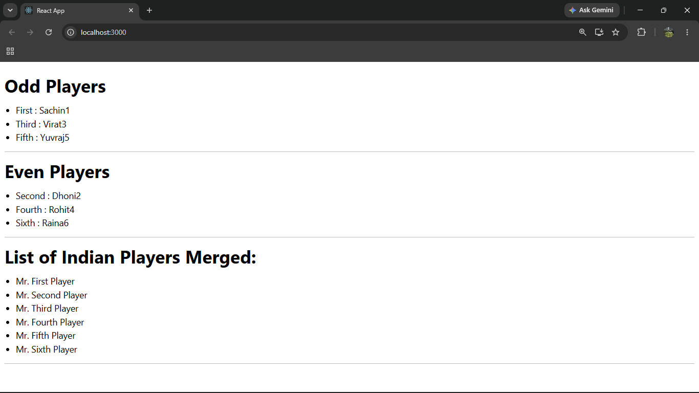

# ReactJS Hands-on Lab 9

This project implements the exercise described in `9. ReactJS-HOL.docx`.
It demonstrates various ES6 features including `map()`, arrow functions, destructuring, array merging, and conditional rendering in React.

## Objectives

- Use the ES6 `map()` method.
- Apply ES6 arrow functions.
- Implement ES6 destructuring.
- Merge arrays using the spread operator.
- Display components using a simple `if...else` statement.

## Browser Output

### Flag = true

`output/output1.png`



### Flag = false

`output/output2.png`



---

## Implementation Steps

### 1. Created the React application

A React application named `cricketapp` was created using the Create React App command.

```bash
npx create-react-app cricketapp
```

### 2. Implemented the ListofPlayers component

A component named `ListofPlayers` was created.

- An array containing 11 players with their names and scores was declared.
- The ES6 `map()` method was used to display all players.
- Arrow functions were used to filter and display players having scores less than or equal to **70**.

### 3. Implemented the IndianPlayers component

The `IndianPlayers` component was created to demonstrate ES6 features.

- Array destructuring was used to display the **Odd Team Players** and **Even Team Players**.
- Two arrays named `T20Players` and `RanjiTrophyPlayers` were declared and merged using the ES6 spread operator.

### 4. Displayed the components

Both components were displayed on the same page using a simple `if...else` statement with a boolean `flag`.

- `flag = true` displays the player list and filtered players.
- `flag = false` displays the odd players, even players, and merged Indian players.

### 5. Ran and verified the application

The application was started using:

```bash
npm start
```

The browser successfully displayed the expected output for both values of the `flag` variable.

## Available Commands

| Command | Purpose |
| --- | --- |
| `npm start` | Starts the development server |