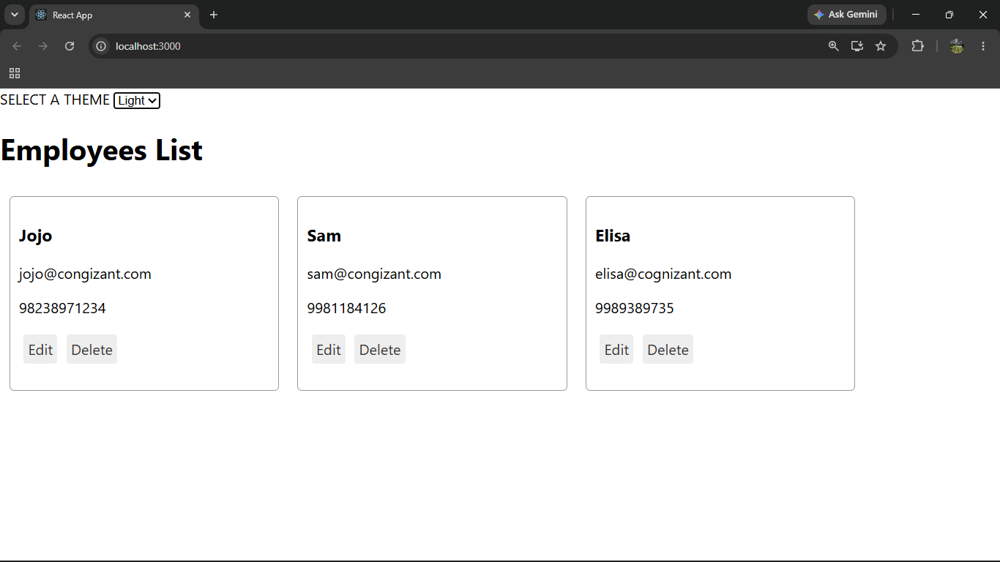
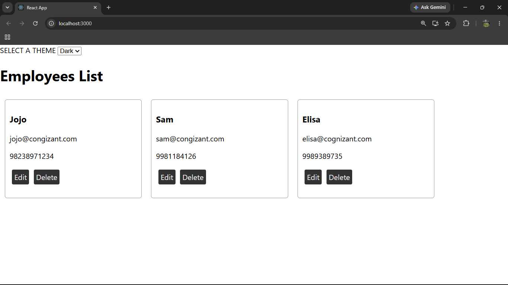

# ReactJS Hands-on Lab 14

This project implements the exercise described in `14. ReactJS-HOL.docx`.
It uses the employee management application embedded inside the Word file and converts theme passing from props to React Context API.

## Project Source

The application was taken from the zip/app embedded in the Word file.

The project name in `package.json` is:

```bash
employeesapp
```

## Browser Output

`output/output1.png`



`output/output2.png`



---

## Implementation Steps

### 1. Unzipped and opened the embedded application

The employee management application embedded in the Word file was used as the base project.

### 2. Restored node modules

The node modules were restored using:

```bash
npm install
```

### 3. Started the application

The application was started using:

```bash
npm start
```

### 4. Explored existing components

The existing files were checked:

- `App.js`
- `EmployeesList.js`
- `EmployeeCard.js`

### 5. Created ThemeContext

Created `ThemeContext.js` using `createContext('light')`.

### 6. Imported ThemeContext in App

Imported `ThemeContext` in `App.js`.

### 7. Added ThemeContext Provider

Wrapped the complete JSX of `App` with `ThemeContext.Provider`.

The selected theme value from state is passed to the provider.

### 8. Removed theme prop from EmployeesList

The `theme` value is no longer passed from `App.js` to `EmployeesList.js`.

### 9. Updated EmployeesList

The `theme` value is no longer passed from `EmployeesList.js` to `EmployeeCard.js`.

### 10. Imported ThemeContext in EmployeeCard

Imported `ThemeContext` inside `EmployeeCard.js`.

### 11. Used useContext in EmployeeCard

Used `useContext(ThemeContext)` to get the selected theme.

### 12. Applied theme className to buttons

The selected theme is applied as the class name for the `Edit` and `Delete` buttons.

## Available Commands

| Command | Purpose |
| --- | --- |
| `npm start` | Starts the development server |
