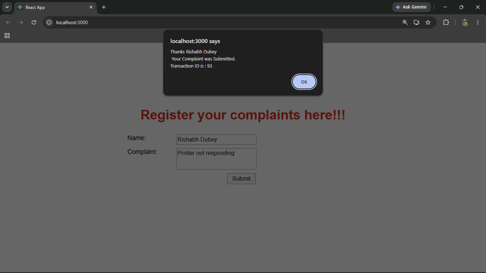

# ReactJS Hands-on Lab 15

This project implements the exercise described in `15. ReactJS-HOL.docx`.
It demonstrates React forms using a complaint registration form.

## Project Creation

The React application was created from the command line using:

```bash
npx create-react-app ticketraisingapp
```

## Browser Output

`output/output.png`



---

## Implementation Steps

### 1. Created the React application

A React application named `ticketraisingapp` was created.

```bash
npx create-react-app ticketraisingapp
```

### 2. Created ComplaintRegister component

Created a component named `ComplaintRegister`.

The component is placed inside the `src/components` folder.

### 3. Created the complaint form

The form contains:

- Textbox to enter employee name
- Textarea to enter complaint
- Submit button

### 4. Handled form input

The `handleChange` event updates the component state when values are entered in the form.

### 5. Submitted the complaint

The `handleSubmit` event submits the complaint and displays an alert message with a transaction ID for further follow-ups.

### 6. Ran the application

The application was started using:

```bash
npm start
```

## Available Commands

| Command | Purpose |
| --- | --- |
| `npm start` | Starts the development server |
