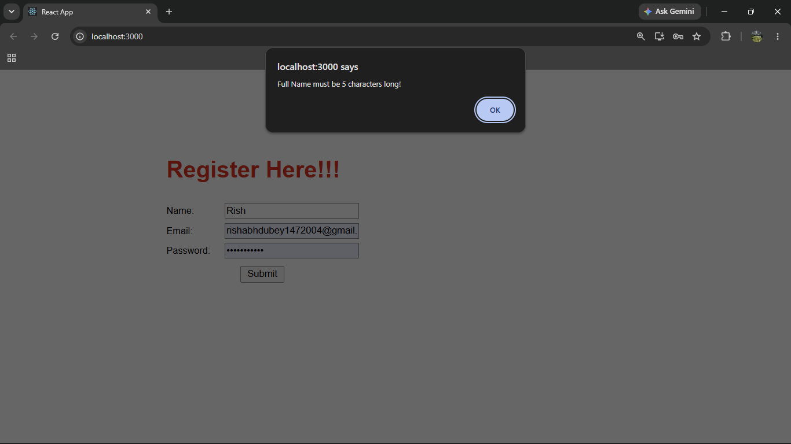
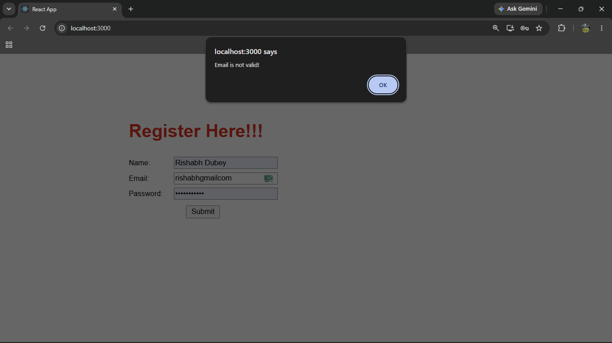
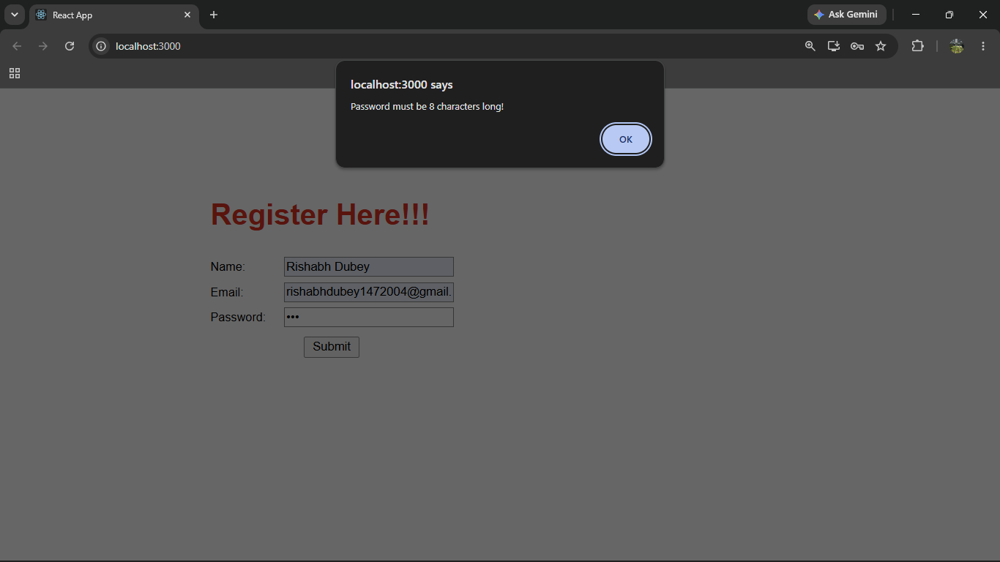
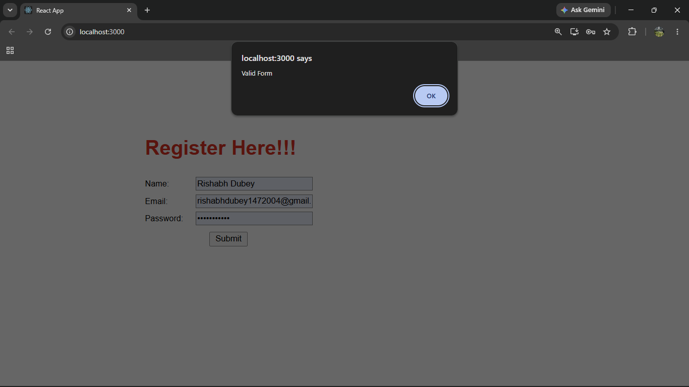

# ReactJS Hands-on Lab 16

This project implements the exercise described in `16. ReactJS-HOL.docx`.
It demonstrates React form validation using name, email, and password fields.

## Project Creation

The React application was created from the command line using:

```bash
npx create-react-app mailregisterapp
```

## Browser Output

`output/output1.png`



`output/output2.png`



`output/output3.png`



`output/output4.png`



---

## Implementation Steps

### 1. Created the React application

A React application named `mailregisterapp` was created.

```bash
npx create-react-app mailregisterapp
```

### 2. Created component folder

Created a folder named `component` inside `src`.

### 3. Created register.js component

Created a function component named `register.js` inside the `src/component` folder.

### 4. Created the registration form

The form accepts:

- Name
- Email
- Password

### 5. Added name validation

Name should have at least 5 characters.

If the name is invalid, the alert displays:

```text
Full Name must be 5 characters long!
```

### 6. Added email validation

Email should contain `@` and `.`.

If the email is invalid, the alert displays:

```text
Email is not valid!
```

### 7. Added password validation

Password should have at least 8 characters.

If the password is invalid, the alert displays:

```text
Password must be 8 characters long!
```

### 8. Handled form events

Validations were implemented using form input handling and form submit handling.

### 9. Ran the application

The application was started using:

```bash
npm start
```

## Available Commands

| Command | Purpose |
| --- | --- |
| `npm start` | Starts the development server |
