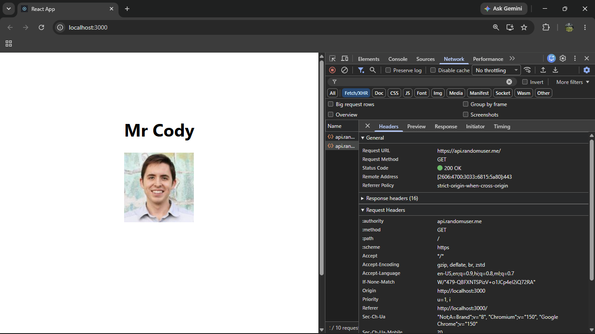
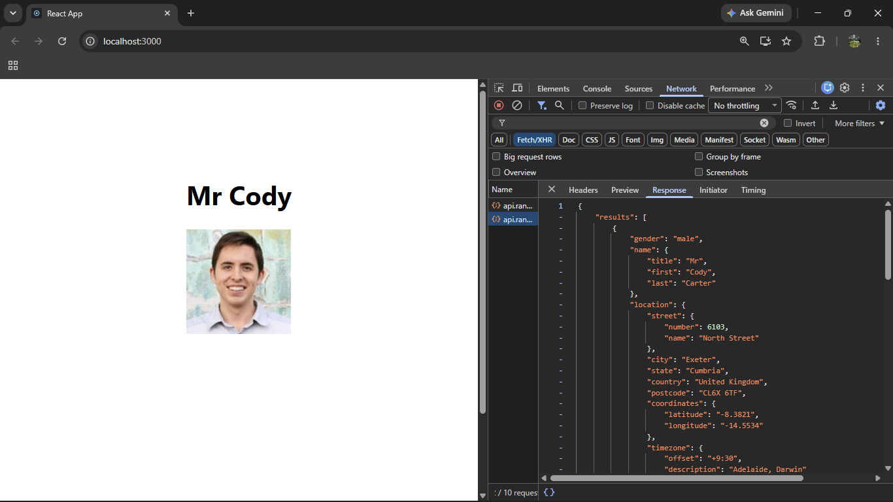

# ReactJS Hands-on Lab 17 – Fetch User App

This project implements the exercise described in `17. ReactJS-HOL.docx`.
It fetches user details from the Random User API and displays the user's title, first name, and image.

## Output




## Create the Application

```bash
npx create-react-app fetchuserapp
```

## Run the Application

```bash
cd fetchuserapp
npm start
```

## Implementation

- The `Getuser` functional component is implemented as per the word file.
- `useEffect()` invokes `https://api.randomuser.me/` using `fetch()`.
- `useState()` stores the fetched user and loading state.
- The component displays the user's title, first name, and image.
