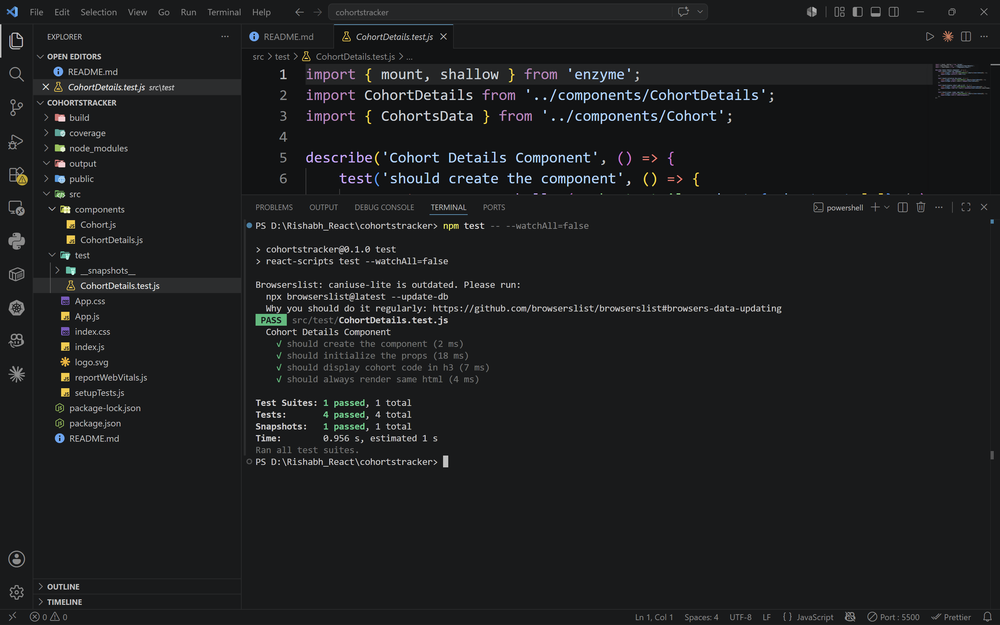
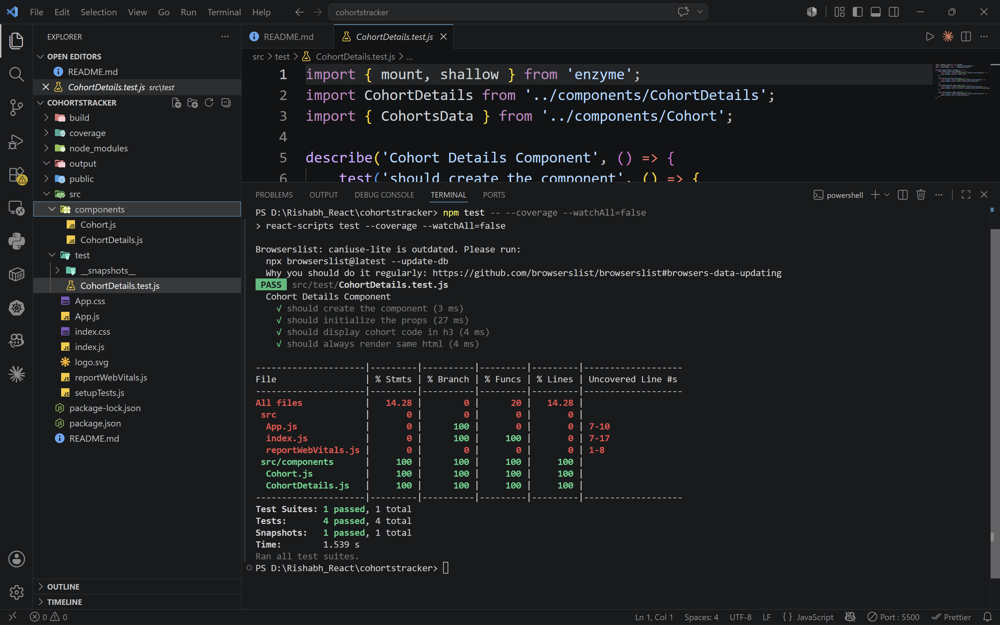
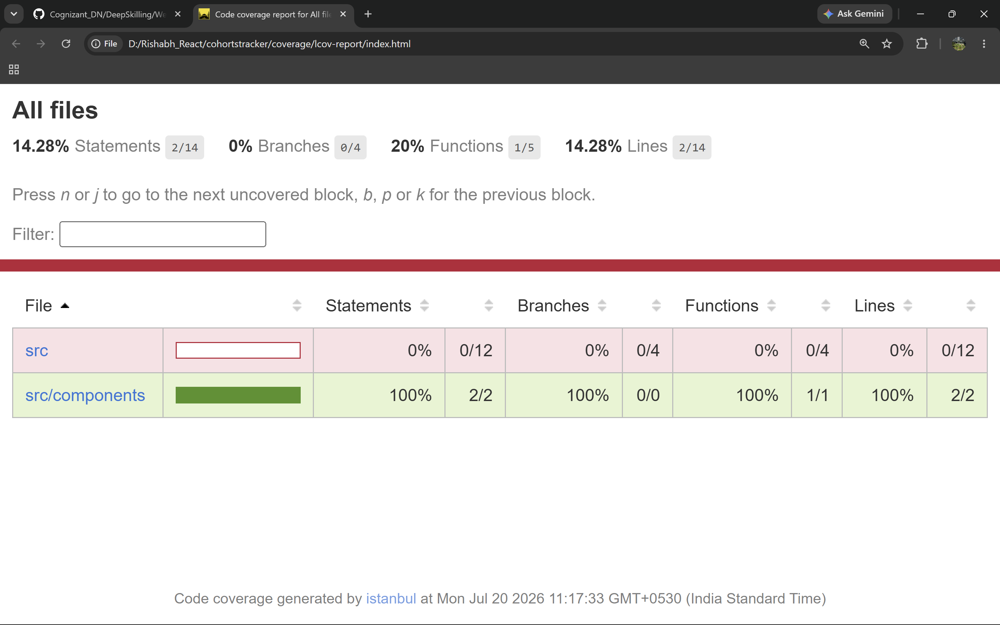
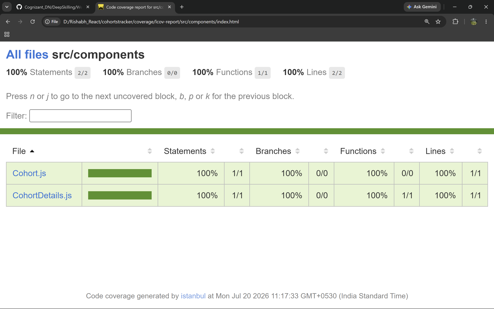

# ReactJS Hands-on Lab 18

This project implements the exercise described in `18. ReactJS-HOL.docx`.
It uses the attached `cohortstracker` React project and adds Jest and Enzyme unit tests for the `CohortDetails` component.

## Objectives

- Explain the need for unit testing in React.
- Work with Jest and Enzyme in React.
- Install and configure Enzyme.
- Create unit tests using `describe()` and `test()`.
- Mount components and test them using matchers.
- Capture snapshots of React components.


## Outputs and Reports

`output/output1.png`



`output/output2.png`



`output/output3.png`



`output/output4.png`



The generated Jest coverage report files are available in:

```text
coverage/lcov-report/index.html
coverage/lcov.info
coverage/clover.xml
coverage/coverage-final.json
```
## Project Setup

The React application attached inside the hands-on document was unzipped and opened.

---

## Implementation Steps

### 1. Restored packages

The packages were restored using:

```bash
npm install
```

### 2. Installed Enzyme support

Enzyme, React 16 adapter, and React test renderer were installed using:

```bash
npm install --save-dev enzyme enzyme-adapter-react-16 react-test-renderer
```

### 3. Configured Enzyme support

The `setupTests.js` file was updated to configure Enzyme with the React 16 adapter.

### 4. Added CohortDetails unit tests

The `CohortDetails.test.js` file was created inside the `src/test` folder.

The test suite is named `Cohort Details Component` and contains:

- `should create the component`
- `should initialize the props`
- `should display cohort code in h3`
- `should always render same html`

### 5. Ran the tests

The tests are executed using:

```bash
npm test
```

The test run verifies the `CohortDetails` component using the following tests:

- Component creation
- Props initialization
- Cohort code display in `h3`
- Snapshot rendering

### 6. Generated test coverage report

The Jest coverage report is generated using:

```bash
npm test -- --coverage --watchAll=false
```

The HTML coverage report is available at:

```text
coverage/lcov-report/index.html
```

The report includes coverage details for:

- `Cohort.js`
- `CohortDetails.js`
- Other application files included by Jest coverage

## Available Commands

| Command | Purpose |
| --- | --- |
| `npm install` | Restores project dependencies |
| `npm test` | Runs the Jest test suite |
| `npm test -- --coverage --watchAll=false` | Generates the Jest coverage report |
