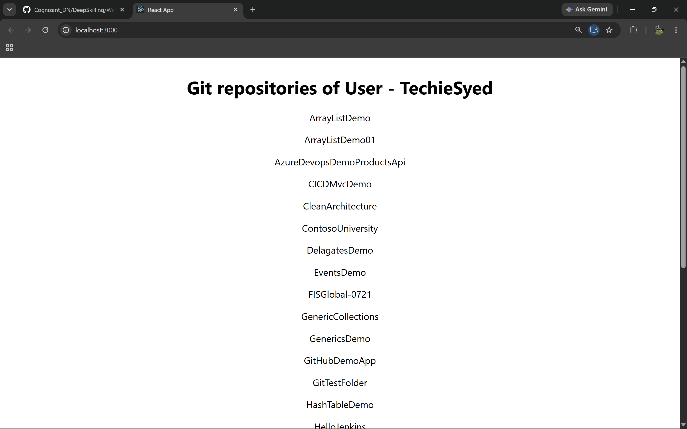
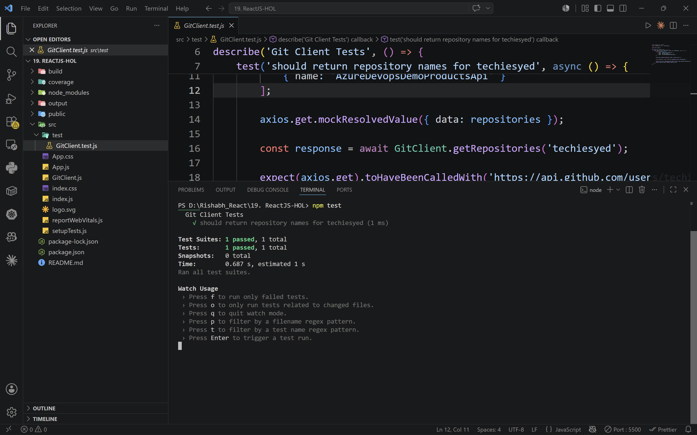
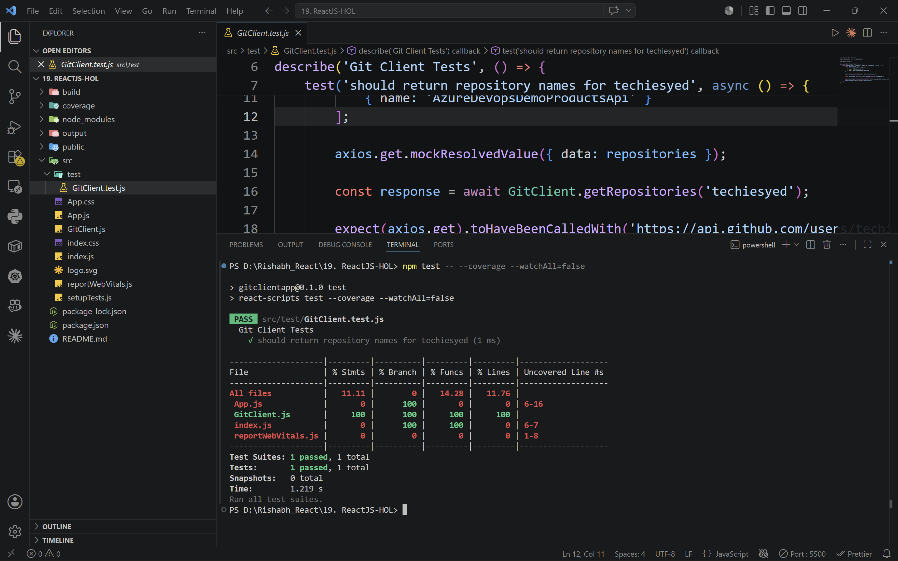
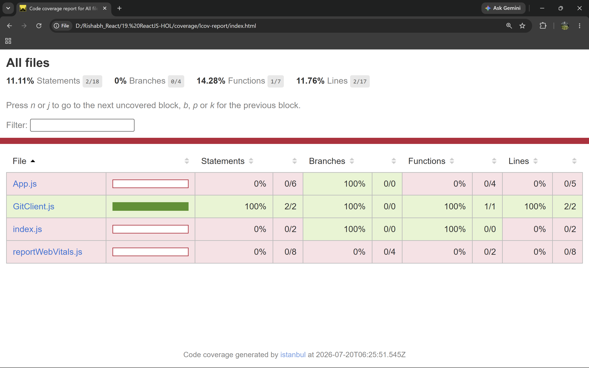

# ReactJS Hands-on Lab 19

This project implements the exercise described in `19. ReactJS-HOL.docx`.
It fetches and displays GitHub repository names for the user `techiesyed` and unit tests the API module using Jest mocking.

## Objectives

- Understand the need for isolation in testing.
- Understand the concept of mocking.
- Use Jest for unit testing and mocking.
- Unit test modules in isolation.
- Create and configure mocks and spies.


## Outputs and Reports

`output/output1.png`



`output/output2.png`



`output/output3.png`



`output/output4.png`



The generated Jest coverage report files are available in:

```text
coverage/lcov-report/index.html
coverage/lcov.info
coverage/clover.xml
coverage/coverage-final.json
```

## Implementation Steps

### 1. Create React app

A React application named `gitclientapp` was created using Create React App.

```bash
npx create-react-app gitclientapp
```

### 2. Open app in VS Code

The generated React application was opened in Visual Studio Code.

```bash
cd gitclientapp
code .
```

### 3. Install Axios

Axios was installed to make calls to the GitHub API.

```bash
npm install axios
```

### 4. Create GitClient.js

The `GitClient.js` file was created inside the `src` folder to fetch repositories from:

```text
https://api.github.com/users/{userName}/repos
```

### 5. Add GitClient module code

The `GitClient` module was implemented to call `api.github.com` and fetch repositories using Axios.

### 6. Modify App component

The functional `App` component uses `useEffect` and `useState` to fetch and display repository names for `techiesyed`.

### 7. Run application

The application is started using:

```bash
npm start
```

The browser displays the heading and repository names for `techiesyed`.

### 8. Create GitClient.test.js

The `GitClient.test.js` file was created inside the `src/test` folder.

### 9. Import Axios and GitClient

The test file imports:

- `axios`
- `GitClient`

### 10. Define Git Client Tests suite

The test suite is named `Git Client Tests` and contains:

- `should return repository names for techiesyed`

### 11. Create unit test using test()

A unit test was created using `test()` with the name:

```text
should return repository names for techiesyed
```

### 12. Mock Axios response

Axios is mocked so the test runs in isolation without calling the real GitHub API.

The mocked response returns dummy repository data for `techiesyed`.

### 13. Invoke getRepositories()

The `getRepositories()` method of `GitClient` is invoked and verified against the mocked data.

### 14. Run tests

The test suite is executed using:

```bash
npm test
```

### 15. Generate coverage report

The Jest coverage report is generated using:

```bash
npm test -- --coverage --watchAll=false
```

The HTML coverage report is available at:

```text
coverage/lcov-report/index.html
```

## Available Commands

| Command | Purpose |
| --- | --- |
| `npm start` | Starts the development server |
| `npm test` | Runs the Jest test suite |
| `npm test -- --coverage --watchAll=false` | Generates the Jest coverage report |
